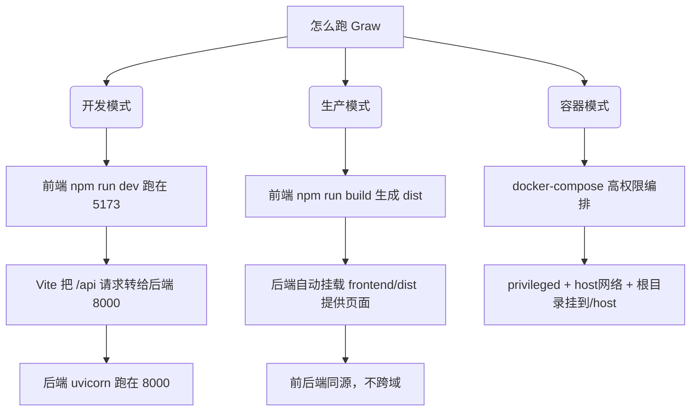
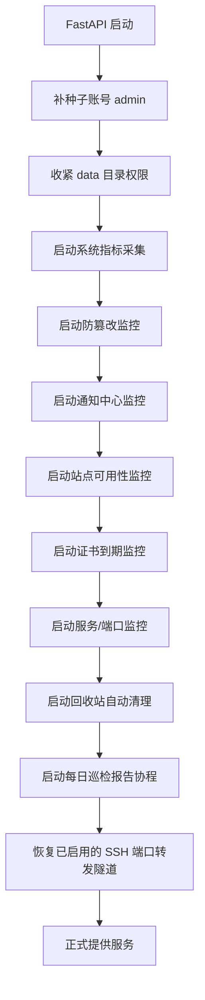

# 01 项目架构与启动流程

## 一句话说清 Graw 是什么

Graw 是一个用网页当界面的「服务器管理面板」。它的界面长得跟电脑桌面似的——有壁纸、有桌面快捷方式、底部有任务栏，你点点图标就能打开一个个「窗口」去管理东西（看系统监控、管 Docker、建网站、管数据库、设防火墙……），而不是像普通网站那样一页一页翻。

它有两个本事是普通面板没有的：
1. **管本机**：直接管理自己跑着的那台服务器。
2. **管别人家的机器**：既能用 **SSH** 连一台「裸服务器」（没装面板的机器）去操作它，也能通过 **Agent 隧道** 把一台装了完整 Graw 的「子节点」也纳入统一面板，一个界面管一片。

## 用了什么技术

- 前端：Vue 3（前端框架）+ Vite（打包工具）+ Axios（发请求）+ ECharts（画图表）+ xterm.js（网页终端）+ vue-i18n（界面多语言，内置 22 个语言包）
- 后端：Python + FastAPI（网页服务框架）+ Uvicorn（跑服务的进程）+ psutil（拿系统信息的工具）+ Docker SDK（调 Docker 的库）
- 通信方式：普通请求走 `REST`（路径是 `/api/xxx`，返回 JSON）；要实时刷新的（系统监控、终端）走 WebSocket

整台面板是「前后端同源」的单体应用——意思就是前端页面和后端接口是同一个网站域名下的，不搞跨域，安全又简单。

## 分三种方式跑起来

- **开发**：前端 `npm run dev`（:5173），它把 `/api` 请求转发给后端的 :8000，方便随时改代码热更新。
- **生产**：前端打包出 `frontend/dist`，后端自己提供这个静态页面；一个端口 :8000 同时管前端和后端，所以不跨域、也关掉了 CORS。
- **容器**：`docker-compose.yml` 给了超高的权限（privileged、用宿主网络、把根目录 `/` 挂载到 `/host`、挂 docker.sock），目的就是让面板能完整管理宿主机。注意：这只适合可信环境，Windows 的 Docker Desktop 上这些特权没法完全生效，所以开发建议直接本地跑前后端。

## 后端一启动就干嘛（lifespan 启动流程）

后端进程起来后，不是立刻就能接客，它会先按顺序做准备（这段写在 `backend/app/main.py` 的 `lifespan` 里）：

1. **补种子账号**（`seed_default_users`）：第一次运行会创建一个默认管理员 `admin / admin123`，并标记「首次登录必须改密码」。如果发现 admin 账号存在但角色不是管理员，会自动修正回来，保证永远至少有一个管理员。
2. **收紧数据权限**（`_secure_data_dir`）：把存配置的 `data/` 目录改成只有自己能读写（Linux 上目录 0700、文件 0600），防止同机器的其他低权限用户偷看我们的密码、SSH 凭据和签名密钥。Windows 上这个没实际效果，所以静默跳过。
3. **启动 7 组常驻后台小任务**（这些协程在关机时会逐一停掉，保证不留垃圾进程）：
   - 系统指标采集：定时取 CPU/内存/磁盘，喂给首页的仪表盘。
   - 防篡改监控：盯着网站文件，一旦被改就备份恢复并报警。
   - 通知中心监控：检测 CPU/内存等指标超过阈值就发告警。
   - 站点可用性：定期探网站通不通，宕了就通知。
   - 证书到期：盯着 SSL 证书还剩多少天，快过期就提醒。
   - 服务监控：检查你自定义的端口/进程/systemd 服务状态。
   - 回收站自动清理：每小时清理各节点回收站里过期（默认 30 天）的条目。
4. **再点起两件「一次性或低频」的活儿**：
   - 每日巡检报告（`reporting.start_daily`）：每天 08:00 汇总资源/证书/服务/站点/告警五段信息，出一份报告按文件名轮转保留 30 份，并推到通知渠道；生成过程丢进线程池，不阻塞事件循环。
   - 恢复 SSH 端口转发隧道（`portforward.restore_all`）：把上次标记为启用的转发条目（如「远程 3306 → 本地 13306」）重新拉起来，每条隧道一个守护线程，监听地址**强制 127.0.0.1**。

> 约定：以后要新增常驻后台监控，必须在这里的「启动区」和「停止区」同时登记，否则协程会泄漏（一直挂着占资源）。目前关机区的停法也一一对应：7 个协程 `stop_*` + `reporting.stop_daily()` + `portforward.stop_all()`。

## 版本号与文档开关

- 版本号只有一个来源：`backend/app/main.py` 最上面那个 `APP_VERSION`（现在是 1.6.1）。升级只改这一处。
- 交互式 API 文档（`/docs` 那些）默认是**关掉的**——因为一旦打开，任何陌生人访问就能看到全部接口结构，等于把攻击面地图免费送人。调试时才用环境变量 `GRAW_ENABLE_DOCS=1` 打开。

---

## 更新记录
- `2026-09-25`：版本基线更新到 1.6.1；启动流程补上「回收站自动清理」「每日巡检报告协程」「SSH 端口转发隧道恢复」三步，技术栈补 vue-i18n（22 个语言包）。
- `2026-08-24`：拆分为独立文件，用大白话重写本项目架构与启动流程。