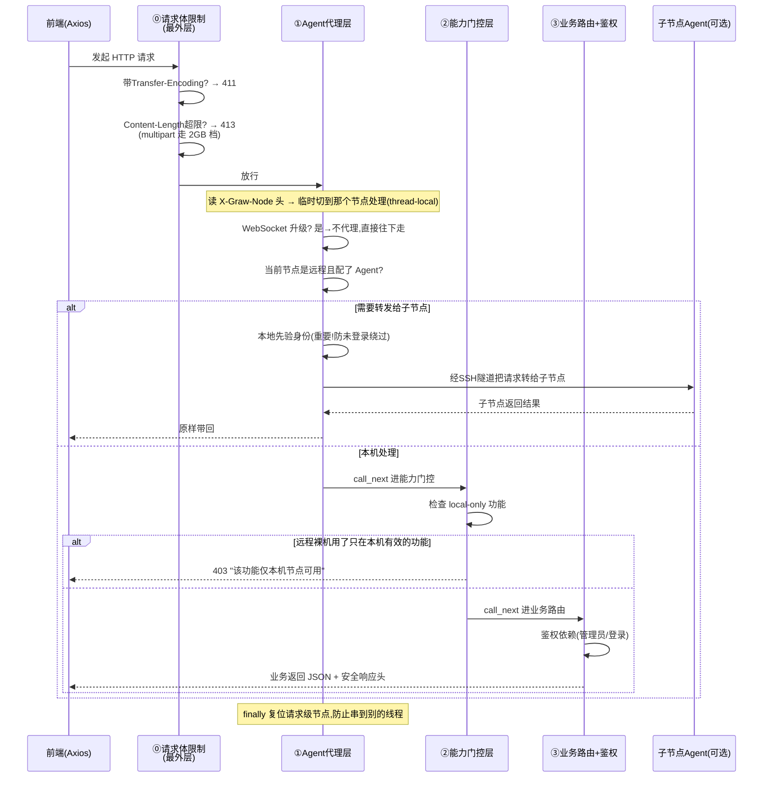

# 02 请求生命周期与中间件链

> 大白话主线：你在前端点一下，这个请求从浏览器发出，要经过 **几道闸机** 才能到业务代码手里，最后把结果带回给你。

## 一句话版

前端发的每个 `/api/*` 请求，会依次经过下列「中间件」（middleware，其实就是几个拦截关卡）。顺序是**从外到内**（`main.py` 里**最后注册的反而最先执行**，所以看注册顺序是反的）：

1. **请求体大小限制**（`_RequestBodyLimitMiddleware`，最外层）：超限的大请求体在这里就被挡掉。
2. **Agent 代理层**（`agent_proxy_middleware`）：判断这请求要不要转发给子节点机器去处理。
3. **能力门控层**（`remote_capability_guard`）：判断这台机器支不支持这个功能（有些功能只在本机有效）。
4. **安全响应头 / CORS**（`security_headers`、`CORSMiddleware`）：给出去的响应戴好「头盔」。
5. **业务路由层**：真正执行你的操作（这里还会再验一次身份权限）。

## 完整流程图

假设你正处在一个远程节点之上，请求可能被转发到子节点：

## 第零层：请求体大小限制（`_RequestBodyLimitMiddleware`）

这层是**防「撑爆内存」**的：uvicorn 在应用读请求体之前会先把整个 body 缓冲进内存，FastAPI 解析 JSON 还会再复制一份。未认证攻击者只要给公开的 `/api/auth/login` 并发丢超大 JSON，就能低成本耗光面板内存。所以：

- **带 `Transfer-Encoding` 的请求直接 411**：HTTP/1.1 的请求体必须用 `Content-Length` 声明大小，否则服务端无法在不缓冲的前提下判定边界。主流客户端（浏览器/axios/requests/curl、面板自己的 agent_client）都用 Content-Length，不受影响。
- **`Content-Length` 超限直接 413**，且发生在读取请求体之前（uvicorn 会关掉未消费完的连接，攻击者的数据被 TCP 层截断）。
- **两级限额**：普通请求默认 16MB，`multipart/` 上传默认 2GB（可用环境变量 `GRAW_MAX_BODY_MB` / `GRAW_MAX_UPLOAD_MB` 覆盖，最小 1MB）。
- **多个不一致的 `Content-Length` 头直接 400**（防请求走私）。

## 第一层：Agent 代理层（`agent_proxy_middleware`）

**它干嘛**：统一的「多面板接管」能力。当你操作的当前节点是 SSH 且配置了 Agent，面板的大部分业务请求其实不是本机处理，而是**通过 SSH 隧道转发给那台子节点**去真的干活，再把结果拿回来。这样同一个界面就能管好多台机器。

它具体做了这几件事：

1. **看你要操作哪台机器**：从请求头 `X-Graw-Node` 读「目标节点」，用它临时覆盖当前线程的全局节点。用线程私有存储（thread-local）保证不同窗口能同时访问不同机器互不干扰；接口处理完在 `finally` 里复位，防止污染下一个请求。
2. **WebSocket 不代理**：请求头带 `Upgrade: websocket` 的（系统监控、终端）不走这条隧道，由本机或 paramiko 直接处理。
3. **判断要不要代理**：`_should_agent_proxy()`——只有路径以 `/api/` 开头，并且不在「排除名单」里才可能被代理。当前排除名单（`_AGENT_PROXY_EXCLUDE_PREFIX`）是：
   - `auth` / `nodes` / `agent` / `health`：登录、节点管理、机器间鉴权、健康检查是**主面板自己的职责**，必须在本机处理；
   - `terminal`：终端是 WebSocket + paramiko，不走 HTTP 代理；
   - `ui` / `shunx`：界面设置与安全入口属于本机；
   - `batch`：批量命令由主面板持全部节点凭据直连执行，不能转给某一个子节点；
   - `gitdeploy` / `portforward`：部署要按配置里的 `node_id` 分发、隧道建立在主面板与节点之间，同样必须留在主面板执行。

   而且只有当当前节点**确实配了 Agent** 才会真的代理，否则就交回给路由链自己处理（不改变本地部署的原味行为）。
4. **转发前必须先本地验身份**（这是当年的安全修复）：因为代理用的是**子节点给的管理员级 JWT**，如果不在本机先拦一次身份，任何人都能借这个代理接口对子节点为所欲为（比如读写文件 = 直接远程执行命令）。所以代理发生前，先按正常登录的校验链验一遍 Bearer 令牌：
   - 令牌有效、用户存在、token 版本对得上、会话没被踢、不是默认密码；
   - 非管理员只能代理有限几个只读/轻量路径（系统概览 GET、备忘录 GET/POST、登录历史 GET、防篡改状态 GET），其余一律要求管理员。

> 一句话：**没带合法登录令牌的请求，别想借这台子节点的 Agent 偷偷干坏事。**

## 第二层：能力门控层（`remote_capability_guard`）

**它干嘛**：SSH 节点是「裸服务器」，没装完整的 Graw。所以有些功能在远程机器上**根本没意义**，必须禁用，否则会出问题。

- 「local 类」功能就是数据存在面板本地 `data/*.json`、或者依赖面板自建基础设施的那些。名单写在 `remote_cap.py` 的 `LOCAL_PREFIX` 里：sites / databases / cron / ssl / protection / runtime / tasks / appstore / backup / netstorage / notify / uptime / webstats / rewrite / sitesopts / waf / tamper / phpversions / ftpusers / sshkeys / certcheck / panelbackup / update / webmode / loginlog / plugins / op。这些在一台裸的远程机器上派不上用场。
- 「host 类」功能不在名单里，远程仍可用：进程、文件、Docker、磁盘、日志、终端、系统监控、防火墙、服务监控、体检、工具箱、批量操作等——它们直接操作远程机器的系统状态，切换节点后真正作用到那台机器上。

处理方式：`reject_if_local_remote()` = 当前是远端节点 且 路径命中的是 local 类 → 返回 403「该功能仅本机节点可用」。这是**纵深防御**的兜底——前端其实已经把对应快捷方式隐藏/禁用了，这里再拦一次以防万一。

> **重要前提**：这一层拦的是「远程裸机」。如果那台远程机器**装了完整 Graw 且配好了 Agent**，请求在外层的 Agent 代理层就被转发到子节点去了，根本走不到这里——因为对子节点来说它自己就是「本机」，这些 local 类功能在它那儿全都成立。前端也是按这个逻辑判断的：远端且 `agent_enabled` 为假才禁用 local 类应用（`App.vue` 的 `openWindow` 守卫）。

## 第三层：业务路由 + 鉴权依赖

这一层才是真正干活的地方。每个 `/api/*` 路由会挂不同的授权级别（见 `main.py`）：

- `PROTECTED`：只要登录就能访问（只读信息类，比如系统概览、备忘录、登录历史）。
- `ADMIN`：必须是管理员（文件、终端、计划任务、Docker、防火墙这类能写东西或执行命令的）。
- 有些路由**在接口内部自己鉴权**，不挂全局依赖，原因是浏览器侧拿不到 Bearer 头、或者这些端点必须对未登录者开放：
  - `system`：为了它的 WebSocket 能用 `?token=` 鉴权（全局依赖会让 WS 连不上）；
  - `terminal`：同样是 WebSocket，处理函数内用 `?token=` + 强制管理员；
  - `tamper`：REST 端点各自校验（读要登录、写要管理员），另有 `/ws` 告警推送；
  - `shunx`：`/status` 是公开接口（登录页安全入口要用），`/config` 内部再验管理员；
  - `ui`：`/public` 公开（登录页展示站点名/Logo），`/config` 内部验管理员；
  - `agent`：机器间鉴权（成对密钥换 JWT），不依赖面板登录态；
  - `appstore` 的图标路由：`` 直接加载，没有令牌；
  - `gitdeploy` 的 webhook：Git 平台没有面板登录态，端点内校验签名令牌；
  - `op`（插件开放接口）：插件凭令牌调用，内部按能力白名单校验。

## 附：安全响应头与 CORS（`security_headers` / `CORSMiddleware`）

这两层不拦请求，只管「给出去的响应长什么样」：

- **安全响应头**（`security_headers`）：给所有响应补上 `Content-Security-Policy`（默认只允许同源；因为 Vue scoped 样式、ECharts、xterm 需要，`style-src` 放行 inline、`script-src` 放行 inline + eval）、`X-Content-Type-Options: nosniff`、`X-Frame-Options: DENY`、`Referrer-Policy: same-origin`。改动前端要引入外部 CDN 资源时，先想想 CSP 会不会把它挡掉。
- **CORS 全关**：`allow_origins=[]` + `allow_credentials=False`。因为面板前后端永远同源（开发走 Vite 代理，生产由后端托管 `frontend/dist`），不需要放行任何跨域来源。曾经 `allow_origins=["*"] + allow_credentials=True` 的组合会让 Starlette 反射任意 Origin，属于危险配置，已修掉。

## 前端怎么发请求（`frontend/src/api.js`）

- 用 Axios，baseURL 是 `/api`。
- **请求拦截器**自动给你加上两样东西：
  - 登录令牌：`Authorization: Bearer <token>`；
  - 目标节点：从 `store/requestNode` 读当前聚焦窗口绑定的节点，塞进 `X-Graw-Node` 头（这就是上面第一层读的那个头）。
- **响应拦截器**处理两种情况：
  - 收到 401 且本地有 token → 说明登录失效，自动退出登录回登录页；
  - 收到「必须修改默认密码」的 403 → 也退出登录，去走强制改密流程。

> 一句话：前端把「身份」和「想操作哪台机器」都随请求带上，后端三层安检逐层放行到业务代码。

---

## 更新记录
- `2026-09-25`：补上最外层的「请求体大小限制」与「安全响应头 / CORS」两层，文档改称「中间件链」；剔除已下线的 VIP 说明；刷新 Agent 代理排除名单（新增 batch / gitdeploy / portforward）与端点内自鉴权路由清单；补齐 local 类前缀全表与「配了 Agent 后 local 类可在子节点用」这一前提。
- `2026-08-24`：拆分为独立文件，用大白话详细讲清三层中间件的职责与顺序。