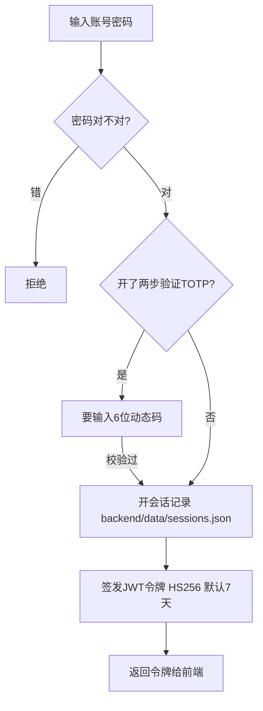
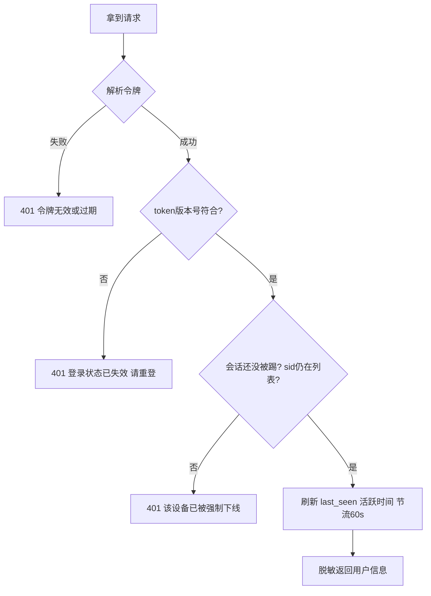

# 03 登录与鉴权

> 大白话主线：把「登录面板」想成进一家高级健身房。你得先办卡（注册/初始账号）、每次出示会员卡（令牌）进门、卡能单独作废（踢人）、也能因为改密码把整叠旧卡失效。

对应文件：`backend/app/auth.py`。账号、密钥、会话都存成文件，放在 `backend/data/`。

## 一、密码怎么存

- 用 **bcrypt** 哈希算法存，不是明文。而且只取前 **72 字节**——这是 bcrypt 的硬上限，超过会直接报错，所以代码里显式截断兜底，防止有人传个超长密码把接口打挂。
- **默认密码**是 `admin123`。面板会盯住这个：任何地方（创建、重置、改密码）都不许再用回默认密码。
- 签名用的密钥 `data/secret.key` 第一次运行自动生成一长串随机数，并设成只有自己能读（chmod 600）。

## 二、登录流程

**JWT 令牌里带啥**：用户名（`sub`）、一个版本号（`tv`）、签发/过期时间、和一个会话 ID（`sid`）。这是后面所有鉴权的核心。

## 三、之后每一次请求怎么验身份

前端每次请求都带上 `Authorization: Bearer <token>`，后端校验链如下（`get_current_user`）：

- **版本号撤销机制**：改密码、注销、或管理员强制重置时，会把这个用户的 `token_version + 1`。这样他之前签的所有旧令牌因为版本号对不上直接集体失效——不用维护黑名单，非常省事。
- **单设备踢出机制**：登录时在 `sessions.json` 里记一条并生成 `sid`。要「踢掉某台设备」，只需删掉那条 `sid` 记录；此后这个令牌验 `session_active(sid)` 时就说不在了，返回「该设备已被强制下线」。
- **在线判定用 last_seen 而不是登录时间**：一个人开着面板会持续发请求，每次都刷新 `last_seen`。如果超过 `GRAW_SESSION_ONLINE_SECONDS`（默认 2 小时）没动静，就算「离线」，从在线列表里清掉。这样避免了「人都关机了还显示在线」的假象。
- **节流**：刷新 `last_seen` 不是每次请求都写盘，同一会话 60 秒内最多写一次，避免磁盘狂写。

## 四、权限分级

| 级别 | 谁能访问 | 典型接口 |
|------|---------|---------|
| `PROTECTED` | 登录即可 | 系统概览、备忘录、登录历史 |
| `ADMIN` | 必须管理员（且已改密） | 文件、终端、计划任务、Docker、防火墙…… |

- `require_admin` 内部已经自动级联「必须是登录用户 + 必须不是默认密码」，你不需要重复声明。
- **强制改密**：`require_non_default_password` 是实时去比对当前密码哈希是不是默认密码，哪怕有人手动清了 `must_change_password` 标志也能拦住。这是为了堵住有些脚本把密码重置回默认密码的路。
- **WS 鉴权用 `?token=`**：浏览器的 WebSocket 没法加 `Authorization` 头，所以用查询参数 `?token=...` 传令牌。`get_current_user_ws` 负责普通登录连接，`get_current_user_ws_admin` 还会额外要求「必须是管理员且已改密」（防止用终端绕过默认密码拦截）。

## 五、两步验证（TOTP）

- 用标准 RFC 6238 的 TOTP，不依赖第三方服务，代码自己算 6 位动态码。
- 用户可绑定 Google Authenticator / 1Password 等 App；登录时除了密码还要输 6 位码。
- 校验时允许 ±1 个时间窗口容忍时钟偏差，并且用「常量时间比较」防时序侧信道。

## 六、拿到客户端真实 IP

- 直接部署：取 socket 对端 IP（`request.client.host`）。
- 反之若配了反向代理（`TRUSTED_PROXY_DEPTH > 0`）：从 `X-Forwarded-For` 里从右往左数第 N 个地址取真实 IP。这个头由可信代理追加，**不配的情况下完全忽略 XFF**，防止客户端伪造 IP 绕过限流或审计。

## 七、会话表（sessions.json）的坑

- 每次都先做「裁剪」：token 超过有效期（`created_at + TTL`）或超时空闲的会话会被清掉，防止表无限膨胀。
- 传统无 `sid` 的旧令牌（老版本签发）会被「补一条稳定会话」，保证这些正在使用的账号也能在在线列表里看到。
- 所有会话记录写入都走**原子写**（写 `.tmp` 再 `os.replace`），避免并发写串。

> 一句话：身份靠「bcrypt 密码 + JWT 令牌」，撤销靠「版本号 + 会话ID」，在线靠「最近活跃时间」，三层一起保证安全和体面。

---

## 更新记录
- `2026-08-24`：拆分为独立文件，用大白话讲透登录、令牌、撤销、权限分级与两步验证。