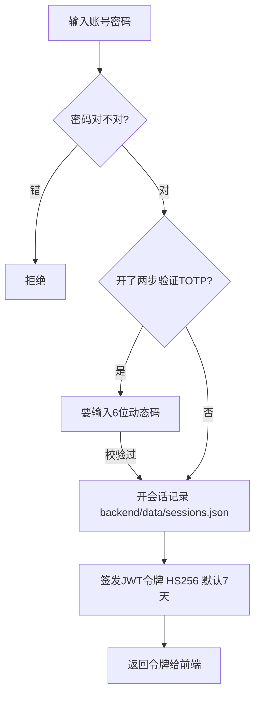
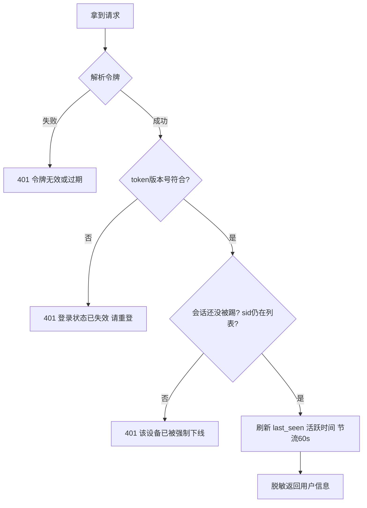
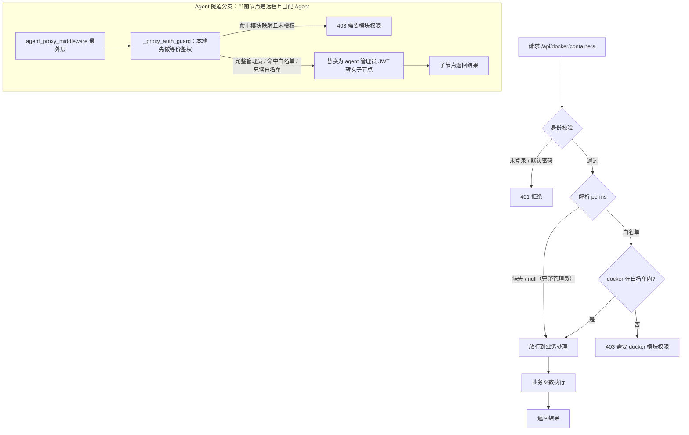

# 03 登录与鉴权

> 大白话主线：把「登录面板」想成进一家高级健身房。你得先办卡（注册/初始账号）、每次出示会员卡（令牌）进门、卡能单独作废（踢人）、也能因为改密码把整叠旧卡失效。

对应文件：`backend/app/auth.py`。账号、密钥、会话都存成文件，放在 `backend/data/`。

## 一、密码怎么存

- 用 **bcrypt** 哈希算法存，不是明文。而且只取前 **72 字节**——这是 bcrypt 的硬上限，超过会直接报错，所以代码里显式截断兜底，防止有人传个超长密码把接口打挂。
- **默认密码**是 `admin123`。面板会盯住这个：任何地方（创建、重置、改密码）都不许再用回默认密码。
- 签名用的密钥 `data/secret.key` 第一次运行自动生成一长串随机数，并设成只有自己能读（chmod 600）。

## 二、登录流程


```mermaid
flowchart TD
    A[输入账号密码] --> B{密码对不对?}
    B -- 错 --> Z[拒绝]
    B -- 对 --> C{开了两步验证TOTP?}
    C -- 是 --> C1[要输入6位动态码]
    C1 -- 校验过 --> D
    C -- 否 --> D
    D[开会话记录 backend/data/sessions.json] --> E[签发JWT令牌 HS256 默认7天]
    E --> F[返回令牌给前端]
```

**JWT 令牌里带啥**：用户名（`sub`）、一个版本号（`tv`）、签发/过期时间、和一个会话 ID（`sid`）。这是后面所有鉴权的核心。

## 三、之后每一次请求怎么验身份

前端每次请求都带上 `Authorization: Bearer <token>`，后端校验链如下（`get_current_user`）：


```mermaid
flowchart TD
    S[拿到请求] --> A{解析令牌}
    A -- 失败 --> E[401 令牌无效或过期]
    A -- 成功 --> B{token版本号符合?}
    B -- 否 --> F[401 登录状态已失效 请重登]
    B -- 是 --> C{会话还没被踢? sid仍在列表?}
    C -- 否 --> G[401 该设备已被强制下线]
    C -- 是 --> H[刷新 last_seen 活跃时间 节流60s]
    H --> I[脱敏返回用户信息]
```

- **版本号撤销机制**：改密码、注销、或管理员强制重置时，会把这个用户的 `token_version + 1`。这样他之前签的所有旧令牌因为版本号对不上直接集体失效——不用维护黑名单，非常省事。
- **单设备踢出机制**：登录时在 `sessions.json` 里记一条并生成 `sid`。要「踢掉某台设备」，只需删掉那条 `sid` 记录；此后这个令牌验 `session_active(sid)` 时就说不在了，返回「该设备已被强制下线」。
- **在线判定用 last_seen 而不是登录时间**：一个人开着面板会持续发请求，每次都刷新 `last_seen`。如果超过 `GRAW_SESSION_ONLINE_SECONDS`（默认 2 小时）没动静，就算「离线」，从在线列表里清掉。这样避免了「人都关机了还显示在线」的假象。
- **节流**：刷新 `last_seen` 不是每次请求都写盘，同一会话 60 秒内最多写一次，避免磁盘狂写。

## 四、权限分级

| 级别 | 谁能访问 | 典型接口 |
|------|---------|---------|
| `PROTECTED` | 登录即可 | 系统概览、备忘录、登录历史 |
| `ADMIN` | 必须完整管理员（且已改密） | 多节点、SSH 密钥、插件安装、面板更新、面板备份 |
| `PERM("模块")` | 该模块在授权范围内（受限管理员按白名单） | 文件、终端、Docker、网站、防火墙…… |

- `require_admin` 内部已经自动级联「必须是登录用户 + 必须不是默认密码」，你不需要重复声明。
- `require_perm("模块")` 是模块级权限依赖（见第八节），同样级联上述两道校验；它只在**管理员身份之上做收窄**，不是管理员一律 403。
- **强制改密**：`require_non_default_password` 是实时去比对当前密码哈希是不是默认密码，哪怕有人手动清了 `must_change_password` 标志也能拦住。这是为了堵住有些脚本把密码重置回默认密码的路。
- **WS 鉴权用 `?token=`**：浏览器的 WebSocket 没法加 `Authorization` 头，所以用查询参数 `?token=...` 传令牌。`get_current_user_ws` 负责普通登录连接，`get_current_user_ws_admin` 额外要求「必须是管理员且已改密」，`require_perm_ws("模块")` 则把「必须是管理员」换成「必须拥有该模块权限」。

## 五、两步验证（TOTP）

- 用标准 RFC 6238 的 TOTP，不依赖第三方服务，代码自己算 6 位动态码。
- 用户可绑定 Google Authenticator / 1Password 等 App；登录时除了密码还要输 6 位码。
- 校验时允许 ±1 个时间窗口容忍时钟偏差，并且用「常量时间比较」防时序侧信道。

## 六、拿到客户端真实 IP

- 直接部署：取 socket 对端 IP（`request.client.host`）。
- 反之若配了反向代理（`TRUSTED_PROXY_DEPTH > 0`）：从 `X-Forwarded-For` 里从右往左数第 N 个地址取真实 IP。这个头由可信代理追加，**不配的情况下完全忽略 XFF**，防止客户端伪造 IP 绕过限流或审计。

## 七、会话表（sessions.json）的坑

- 每次都先做「裁剪」：token 超过有效期（`created_at + TTL`）或超时空闲的会话会被清掉，防止表无限膨胀。
- 传统无 `sid` 的旧令牌（老版本签发）会被「补一条稳定会话」，保证这些正在使用的账号也能在在线列表里看到。
- 所有会话记录写入都走**原子写**（写 `.tmp` 再 `os.replace`），避免并发写串。

> 一句话：身份靠「bcrypt 密码 + JWT 令牌」，撤销靠「版本号 + 会话ID」，在线靠「最近活跃时间」，三层一起保证安全和体面。

## 八、受限管理员（RBAC 模块级权限）

**为什么要有**：以前只有 `admin` / `user` 两档，管理员权限「全有或全无」——想让运维只管理「网站 + 日志」，就只能给他完整管理员（连带文件管理和 Web 终端，等于给了等同于 RCE 的能力）。现在可以在管理员身份之上再按**模块**收窄。

**数据长什么样**（`data/users.json` 每条记录多一个字段）：

```json
{ "username": "ops1", "role": "admin", "perms": ["sites", "logs"] }
```

判定的四条规矩：

| perms 的取值 | 含义 |
|---|---|
| 字段缺失 / `null` | **全量权限**（完整管理员；升级前创建的老账号就是这种，行为完全不变） |
| 模块数组 | 白名单：只放行列出的模块 |
| `[]` | 什么都不放行（可用于临时冻结账号） |
| 类型非法（被手工改坏） | 按空集合处理 —— 取最严，防止配置损坏反而放大权限 |

**后端怎么拦**（`backend/app/auth.py`）：

- `user_perms(user)` 解析白名单（非管理员恒为空集合）；`has_perm(user, *模块)` 是「任一命中即放行」，供聚合窗口这类多模块场景使用。
- `require_perm("模块")` 是依赖工厂（HTTP 用），`require_perm_ws("模块")` 是 WebSocket 版（`?token=` + 默认密码拦截 + 模块判定）。
- 路由组用法：`app.include_router(xxx.router, dependencies=PERM("docker"))`，其中 `PERM()` 只是把单个依赖包成列表（`include_router` 要求 dependencies 是序列）。
- 模块清单唯一来源是 `auth.MODULES`（26 个 key），前端通过 `GET /api/auth/modules` 拉取渲染，避免前后端两份清单漂移。
- **面板自身安全边界不参与模块授权**，始终要求完整管理员（`main._FULL_ADMIN_PREFIXES`）：用户管理、多节点、SSH 密钥、插件安装、面板更新、面板备份、界面设置、安全入口等。

**Agent 隧道这条特殊路径**（最容易漏的地方）：经隧道把请求转发给子节点时，`Authorization` 会被替换成 agent 的**管理员** JWT，子节点不会（也无法）按主面板的模块白名单拦截。所以 `agent_proxy_middleware` 在代理**之前**必须先在主面板本地做完等价的模块判定——`_proxy_perm_map()` 在首次使用时遍历路由依赖树，把 `require_perm` 携带的 `__perm_modules__` 汇总成「`/api/<前缀>` → 模块」映射，受限管理员访问未授权模块直接 403；没有模块映射的路径（只读监控/备忘录等）只放行只读白名单，其余默认拒绝（默认闭合）。

**前端怎么配合**（体验层，真正的边界在后端）：

- 登录响应里的 `user.perms` 存进 `store/auth`；`hasPerm(...模块)` 与后端 `has_perm` 语义一致（`null` = 全量放行）。
- `App.vue` 的快捷方式清单带 `perm` 声明（省略表示不受模块限制）。**按产品约定：不按模块隐藏入口**——受限管理员同样能看到全部功能入口，只是点开无权限模块时由 `openWindow()` 弹「该用户无此权限」提示条并**不打开窗口**（避免出现空白窗口）。桌面图标、面板模式侧边栏、Ctrl+K 全局搜索都取 `visibleShortcuts`，所以三个入口行为天然一致。
- 聚合窗口内部同理：如 ShunX 安全中心的标签**不隐藏**，切到无权限标签时仅在标签内显示「该用户无此权限」（`ShunxSecurityWindow.vue` 的 `TAB_GATE` / `tabAllowed()`）。
- `fullAdminOnly` 标记的面板自身功能（如账号管理、界面设置）仍对受限管理员隐藏——它们不属于「模块」，而是面板自身安全边界。

**启动期自检**：`main._audit_route_perms()` 会扫描所有路由，找出「仍要求完整管理员、又没登记为面板自身边界」的接口并打 warning —— 新增路由若忘记从 `ADMIN` 换成 `PERM(...)`，它会提醒你，避免漏挂导致该模块对受限管理员全量开放。

**兜底约束：必须保留一个完整权限的超级管理员**（`routers/auth.py`）：受限管理员做不了用户管理 / 插件 / 更新等面板自身操作，所以系统里必须始终存在至少一个 `role=admin` 且 `perms` 为空（全量）的账号。用户管理接口在**改角色、收窄 `perms`、删除账号**时都会统计「完整权限超级管理员」数量（`_super_admin_count()`，受限管理员不计入），一旦会把最后一个改没就返回 400「必须保留至少一个完整权限的超级管理员」。只在「原本还有、却被本次变更清零」时拦截（数据本就异常时不阻断修复）。


```mermaid
flowchart TD
    A[请求 /api/docker/containers] --> B{身份校验}
    B -- 未登录 / 默认密码 --> E1[401 拒绝]
    B -- 通过 --> C{解析 perms}
    C -- "缺失 / null（完整管理员）" --> F[放行到业务处理]
    C -- "白名单" --> D{docker 在白名单内?}
    D -- 否 --> E2["403 需要 docker 模块权限"]
    D -- 是 --> F
    F --> G[业务函数执行]
    G --> H[返回结果]

    subgraph X[Agent 隧道分支：当前节点是远程且已配 Agent]
      I[agent_proxy_middleware 最外层] --> J["_proxy_auth_guard：本地先做等价鉴权"]
      J -- 命中模块映射且未授权 --> E3["403 需要模块权限"]
      J -- 完整管理员 / 命中白名单 / 只读白名单 --> K["替换为 agent 管理员 JWT 转发子节点"]
      K --> L[子节点返回结果]
    end
```

---

## 更新记录
- `2026-08-24`：拆分为独立文件，用大白话讲透登录、令牌、撤销、权限分级与两步验证。
- `2026-10-01`：新增第八节「受限管理员（RBAC 模块级权限）」——`users.json` 新增 `perms` 白名单字段（缺失/null = 全量，兼容存量账号），后端 `require_perm` / `require_perm_ws` 依赖工厂 + `MODULES` 模块清单，路由组改用 `PERM("模块")`；Agent 隧道代理前用 `_proxy_perm_map()` 做等价的模块判定（子节点侧拿的是 agent 管理员令牌，拦不住）；前端 `hasPerm()` + 快捷方式 `perm` 声明统一门控三处入口；启动期 `_audit_route_perms()` 自检漏挂路由。第四节权限分级表同步更新。
- `2026-10-01`（修订）：按产品约定**入口不再按模块隐藏**——受限管理员可见全部功能入口，点开无权限模块时前端提示「该用户无此权限」且不打开窗口（`App.vue` 的 `openWindow()` / ShunX 聚合窗口的标签级提示）；新增「必须保留一个完整权限的超级管理员」兜底约束（`_super_admin_count()`，改角色 / 收窄权限 / 删除账号时校验）。