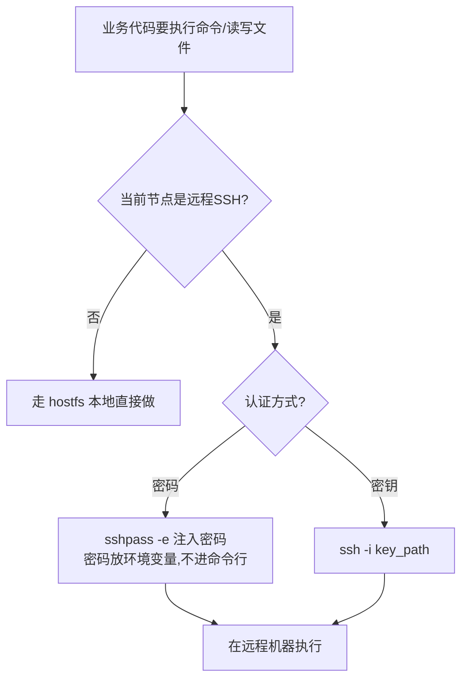
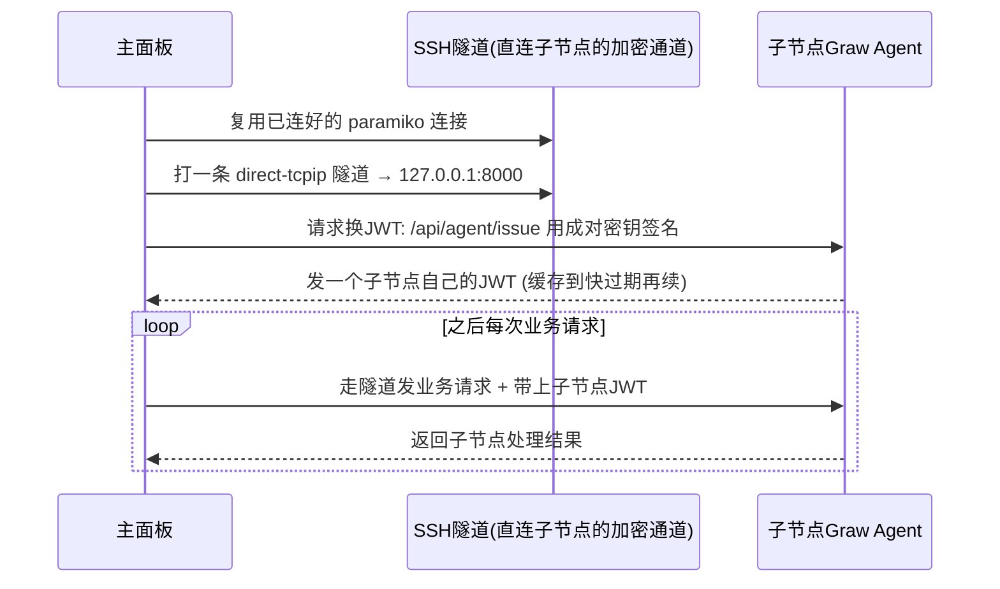

# 04 多节点与 Agent 隧道

> 大白话主线：把「一台面板」比作一个**总台**，它有俩本事把远端机器拉进来一起管：
> 1. **SSH 节点**——远程是一台「光杆服务器」（没装面板），总台通过 SSH 直接指挥它干活。
> 2. **Agent 隧道**——远程是一台装了完整 Graw 的「子节点」，总台不走公网、而是通过一条加密隧道，像掏自家内网一样访问子节点的面板接口。

对应文件：`node_manager.py`（节点层）、`agent_client.py`（隧道客户端）、`agent_auth.py`/`agent_cfg.py`（子节点侧鉴权与开关）。

## 第一部分：SSH 节点（管「裸服务器」）

### 节点怎么存

- 所有节点信息存在 `backend/data/nodes.json`，里面标了「当前选中节点」（`current`）。
- 本地节点永远存在，id 是 `local`。SSH 节点由管理员增删改。
- 给前端看的节点信息是**脱敏**的——只告诉网页「有没有配密码」（`has_password`）、有没有配掉 Agent（`agent_enabled`）、Agent 端口是多少，**绝不回传密码/密钥本身**。

### 当前到底在管哪台机器？（优先级）

每当要干活，先问「现在该操作谁」。`get_current_node()` 的答案优先级是：

**请求级节点（请求头里的 `X-Graw-Node`，线程私有）** > **全局选中的当前节点（`current`）**

这个设计的好处：不同窗口可以并行访问不同子节点——比如 A 窗口在管服务器甲、B 窗口在管服务器乙，互不冲突。每个请求线程干净隔离，用完就复位。

### 干活时怎么分本地/远程

业务代码不直接碰系统，而是统一走一套「当前节点感知」的工具函数（`host_cmd`、`host_shell`、`host_which` 以及一批文件操作原语），它们自己判断：

- 本地节点 → 直接调 `hostfs`（宿主文件系统适配层，保留容器的 `/host` chroot 语义）。
- 远程节点 → 把命令打过去用 SSH 执行。

### SSH 连接池（性能关键）

- 如果用 paramiko（纯 Python 的 SSH 库），每次重头建连要 3 秒左右，太慢。
- 所以做了**连接池**：按 `node_key(host,port,user)` 缓存已经连好的 client 复用它。多个窗口要访问不同节点就各存各的，互不干扰。容量上限 16，超过就把最久没用的踢掉。
- 节点被删/改密码改了，只丢掉对应那一台的连接，其余在途访问不受影响。

### SSH 安全（防注入）

SSH 会把 `-oProxyCommand=...` 之类当成参数执行。万一 host/user 字符串以 `-` 开头或带空格，就会被 ssh 误解析成额外选项，变成**命令注入**。所以入口处用正则强校验：host 只能主机名/IP 的字符、user 只能常规 POSIX 用户名、key_path 不能带换行/NUL，不合法就直接拒绝。

## 第二部分：Agent 隧道（管「装了 Graw 的子节点」）

子节点是完整 Graw。如果让子节点的面板端口直接暴露公网，谁都可能闯进来，不安全。所以要做成「不开放公网口，主面板走隧道访问」：

具体步骤：
1. **复用 SSH 连接**：从连接池拿连接到子节点的那条 paramiko client。
2. **打通隧道**：用 SSH 的 `direct-tcpip` 通道，把请求送进子节点本机的 `127.0.0.1:<agent_port>`（默认 8000）。这条通道是从你已有的 SSH 加密会话里剥出来的，全程加密，且无需打洞公网。
3. **换子节点 JWT**：第一次访问前，用**成对密钥**（`agent_key` + `agent_secret`，对 `ts|nonce` 做 HMAC-SHA256 签名）去访问子节点 `/api/agent/issue` 换一个子节点承认的 JWT。按节点缓存，剩余不够 `TOKEN_RENEW_MARGIN`（300 秒）就提前续期。
4. **带票干活**：之后的业务请求都加上 `Authorization: Bearer <子节点JWT>`。

### 关键安全与开关

- **换 JWT 不看面板登录**：`/api/agent/issue` 用的是机器间的「成对密钥」，它验证的是「这个机器人是不是真主面板」，而不是某个真人用户——这是机器对机器鉴权。
- **角色定死为 admin**：子节点签发的 JWT 角色**固定是 admin**，写在子节点代码里、由子节点侧强制，不接受请求方自报（早期用过的 `GRAW_AGENT_ROLE` 环境变量已不再读取）。这条是为了防越权——拿到成对密钥也只能换到既定角色。
- **隧道落点是子节点本机**：隧道打到的地址是子节点的 `127.0.0.1:<agent_port>`（默认 8000），复用已有的 SSH 加密会话，所以**子节点不需要把 Agent 端口暴露到公网**，防火墙上只要放行 SSH 端口即可。
- **热开关**：子节点「收取模式」存在 `data/agent.json`，可以设置界面随时开关，不用重启也不用改环境变量。没开启时 `/issue` 直接返回 404。

## 第三部分：能力门控（什么功能不能在远端用）

见 `remote_cap.py`。记住一句话：**SSH 节点是光杆服务器，只有「host 类」功能能用；「local 类」功能只在本机有效。**

- **host 类**（可在远端用）：进程、文件、Docker、磁盘、日志、终端、系统监控、防火墙、服务监控、体检、工具箱、批量操作。
- **local 类**（远端裸机禁用，403）：`LOCAL_PREFIX` 里列全了——sites / databases / cron / ssl / protection / runtime / tasks / appstore / backup / netstorage / notify / uptime / webstats / rewrite / sitesopts / waf / tamper / phpversions / ftpusers / sshkeys / certcheck / panelbackup / update / webmode / loginlog / plugins / op。它们依赖面板本地的 `data/*.json` 或自建基础设施，对一台裸远程主机没意义。

配套的两个细节：

- **配了 Agent 就不一样了**：这些接口只是「远程裸机」上没意义；一旦远端装了完整 Graw 且配好 Agent，请求在外层 Agent 代理层就被送进子节点执行了（对子节点来说它自己就是本机），不会再撞上这层门控。前端的判断同样如此：远端 + `agent_enabled` 为假才禁用 local 类应用。
- **哪些请求根本不代理**：`main.py` 的 `_AGENT_PROXY_EXCLUDE_PREFIX` 里那几类（auth/nodes/terminal/agent/ui/shunx/health/batch/gitdeploy/portforward）永远留在主面板执行——批量命令要同时指挥多台机器、Git 部署要按配置里的节点分发、端口转发隧道建在主面板与节点之间，都不该丢给某一个子节点。详见 02-请求生命周期与中间件.md。

这套门控属于「纵深防御」：前端早就把对应按钮藏了，后端再兜底拦一次。

> 一句话：想管一台装好 Graw 的服务器，就给它配 Agent 走加密隧道进它内网；想管一台光杆服务器，就用 SSH 直接指挥它。这两条路拼成了「一台面板管一片」的能力。

---

## 更新记录
- `2026-09-25`：修正「子节点 JWT 角色由 `GRAW_AGENT_ROLE` 决定」的过时说法（现固定 admin）；补上「隧道落点是子节点本机、Agent 端口无需暴露公网」；补齐 `remote_cap.LOCAL_PREFIX` 全量清单，并说明「远端配好 Agent 后 local 类可在子节点执行」与「哪几类请求永不代理」。
- `2026-08-24`：拆分为独立文件，用大白话讲清 SSH 节点、Agent 隧道与能力门控。