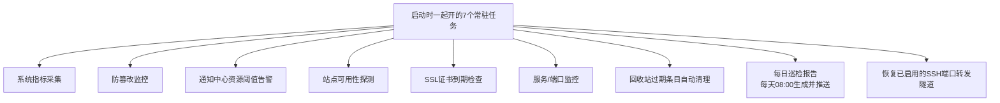

# 05 数据存储与后台任务

> 大白话主线：Graw 「不装数据库」，它把配置、密码、凭据全用 **JSON 文件** 存在 `backend/data/` 文件夹里。后台还跑着几个常驻小任务，负责持续盯系统状态、发告警。

## 一、数据存在哪、怎么保护

所有东西都在 `backend/data/`，用文件组织。别小看这些文件，里面装的是**存取服务器的大权**（SSH 密码、数据库密码、JWT 密钥），所以要格外小心：

| 文件 | 存了什么 |
|------|---------|
| `users.json` | 用户列表、bcrypt 密码哈希、角色、token 版本号、是否开两步验证 |
| `secret.key` | 给 JWT 签名的密钥（第一启动自动生成） |
| `sessions.json` | 在线会话：会话ID、用户、IP、设备、创建时间、最近活跃时间 |
| `nodes.json` | 节点清单（含 SSH 凭据）、当前管理哪个节点 |
| `ssh_known_hosts.json` / `sshkeys.json` | SSH 主机指纹记录 / 面板生成或导入的部署密钥 |
| `agent.json` | 子节点收取模式开关与配置 |
| `plugins.json` + `plugins/<插件ID>/config.json` | 插件注册表（只存令牌哈希）与总开关 / 各插件的持久化配置 |
| `recycle.json` | 回收站开关、自动清理天数 |
| `login_logs.json` / `login_known.json` | 登录历史 / 常见登录 IP 基线（用于异地登录提醒） |
| `databases.json` / `ftp_users.json` / `netstorage.json` / `frp.json` | 各类连接凭据（数据库、FTP、网络储存、内网穿透） |
| `sites.json` / `sites_names.json` / `sitesopts_external.json` / `waf.json` / `webserver.json` | 网站清单、外部站点名、站点增强、WAF 配置、Web 引擎模式（Nginx/OpenResty） |
| `protection.json` / `firewall.json` / `cron.json` / `backup.json` / `svcmonitor.json` / `certcheck.json` / `uptime.json` | 防护、防火墙、计划任务、备份、服务监控、证书与可用性监控配置 |
| `appstore.json` / `tasks.json` / `runtime.json` | 应用商店设置、任务中心长线任务、运行时容器记录 |
| `reports/`、`config_snapshots/` | 每日巡检报告（按文件名轮转留 30 份）、写 nginx/防火墙前的配置快照 |

两道防线：

1. **启动时收紧权限**（`_secure_data_dir`）：Linux 上把 `data/` 目录设成 0700、里面文件设 0600——只有面板自己能读写，邻居用户偷不走。Windows 上 chmod 没意义，静默跳过。
2. **原子写**：写配置不是直接改原文件，而是先写一个 `.tmp`，再用 `os.replace` 覆盖。这样即使中途断电/崩溃，也不会有「写了一半的坏文件」，最多是旧文件完好无损。

## 二、后台常驻任务都在干嘛

这 7 个协程在启动时一起开、关停时一起停（配对启停，防止泄漏）；另有每日巡检报告协程与「恢复 SSH 端口转发隧道」两件启动动作：

| 任务 | 大白话它在干嘛 |
|------|---------------|
| **系统指标采集** | 定时取 CPU/内存/磁盘/网络，喂给首页三张仪表盘（通过一条公共 WebSocket 流共享，省资源） |
| **防篡改监控** | 盯着网站文件，一旦被非法改动就自动备份回滚并在线告警 |
| **通知中心** | 盯着 CPU/内存/磁盘有没有超过你设的阈值，超了就按渠道（Webhook/Telegram/钉钉/企业微信/Server酱/邮件）推送 |
| **站点可用性** | 定期探你监控的网站/服务通不通，宕机或恢复都通知你 |
| **证书到期** | 每天检查 SSL 证书还剩多少天，快过期/已过期就提醒你续 |
| **服务/端口监控** | 检查你自定义的监控项——某端口、某进程、或某个 systemd 服务是死是活，做个状态看板 |
| **回收站过期清理** | 每小时遍历本地+所有 SSH 节点的回收站，把超过保留天数（默认 30 天）的条目物理删除；开关与天数在「设置→回收站」维护 |
| **每日巡检报告** | 每天 08:00 汇总「资源 24h 概览 / 证书临期 / 服务监控异常 / 站点可用性异常 / 告警统计」五段，写成报告留 30 份并推到通知渠道；任一段失败只降级该段，不影响整份报告 |
| **SSH 端口转发恢复** | 面板重启后，把上次标记为启用的转发条目重新拉起来（本地监听强制 127.0.0.1，绝不暴露公网） |

> 约定：以后要加新的常驻监控，必须在 `lifespan()` 的启动区和停止区**同时**登记，否则协程永远挂着不回收。报告与隧道的收尾分别在 `reporting.stop_daily()` 和 `portforward.stop_all()` 里完成。

## 三、生产静态文件托管

- 前端 `npm run build` 后输出 `frontend/dist`，后端会自动检测并挂载。
  - `/assets` 下的静态资源直接给；
  - 其它非 `/api/*` 的路径做 **SPA 回退**：都返回 `index.html`，让前端根据地址栏自己决定显示登录页还是安全入口门禁。
- 安全细节：回退前会检查路径经过 `commonpath` 确保没穿越出 `dist` 目录（防目录穿越）；如果是其他盘符的绝对路径会抛 `ValueError`，代码里捕获掉，别让一个非法路径把请求搞成 500。
- `/api/*` 但没命中的路由直接返回 404，绝不误回退到前端页面。

> 一句话：数据全是 JSON 文件、权限收紧、写入原子化；后台几个常驻协程负责持续盯梢和告警。

---

## 更新记录
- `2026-09-25`：补齐启动阶段的两项动作「每日巡检报告」「SSH 端口转发隧道恢复」；数据文件清单扩到当前实际落盘范围（插件注册表、巡检报告、配置快照等）。
- `2026-08-27`：后台常驻任务新增「回收站过期条目自动清理」（第 7 个协程，见 07-文件管理与回收站.md）。
- `2026-08-24`：拆分为独立文件，用大白话讲清数据存储与后台常驻任务。