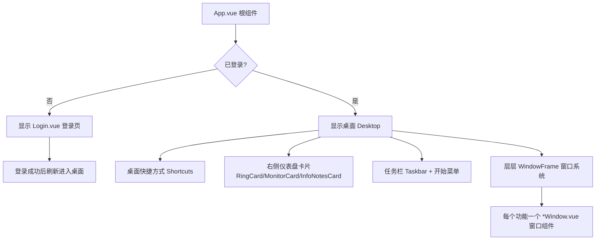
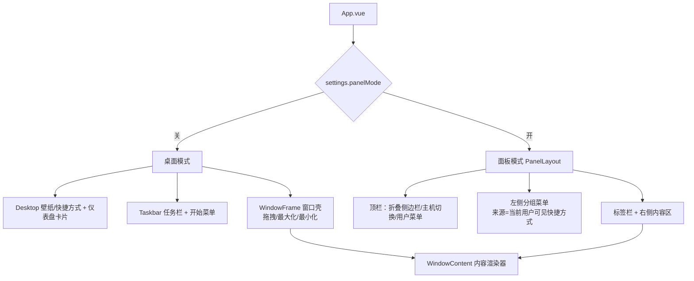

# 06 前端界面逻辑

> 大白话主线：把整个面板想成你的**电脑桌**——开机进桌面（登录进面板）、桌上有图标（功能快捷键）、点了竖屏出一个「窗口」（功能页面）、底部有任务栏管理这些窗口。前端这套「桌面系统」是用 Vue 3 手撸的。

对应目录：`frontend/src/`。

## 一、入口长啥样

`main.js` 只做一件事：用 `createApp(App).use(i18n)` 挂载根组件 `App.vue`，并注入多语言。

`App.vue` 是桌面的根，它判断你登录了没：

## 二、桌面 UI 组件

- **Desktop**：整个桌面环境（壁纸可以是视频或图片轮播）。
- **Taskbar**：底部任务栏 + 开始菜单。开始菜单里有账号管理、改密码、设置、反馈、退出登录。
- **WindowFrame**：窗口框架，支持**拖拽、最大化、最小化**。每个打开的功能窗口都是通过 `<component :is="w.component" v-bind="w.props"/>` 动态渲染出来的。
- **每个功能 = 一个独立窗口组件**：`frontend/src/components/windows/*Window.vue`，比如 DockerWindow、SitesWindow、FirewallWindow、DatabasesWindow…… 一个功能一个窗口，打开后互不干扰。

新增一个功能页的套路：新建一个 `XxxWindow.vue`，在桌面的快捷方式里注册入口，就能像开窗一样打开了。

## 三、状态管理（没有 Pinia）

Graw 特意**不用 Pinia**，而是用 Vue 的 `reactive` 单例，放在 `src/store/*.js`：

- `store/auth.js`：登录态、token、是否管理员（提供 `setAuth/clearAuth/isAdmin`）。
- `store/desktop.js`：桌面快捷方式 / 窗口列表。
- `store/requestNode.js`：当前聚焦窗口绑定的「目标节点」（多面板功能的关键）。
- `store/docker.js`、`store/systemMetrics.js`、`store/siteBus.js` …：各业务模块的数据。

> 约定：要继续加全局状态，就新建一个 `store/xxx.js` 导出 `reactive` 对象，别引入 Pinia。

## 四、窗口与「目标节点」的关系（重点）

Graw 最有意思的地方：**每个窗口可能管的是不同的服务器**。

- 打开一个窗口时（比如 Docker 窗口），前端会记住「这个窗口当时聚焦的是哪台机器」，写进 `store/requestNode.js`。
- 窗口**打开/聚焦**时会**同步**下发这个目标节点——换句话说，A 窗口管甲机、B 窗口管乙机，各自对各自的机器发请求。
- **切换主机后要立刻重置请求节点**，否则后续请求可能还用旧的节点，导致「在新机器上却还在操作旧机器」。

> 一句话：前端用「窗口绑节点」的方式，实现一个面板界面里同时管多台机器的体验。

## 五、怎么调后端接口

统一走 `src/api.js`（封装好的 Axios）：

- **请求拦截器**：自动加两样头 → 登录令牌 `Authorization: Bearer <token>` + 目标节点 `X-Graw-Node`（从 `requestNode` 读）。这样后端知道「你是谁」和「你在管哪台机器」。
- **响应拦截器**：
  - 收到 401 且本地有 token → 登录失效，自动退出回登录页。
  - 收到「必须修改默认密码」的 403 → 退出登录去走强制改密流程。

## 六、国际化

- 用 `vue-i18n`，所有文案都放在 `src/locales/*.js`，目前**共 22 个语言包**（zh-CN / zh-TW / en / ja / ru / es / de / fr / pt / ko / eo / ar / arz / egy / ga / vi / el / pl / it / la / bo / za）。
- 模板里**不硬编码中文**，全部走 `$t('app.someKey')`，方便多语言和统一维护。
- 统一由 `src/locales/index.js` 管理：
  - `LANGUAGES` 是支持语言清单（code + 该语言的自称），设置页的语言下拉直接读它；
  - 启动时按 `settings.locale` 初始化，`normalizeLocale()` 把非法/未知的 code 一律回退到简体中文，`fallbackLocale` 也是简体中文（缺键不会显示成 key 字符串）；
  - `setLocale()` 切换语言时同步写回 `settings.locale`（自动落盘 localStorage）并更新 `<html lang>`；
  - `postTranslation` 钩子 `applyBracketStyle()`：古埃及语等「括号约定」语言包（`BRACKET_LOCALES`）的文案统一写成 `本语言书写形式 (中文原文/拉丁转写)`，按用户在设置里的偏好动态裁掉或保留括号注释，语言包本身不用改。
- 仓库里还有两个检查脚本：`scripts/check-i18n-keys.mjs`（key 有没有写漏、写多，防止界面出现「没翻译的白屏」）和 `scripts/check-imports.mjs`（检查漏 import——并发改同一个文件时最容易出这种错，会让前端直接白屏）。

> 一句话：前端是手撸的桌面系统，靠「窗口 + 桌面积目 + 任务栏」交互，靠「reactive 单例」管状态，靠「窗口绑节点」实现多机同管。

---

## 更新记录
- `2026-09-25`：国际化一节补齐到 22 个语言包的实现细节；追加「双界面形态」与「全局快捷搜索」两节。
- `2026-08-24`：拆分为独立文件，用大白话讲清前端桌面界面、状态管理与接口调用。

### 桌面快捷方式：隐藏与固定（2026-08-29 追加）

- 桌面快捷方式支持**右键菜单**：`隐藏`（桌面移除，设置里可恢复）与 `固定到任务栏`（常驻入口，窗口开着时点击聚焦/最小化）。
- 偏好存 localStorage（`store/desktopPrefs.js`）：`perUser` 开关控制「仅当前用户生效」——
  - 关闭（默认）：隐藏/固定列表存全局 key `graw_desktop_prefs`；
  - 开启：改用用户级 key `graw_desktop_prefs_u_<username>`，各账号互不干扰。
- 任务栏新增**固定区**：在窗口列表前渲染 `pinnedShortcuts`（按固定顺序匹配 App.vue 的 shortcuts 定义），点击走 `openPinned()`（未开则 openWindow，已开则聚焦/最小化，兼容 foxcode 特例）。
- 「设置 → 桌面应用」区块：可恢复隐藏的应用、取消任务栏固定、切换仅当前用户。设置窗口内的展示名映射 `DESKTOP_SC_DEFS` 需与 App.vue 的 shortcuts 清单保持同步。

### 双界面形态：桌面模式 ↔ 标准面板模式（2026-09-25 追加）

同一套功能，前端给了**两种壳**：默认是「类桌面」（窗口 + 任务栏），也可以在「设置 → 界面」里打开**标准面板模式**（1Panel 风格侧边栏），即改即生效。

- **开关与持久化**：`store/settings.js` 的 `panelMode`（是否面板模式）与 `panelTabs`（是否多标签），存在 localStorage，改完立即切换，不需要刷新。
- **布局**：`PanelLayout.vue` = 顶栏 + 左侧分组菜单 + 可选标签栏 + 右侧内容区。顶栏的「主机徽标」点开就是节点列表（仅管理员可见），选一个即切换当前管理主机——对应桌面模式的任务栏主机切换。
- **内容区挂载策略**：一次只挂载「激活窗口」的组件。开多标签（`panelTabs`）时用 `KeepAlive` 缓存失活窗口的组件实例——DOM 卸载但**组件状态与 WebSocket 连接保留**，切回标签即恢复现场；关掉多标签就是单页切换，切走即销毁重建。
- **两种壳共用一套内容**：`WindowContent.vue` 同时被桌面模式的 `WindowFrame` 插槽和面板模式的内容区复用；侧边栏/用户菜单产生的 `open(key)` 事件回到 App.vue 的 `openWindow`（带 adminOnly / 远端 local 类门控），标签点击走 `focusWindow`（同步 `activeWindowId` 与请求节点），关闭走 `handleCloseWindow`（含未保存确认）。
- **注意**：面板模式下约 50 个 `openXxx` 事件不是 PanelLayout 自己声明的，而是 `inheritAttrs:false` 后统一经 `$attrs` 透传给内容区的 WindowContent——新增窗口事件时别只改桌面那条链路。

### 全局快捷搜索（Ctrl+K，2026-09-25 追加）

- 组件是 `CommandPalette.vue`（Spotlight 风格弹层），快捷键 **Ctrl+K / ⌘K** 全局唤起（`App.vue` 的 `onPaletteGlobalKey`），输入即过滤。
- 功能入口来自 `paletteItems`——由 `visibleShortcuts` 换算而来，所以**桌面上的门控（管理员限定、被隐藏、远端无 Agent 时的 local 类）在搜索里同样生效**；节点/站点/容器这类动态数据由 CommandPalette 组件内部自行拉取。
- 选中后统一走 `openWindow(key)`，而 `openWindow` 内部本来就带 `adminOnly` + `remoteCap` 两层守卫，因此「从搜索里绕过限制打开应用」这条路是堵死的。