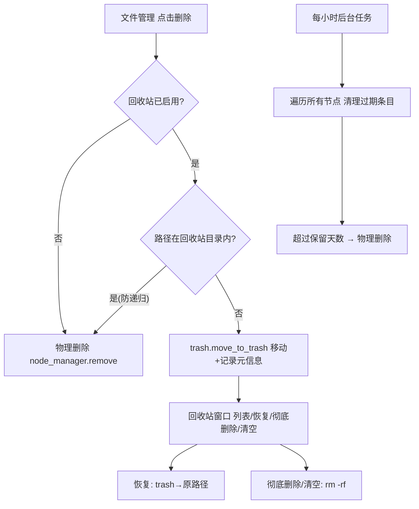
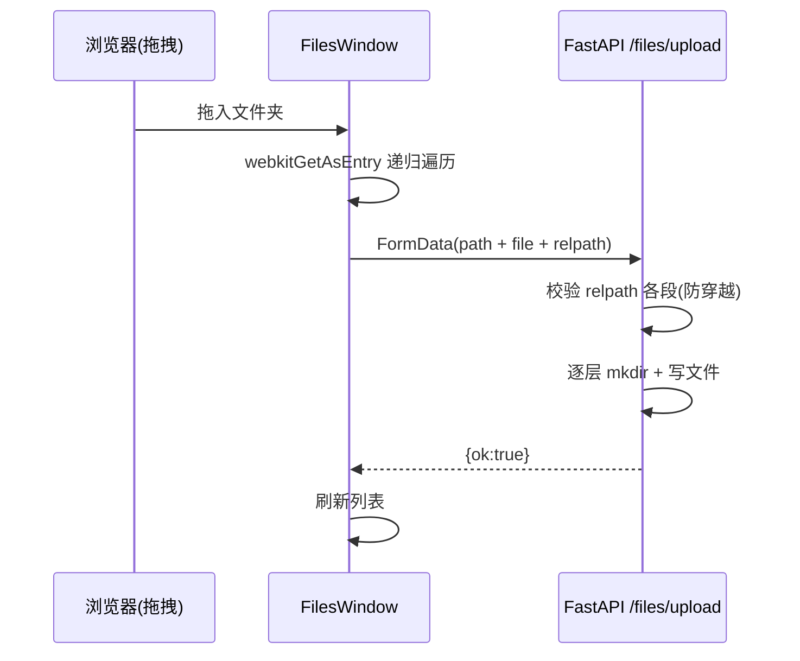

# 07 文件管理与回收站

> 大白话主线：文件管理支持浏览/上传/下载/编辑/压缩/解压/复制/粘贴/重命名/删除等日常操作。删除的文件默认不再直接消失，而是进「回收站」，30 天后自动清理；复制粘贴复刻了 Windows 的「剪贴板」习惯；拖拽上传连整个文件夹都能按原目录结构传上去。

## 一、回收站（本轮新增）

### 1. 业务背景

以前「删除」就是真的删，手一抖就没了。现在默认开启**回收站**：

- 在「文件管理」里删除的文件/文件夹 → 移入回收站（同一主机的隐藏目录，改名 `*(2)*(3)` 防冲突），可随时**恢复**。
- 恢复 = 把文件再从回收站移回原路径（原目录已不存在 / 原路径撞名 / 原路径是面板数据目录时会拒绝）。
- 也支持单条**彻底删除**和**一键清空**。
- 到期自动删除：默认保留 30 天，**每小时**后台扫一遍所有节点，把过期的条目物理删除（可在设置里关掉或改天数）。

### 2. 开关与配置

三个配置项存在面板端 `backend/data/recycle.json`（原子写）：

| 配置 | 默认 | 含义 |
|------|------|------|
| `enabled` | `true` | 是否启用回收站。关闭后删除 = 直接物理删除 |
| `auto_delete` | `true` | 是否到期自动删除 |
| `auto_delete_days` | `30` | 保留天数（1~365） |

界面入口：开始菜单 → 「设置」→「回收站」区块（仅管理员可见）。

### 3. 运行逻辑



### 4. 关键文件与函数

| 文件 | 作用 |
|------|------|
| `backend/app/trash.py` | 回收站核心（非路由）：配置读写、回收站目录定位、移入/恢复/删除/清空、过期清理、`start_auto_purge()/stop_auto_purge()` 后台协程 |
| `backend/app/routers/recycle.py` | `/api/recycle` 路由：`config`(读/写)、`list`、`restore`、`delete`、`empty` |
| `backend/app/routers/files.py` | `/api/files/delete` 改为「回收站启用时移入回收站」；`list` 隐藏回收站目录 |
| `frontend/src/components/windows/RecycleBinWindow.vue` | 回收站窗口（恢复/彻底删除/清空/刷新） |
| `frontend/src/components/windows/SettingsWindow.vue` | 回收站设置区块（开关/保留天数） |
| `frontend/src/api.js` | `recycleApi` |

### 5. 数据持久化

- 面板配置：`backend/data/recycle.json`（原子写）。
- 回收站目录（**宿主机视角**，随被管理主机走）：
  - 远程 SSH 节点 / 本地 Linux（含 Docker `/host`）：`/var/lib/graw-trash`
  - 本地 Windows：`%LOCALAPPDATA%\graw-trash`
- 元信息：`<回收站目录>/.graw_trash.json`，记录每个条目 `{id, original, trash, deleted_at, deleted_by}`。恢复/清理全靠它，**trash 路径必须落在回收站目录内**（后端强校验，防元信息被篡改后越权删任意文件）。
- 回收站目录在文件管理列表里**隐藏**，并且对回收站目录内的路径删除会直接物理删除（防递归回收）。

### 6. 多节点与安全

- 该模块路由挂在 `ADMIN`，随 `/api/files` 同一节点语义（操作当前管理主机）；元信息读写走 `node_manager` 原语，天然支持本地/远程两态。
- 后台清理协程已登记进 `main.py` 的 `lifespan()`（启动区 `recycle.start_auto_purge()` / 停止区 `recycle.stop_auto_purge()`，配对启停）。
- 写配置用「临时文件 + os.replace」原子写；不向客户端回传回收站原始内容。

### 7. 易踩的坑

- 移动用「宿主机视角」路径 + `node_manager.host_path()` 换算真实路径，**千万别在本地 Docker 下再拼一次 `/host`**（会得到 `/host/host` 双前缀）。
- 恢复时要先检查原路径父目录是否还在、原路径是否已存在，避免恢复失败或互相覆盖。
- 自动清理是**每小时**扫一次 + 打开回收站列表时也顺带清一次过期条目；没到点不会实时清。

---

## 二、文件管理：复制 / 粘贴（复刻 Windows）

### 运行逻辑

- 右键菜单「复制到…」→ 改为 **「复制」**：不再弹路径输入框，而是把选中条目路径放进**全局共享剪贴板**（`store/fileClipboard.js` 响应式单例，**跨文件管理窗口生效**——在窗口 A 复制，切到任意其它文件管理窗口粘贴）。
- 文件**多选**：单击选中、`Ctrl+点击` 累加/取消、`Shift+点击` 范围选中、`Ctrl+A` 全选、右键未选中文件自动转为单选（类 Windows）。
- 在目标目录**空白处右键** → 「粘贴/全选/新建…」；右键**目录条目** → 「粘贴到此处」：把剪贴板全部条目复制进该目录。
- `Ctrl+C` 复制选中集、`Ctrl+V` 粘贴、`Delete`/`Backspace` 删除选中集（批量删除逐个执行并汇总错误）。
- 同名冲突由后端自动解决：目标已存在时自动生成 `名称 (2).ext`（Windows 同款命名）。
- 后端 `/api/files/copy` 顺带加了防呆：**不能把目录复制进它自己里面**（无限递归）。

```mermaid
flowchart TD
    A[选中/右键 复制] --> B[剪贴板: 记录源路径]
    B --> C[目标目录右键 粘贴 / Ctrl+V]
    C --> D[api copy src→dst]
    D --> E{dst 已存在?}
    E -- 是 --> F[自动改名为 名称 (2).ext]
    E -- 否 --> G[直接复制]
    G --> H[刷新列表]
    F --> H
```

### 关键点

- 前端 `FilesWindow.vue`：多选选中集（`selected`）、空白处右键菜单、选中高亮、键盘快捷键；剪贴板在 `store/fileClipboard.js`。
- 后端 `files.py /copy`：`_unique_dst()` 自动去重 + 目录自复制防护；返回实际目标路径 `dst`。
- 注意：复制/粘贴目前仅作用于**当前管理主机**（与文件管理其它操作一致）。

---

## 三、文件管理：拖拽文件 / 文件夹上传修复

### 之前的问题

拖「整个文件夹」进窗口会报错：老代码只读 `dataTransfer.files`，浏览器对文件夹给的是不可读的 File 对象（size 0），后端收到后报错。

### 现在的做法

- 优先用 `DataTransferItem.webkitGetAsEntry()` **递归遍历**文件夹（Chrome/Edge/Firefox），把每个文件连同相对路径 `子目录/文件名` 收集起来；
- 逐个上传时在 FormData 里带上 `relpath` 字段；
- 后端 `/api/files/upload` 新增可选 `relpath`：逐段校验（拒绝 `.` / `..` / 空段，防路径穿越）后在目标目录下**逐层建目录**再落盘；
- 不支持的浏览器自动降级成原来的「只传文件」行为，不报错。



### 关键点

- 上传接口 `relpath` 为空时行为与之前完全一致（工具栏单文件上传不受影响）。
- 文件名仍用 `os.path.basename` 消毒后再落盘；目录层级只取 relpath 的父级段。

---

## 更新记录
- `2026-08-27`：新增回收站（删除进回收站、恢复/彻底删除/清空、到期自动清理、设置开关）；文件管理「复制到」改「复制」+ 右键「粘贴」、选中态与 Ctrl+C/Ctrl+V/Delete 快捷键、后端复制自动去重；拖拽文件夹递归上传修复（relpath）。