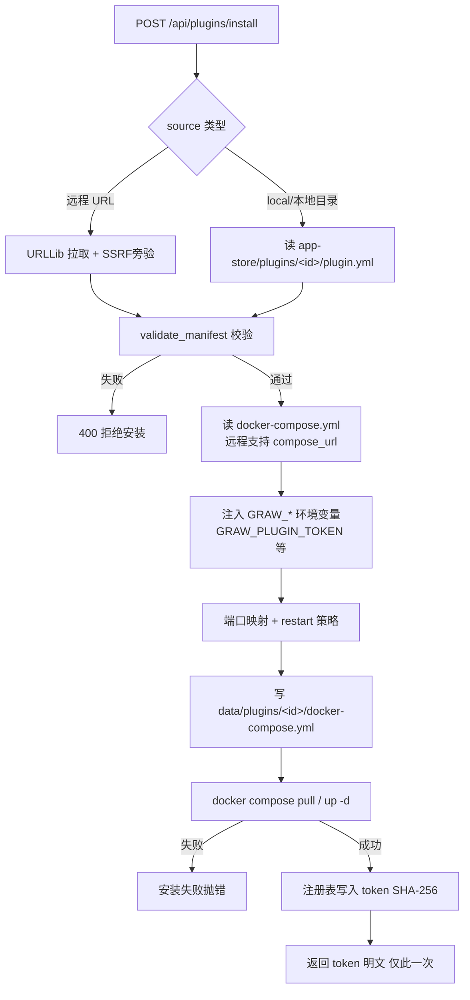
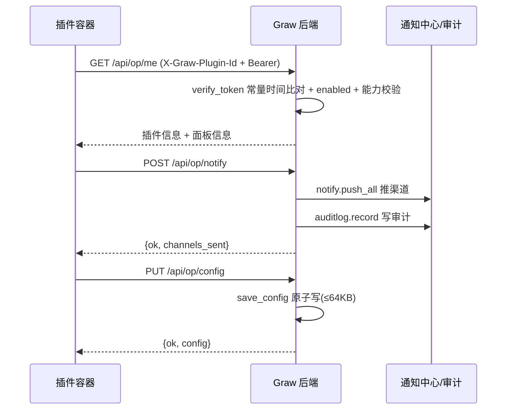

# 08 应用接口开放协议（GPOP）

> 大白话主线：Graw 不再只是「面板装 Docker 应用」，还定义了一套**插件化开发标准**——第三方开发者写一个 `plugin.yml` 清单 + 一个 `docker-compose.yml`，就能做出一个「插件形式的应用」装进 Graw。面板负责安装/启停/卸载/注册，并通过环境变量把一个「访问令牌」注入插件容器；插件凭令牌调用面板的开放接口（查面板信息、发通知、写审计、存配置），实现与面板的双向深度集成。

## 一、业务背景

- 以前的应用商店（`app-store`）是**纯 Docker 分发**：面板只负责 `docker compose up -d`，容器与面板之间没有通信协议。
- 本次新增**应用接口开放协议（Graw Plugin Open Protocol, GPOP v1）**：给第三方应用一个标准化的「接入面板」规范——清单描述 + 生命周期管理 + 令牌鉴权 + 能力白名单 + 开放接口。
- 运行形态：插件依然是 Docker Compose 应用（复用应用商店的 compose 执行链路，兼容 Docker/Podman），区别在于额外获得「面板注入的令牌」与「调用面板开放接口的能力」。

## 二、运行逻辑（文字）

### 1. 总体数据流

```
开发者打包插件包（plugin.yml + docker-compose.yml）
        │
        ▼
管理员 POST /api/plugins/install {id, source, panel_url, port...}
        │  ① 读取清单（本地示例目录 or 远程 URL，远程走 SSRF 防护）
        │  ② validate_manifest 校验（必填字段/ID白名单/能力白名单/版本口径）
        │  ③ 读取 docker-compose.yml（远程可显式 compose_url）
        │  ④ 注入 GRAW_PLUGIN_ID / GRAW_PLUGIN_TOKEN / GRAW_PANEL_URL 环境变量
        │  ⑤ 端口映射（请求 port 或清单 entry.port）
        │  ⑥ 写 data/plugins/<id>/docker-compose.yml
        │  ⑦ docker compose pull + up -d
        ▼
写入注册表 data/plugins.json（token 只存 SHA-256 哈希）→ 返回 token 明文（仅此一次）
        │
        ▼
插件容器内读取环境变量 → 凭令牌调用 GET /api/op/*（面板开放接口）
```

### 2. 鉴权与门控

| 接口 | 鉴权 | 说明 |
|------|------|------|
| `/api/plugins/*`（管理：install/start/stop/restart/uninstall/rotate-token/list/protocol） | `ADMIN` | 挂全局管理员依赖 |
| `/api/op/*`（开放：me/notify/audit/config/protocol） | 端点内部自定义 | `X-Graw-Plugin-Id` + `Authorization: Bearer <token>` 双头校验；令牌哈希常量时间比对 |
| `/api/op/protocol` | 免鉴权 | 协议握手信息，供插件端确认兼容性 |
| `remote_cap` | `/api/plugins`、`/api/op` 属 local 类 | SSH 远端节点下被门控（纵深防御，与 appstore 同级） |

### 3. 令牌与能力模型

- 安装/轮换时 `secrets.token_urlsafe(32)` 生成；面板只存 SHA-256，不回存明文。
- `verify_token(plugin_id, token)` 用 `hmac.compare_digest` 常量时间比对。
- `capabilities` 白名单：`panel_info` / `notify` / `audit` / `config`，清单未声明则对应开放接口 403。
- 未启用（enabled=false）的插件，开放接口一律 403。

### 4. 清单校验要点（validate_manifest）

- 必填：`id / name / version / description`；`api_version` 必须 `<= 面板支持版本`。
- `id` 白名单正则（字母数字开头，仅 `字母/数字/_/-/.`，≤64），且与安装请求 `id` 强一致（防目录穿越）。
- **未知字段直接丢弃**（不透传，防投毒清单夹带 `privileged` 等）。
- `capabilities` 只保留协议已知能力；字符串限长；`version` 字形校验。
- 远程 `compose_url` 仅放行 http/https（安装侧 `_assert_public_http_url` 二次 SSRF 校验）。

### 5. 开放接口明细（插件视角）

| 端点 | 能力 | 作用 |
|------|------|------|
| `GET /api/op/protocol` | 免鉴权 | 协议版本/能力清单 |
| `GET /api/op/me` | `panel_info` | 插件信息 + 面板基本信息（时间/时区） |
| `POST /api/op/notify` | `notify` | 推送到面板通知中心（复用 `notify.push_all`），并写审计 |
| `POST /api/op/audit` | `audit` | 写面板操作审计日志（用户记作 `plugin:<id>`） |
| `GET/PUT /api/op/config` | `config` | 插件自有持久化配置（≤64KB，落盘 `data/plugins/<id>/config.json`） |

## 三、流程图

### 1. 插件安装流程



### 2. 插件调用开放接口时序



## 四、关键文件与函数

| 文件 | 作用 |
|------|------|
| `backend/app/plugin_protocol.py` | 协议核心（无 FastAPI 依赖，便于单测）：清单校验 `validate_manifest`、令牌 `generate_token/hash_token/verify_token/rotate_token`、注册表 `register_plugin/unregister_plugin/update_plugin_status`、配置 `load_config/save_config` |
| `backend/app/routers/plugins.py` | `router`（`/api/plugins` 管理接口）+ `op_router`（`/api/op` 开放接口）；复用 appstore 的 compose 执行与 SSRF 防护 |
| `backend/app/main.py` | 注册两段路由（管理挂 ADMIN / 开放内部鉴权） |
| `backend/app/remote_cap.py` | 新增 local 前缀 `/api/plugins`、`/api/op` |
| `backend/test_plugin_protocol.py` | 26 个单测（清单/令牌/注册表/配置/开放接口鉴权/管理接口门控） |
| `docs/plugin-protocol.md` | 面向开发者的完整协议文档（v1） |
| `plugin-examples/hello-graw/` | 官方示例插件（plugin.yml + compose + server.py，演示握手/通知/配置） |

## 五、数据持久化

- 注册表：`backend/data/plugins.json`（`{api_version, plugins: {id: {...}}}`，**原子写**，token 只存哈希）。
- 插件项目目录：`backend/data/plugins/<id>/docker-compose.yml`。
- 插件自有配置：`backend/data/plugins/<id>/config.json`（≤64KB，原子写）。
- 环境变量注入发生在 compose 渲染阶段，令牌明文仅安装/轮换响应返回一次。

## 六、安全约束与易踩的坑

- **锁必须是 RLock**：`register_plugin` 在持锁状态调 `_load_registry()`（内部再次 acquire 同一把锁），用非重入 `Lock` 会死锁（agent_cfg 曾踩过同样的坑，此处复用教训）。
- 令牌哈希 ≠ 令牌明文：`update_plugin_status` 禁止覆盖 `id` / `token_hash`；轮换令牌必须走 `rotate_token`（直接改注册表）。
- 清单来源不可信（远程 index 可被投毒）：未知字段丢弃 + ID 白名单 + 能力白名单 + URL 仅 http/https + 安装侧 SSRF 二次校验。
- 安装后响应里的明文 token 只出现一次，前端要提示管理员妥善保存；遗失走 `rotate-token` 重新获取。
- `/api/op/protocol` 是唯一免鉴权开放端点，只暴露协议元信息，不泄露任何业务数据。
- 测试隔离：单测必须把 `PLUGINS_FILE` 和 `DATA_DIR` 都指到临时目录，否则 `save_config` 会污染真实 `data/plugins/`。

## 更新记录

- 2026-08-29 新增「08 应用接口开放协议」：GPOP v1 首次落地，含插件清单/令牌/能力模型、管理接口 `/api/plugins`、开放接口 `/api/op`、示例插件 hello-graw 与 26 个单测。
- 2026-08-29 更新：新增**插件功能总开关**（设置 → 插件）。开关持久化于 `data/plugins.json` 顶层 `enabled`；
  关闭后 `main.py` 启动时**不再注册插件业务/开放路由**（真正不加载插件代码），仅 `settings_router`（`GET/PUT /api/plugins/settings`）始终注册以便重新开启；
  修改开关需重启面板完全生效。路由注册改为 `plugin_protocol.is_enabled()` 条件化。