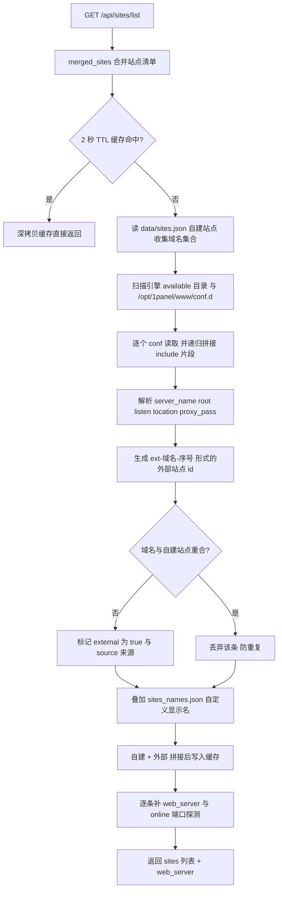
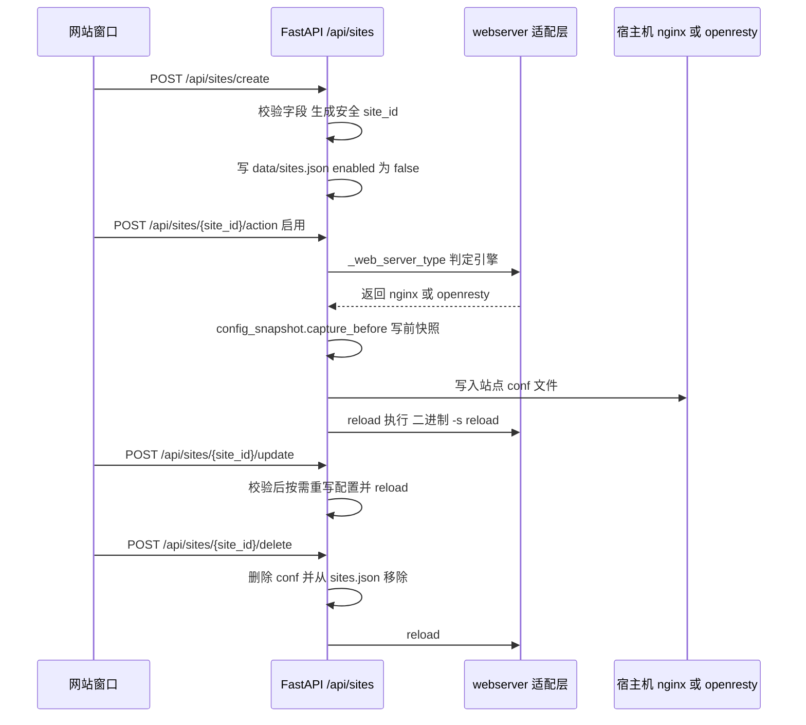
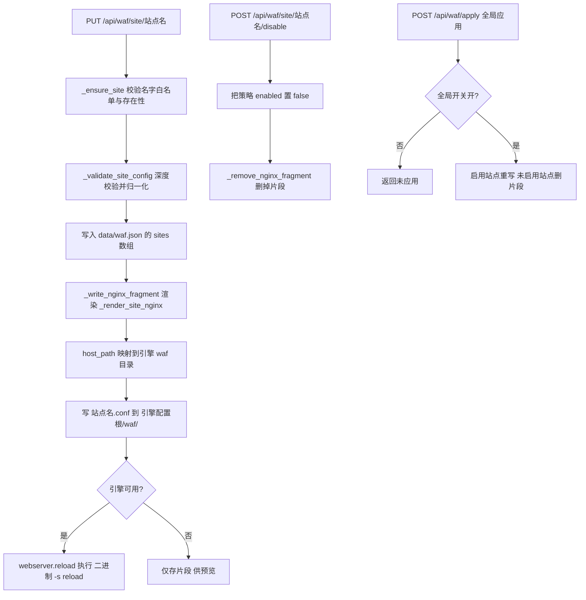

# 09 网站管理与 WAF

> 大白话主线：Graw 的「网站」不只是自己建的站点，还能把服务器上**已经存在的真实站点**（典型的如 1Panel 用 OpenResty 建的站）识别出来一起管。为了让这两拨站点都能改、都能生成 nginx 配置，面板把所有跟 Web 引擎有关的差异（Nginx 还是 OpenResty、二进制叫什么、配置目录在哪、reload 用哪条命令）都收拢到一个适配层里。站点之上再挂四件事：WAF（站点防火墙）、伪静态、站点增强（防盗链 / gzip / 缓存）、访问统计。

## 一、业务背景

- 很多用户手上本来就有一个**已经在跑的网站环境**（1Panel、宝塔、手工装的 OpenResty），域名、证书、反代都在里面配好了。
- 如果 Graw 只认自己 `data/sites.json` 里建过的站点，那么「网站」窗口里会空空如也——真实站点看不见、改不了，用户就得在两个面板之间来回切，还得手工对 nginx 配置，改错一步站点就挂。
- 所以本模块的目标是：**自建站点（面板管）与外部真实站点（配置管）都能看、都能改**。面板对自建站点是「数据 → 生成配置」；对已存在的真实站点是「反向解析配置 → 回写同一份配置」，做到改动真实生效、又不动别人的目录结构。
- 另一个绕不过去的现实：Nginx 和 OpenResty 是「同一套配置格式、不同的安装布局」。原生 nginx 是 `/etc/nginx` + `nginx -s reload`；OpenResty 是 `/usr/local/openresty/nginx/conf` + `openresty -s reload`。写死一个路径，切到另一个就全废。因此有了 `webserver.py` 这层适配。

## 二、站点的两种来源与合并

### 1. 来源一：面板自管站点（`data/sites.json`）

- 存在 `backend/data/sites.json` 里，一个 JSON 数组，字段大概是 `id / name / type / domains / root / port / ssl / reverse_proxy / locations / protocol / upstream / subdomain / domain / enabled / created_at`。
- 四种类型（`sites.py` 里的常量）：`static` 静态网址、`proxy` 反向代理、`tcpudp` TCP/UDP 代理、`subsite` 子网站。
- 新建时 `enabled` 默认 **false**——先落数据，等用户在右键菜单里「启用」时才真正生成配置文件。
- 站点 `id` 会直接当配置文件名（`<id>.conf`），所以创建时把名称规范化成 `[a-z0-9_-]`；中文等无法 ASCII 化的站名退化成 `site-<名称 sha1 前 10 位>`，既安全又允许中文站名。

### 2. 来源二：外部真实站点（解析 nginx conf）

不是存出来的，是**扫出来的**。核心函数 `_discover_existing_sites()`：

- 先由 `_existing_site_dirs()` 给出要扫描的目录，每个目录带 `source` 标签：
  - `{"path": webserver.available_dir(), "source": "nginx"}`——当前引擎的标准 `sites-available` 目录；
  - `{"path": "/opt/1panel/www/conf.d", "source": "1panel"}`——1Panel 的站点目录（前端据此打「1Panel兼容」标签）。
- 逐个 `.conf` 走 `_resolve_site_conf()` 读内容，并把配置里 `include` 的片段**递归拼进来**（1Panel 会把反代配置写成 `include /www/sites/.../proxy/*.conf;`，这是容器内视角，所以代码把 `/www/sites/` 映射成 `/opt/1panel/www/sites/` 再 glob 读取）。
- 然后用一组小解析函数从文本里抠信息：
  - `_parse_server_name()` 取 `server_name` 第一个名字；
  - `_parse_listen()` 取 `listen` 端口，默认 80；
  - `_parse_root_dir()` 取 **server 块级别**的 root（先把 location 块挖掉再取，避免误取 `/.well-known` 里的 root）；
  - `_parse_proxy_pass()` 只在「根路径 `location /` 且块内真有 `proxy_pass`」时才算反向代理——否则静态站点里一个 `/api` 子路径的反代会把整站误判成代理；
  - `_iter_location_blocks()` 用逐字符数花括号的方式切 location 块（保留 location 套 location 的嵌套）。
- 生成的站点带两个关键标记：`external: true`、`source`（`nginx` / `1panel`），另外还有 `config_file`（宿主机视角的真实 conf 路径，回写时用）。
- 外部站点 id 由 `_ext_site_id(server_name, index)` 生成，形如 `ext-域名-序号`，避免与自建站点 id 撞车。

### 3. 两者怎么合并去重（`merged_sites()`）

`merged_sites()` 是「网站」列表、WAF 下拉、站点增强下拉**共用**的站点清单：

1. 读 `data/sites.json` 拿自建站点，收集它们的全部域名（小写）成 `builtin_domains`；
2. 调 `_discover_existing_sites()` 拿外部站点，**凡是域名命中 `builtin_domains` 的整条丢弃**（同一个域名不该出现两遍）；
3. 叠加自定义显示名：读 `data/sites_names.json`，按外部站点 id 覆盖 `name`；
4. 结果 = 自建 + 外部，写入 **2 秒 TTL 缓存**（`_MERGED_CACHE_TTL = 2.0`）。返回前对每条做 `dict()` 浅拷贝，防止调用方改污染缓存。
5. 缓存失效靠 `_invalidate_merged_cache()`——凡是改站点数据、改外部站点显示名的地方都会调它（`_save_sites()` / `_save_external_names()` 里已内建）。

> 为什么要缓存：站点发现是「读文件 + glob + 解析配置」，在 Agent/SSH 场景下还挺重，而列表、WAF、增强下拉会短时间内连着调好几次。2 秒 TTL 既省事，又保证配置变更 2 秒内一定生效。

### 4. 外部站点名怎么持久化、增强配置存哪

- **显示名**：外部站点的 name 每次发现都会从真实配置「复原」，所以用户改的名字不能写在发现结果里。改名单独存 `data/sites_names.json`（`{外部站点 id: 显示名}`），`merged_sites()` 时再叠加上去。
- **增强配置**（防盗链 / gzip / 缓存）：自建站点直接写在 `sites.json` 对应条目上；外部站点写在 `data/sitesopts_external.json`（`{外部站点 id: opts}`），避免每次重新发现就丢配置。
- **WAF 策略**：独立在 `data/waf.json`，键是站点 **name**（不是 id），详见第五节。

## 三、Web 引擎模式（Nginx / OpenResty）

### 1. 模式存在哪、怎么判定

- 配置：`backend/data/webserver.json`，结构就是 `{"mode": "nginx" | "openresty"}`（`webserver.set_mode()` 白名单校验，非法值直接 `ValueError`）。
- 接口：`GET /api/webmode/status`（看模式与可用性）、`POST /api/webmode/mode`（切换）。
- 引擎判定分两层：
  1. `_web_server_type()`（在 `sites.py`）——**给业务决策用**。顺序是：OpenResty 模式且 `available(openresty)` 为真 → `"openresty"`；否则 `webserver.nginx_like_available()`（nginx 或 openresty 任一可用）→ `"nginx"`；再不行看 `apache2` / `httpd` → `"apache"`；Windows 上再探 IIS；最后 `"none"`。
  2. `webserver.available(engine)`——**给可用性判断用**。先 `host_which(命令名)`，再 `命令名 -v` 兜底，最后回退 `_container_has_engine()`。

### 2. Docker 里的 OpenResty 容器怎么认出来

1Panel 常把 OpenResty 跑在 Docker 容器里，宿主机根本没有 `openresty` 这个二进制。所以 `_container_has_engine()` 会通过 `node_manager.host_shell()` 执行 `docker ps --format '{{.Image}}'`（失败再试 `podman ps`），只要镜像名里出现 `openresty` 或 `nginx` 就算引擎可用。任何异常都静默按「不可用」处理，不抛错——状态展示不能被拖垮。

### 3. 切换模式后，sites / waf 怎么改路径与 reload

所有路径都由 `webserver.py` 动态解析（关键就是「别写死」）：

| 用途 | 函数 | nginx 模式 | openresty 模式 |
|------|------|-----------|----------------|
| 配置根目录 | `base_dir()` | `/etc/nginx` | `/usr/local/openresty/nginx/conf` |
| 站点可用目录 | `available_dir()` | `<base>/sites-available` | 同左（跟随 base） |
| 站点启用目录 | `enabled_dir()` | `<base>/sites-enabled` | 同左 |
| 主配置 | `conf_path()` | `<base>/nginx.conf` | 同左 |
| TCP/UDP 目录 | `stream_dir()` | `<base>/stream-enabled` | 同左 |
| stream include | `stream_include()` | `include <base>/stream-enabled/*.conf;` | 同左 |
| WAF 片段目录 | `waf_dir()` | `<base>/waf` | 同左 |
| reload | `reload()` | `nginx -s reload` | `openresty -s reload` |

- `binary()` 就是返回 `nginx` 或 `openresty`，`reload()` 实际执行 `host_cmd([binary(), "-s", "reload"])`。
- 路径都是**宿主机视角**，真正读写时统一走 `host_path()` 映射（容器 `/host` 挂载模式下加 `HOST_ROOT` 前缀，非容器模式原样）。不映射的话，容器里根本看不到宿主的 `/opt/1panel/www/conf.d`，外部站点会一条都发现不了。
- 站点配置生成逻辑对 nginx / openresty 是**同一套格式**（`_nginx_site_config()`），所以切模式不需要改业务代码；只有文件落到哪、reload 用哪条命令会变。
- 1Panel 场景还有两处特殊处理：
  1. `_apply_nginx_config()` 发现「OpenResty 模式 + 宿主机存在 `/opt/1panel/www/conf.d`」时，把 `<id>.conf` 直接写到这个 conf.d 目录（普通文件，无需软链），而不是 `sites-enabled`——因为容器只加载 conf.d，写 sites-enabled 会变成「配置写成功但站点读不到」。
  2. `_nginx_site_config()` 在 OpenResty 模式下若检测到 1Panel 默认证书（宿主 `/opt/1panel/apps/openresty/openresty/conf/ssl/fullchain.pem` 与 `privkey.pem` 都在），会**额外生成一个 443 ssl server**，复用容器内路径 `/usr/local/openresty/nginx/conf/ssl/fullchain.pem`，避免 CDN 走 https 回源落到默认 server 吃 404。

> 注意：`sites.py` 顶部的 `NGINX_AVAILABLE` / `NGINX_ENABLED` 和 `waf.py` 顶部的 `NGINX_WAF_DIR` 是导入期算一次的「兼容引用」，实际读写一律用 `webserver.enabled_dir()` / `webserver.waf_dir()` 动态解析——别拿这些常量去拼真实路径。

### 4. 站点清单怎么发现（含 Docker 容器内路径与站点级日志）

- 配置侧：见第二节，扫的是「引擎 `sites-available`」+「`/opt/1panel/www/conf.d`」。
- 日志侧（访问统计用，见第六节）：`webstats.py` 维护固定候选 + glob 候选：
  - 固定候选：`/var/log/nginx/access.log`、`/var/log/nginx/openresty/access.log`、`/usr/local/openresty/nginx/logs/access.log`、`/usr/local/nginx/logs/access.log`、`/opt/1panel/apps/openresty/openresty/log/access.log`（1Panel 的 OpenResty 容器挂到宿主的全局日志）、`/var/log/httpd/access_log`。
  - glob 候选：`/opt/1panel/www/sites/*/log/access.log`（1Panel **站点级**日志）、`/opt/1panel/wwwlogs/*.log`。
  - 探测时同样每个路径都过 `host_path()` 映射，再 `isfile` / glob 校验。

## 四、站点生命周期（增 / 改 / 启停 / 删 / 维护）

- **新建**（`POST /api/sites/create`）：查重名 → 补全反代协议 → `_validate_site_payload()` 全字段校验 → 生成安全 `site_id` → 静态站点/子网站按需 `os.makedirs` 建 root → 写入 `sites.json`，`enabled=false`。**此时不生成 nginx 配置。**
- **启用 / 停用 / 重启**（`POST /api/sites/{site_id}/action`，action 取 `enable/disable/start/stop/restart`）：`_web_server_type()` 判引擎，nginx 系调 `_apply_nginx_config()`（启用=写 conf，停用=删 conf）后 `_reload_nginx()`；apache 走 `_apply_apache_config()`（写 sites-available + 建 sites-enabled 软链 + `a2ensite` + `apache2ctl graceful`）。
- **更新**（`POST /api/sites/{site_id}/update`）：同样先校验。若 id 在 `sites.json` 里，按字段覆盖，**只在站点已启用时**重写配置并 reload；若 id 不在，则走外部站点分支 `_find_external_site()` 反查，改名写 `sites_names.json`，然后 `_apply_external_nginx_config()` **直接改写真实 conf 文件**（并且**不写回** `sites.json`——列表下次从真实配置重新发现，天然反映改动）。
- **删除**（`POST /api/sites/{site_id}/delete`）：**只允许删自建站点**（外部站点 `_find_external_site` 分支在删除接口里没有，找不到就 404），删 conf + reload + 从 `sites.json` 移除。
- **维护模式**（`POST /api/sites/{site_id}/maintenance`）：把站点切成「仅服务维护页」——生成 `_maintenance_nginx_config()`：只放行 `/ _mainten.html`，其余 `return 503` + `error_page 503` 指回维护页；维护页 HTML 存 `data/maintenance/<site_id>.html`，应用时写到站点 root 下的 `_mainten.html`；关闭维护即写回正常 conf 并清掉维护页和本地存档。
- **TCP/UDP 类型**走另一条线：`_nginx_stream_config()` 生成 `stream {}` 配置写到 `stream_dir()`，并用 `_ensure_stream_include()` 把 `include .../stream-enabled/*.conf;` **幂等注入** `nginx.conf`（插在 `events {}` 之后，保证在 http 块之外）。

## 五、WAF（站点级 Web 应用防火墙）

### 1. 两层开关 + 每站点策略

- **全局总开关**：`data/waf.json` 顶层 `enabled`，`GET /api/waf/status` 看、`POST /api/waf/toggle` 切。
- **每站点策略**：`data/waf.json` 的 `sites` 数组，一条就是一个站点的完整策略（结构见 `_default_site_config()`）：频率限制（access / attack / notfound 三类，模式 `url`/`global`）、十项防御规则（sql / webshell / directory / xss / param / ua / header / cookie / http / url）、自定义（上传大小上限、CDN 开关）、其他（恶意 IP 组、蜘蛛 IP 池）、黑白名单（IP / URL / UA / IP 组）、地区限制、自定义 ACL、等候厅。
- 接口：`GET /api/waf/site/{site_id}` 读（无策略返回默认结构）、`PUT /api/waf/site/{site_id}` 存、`POST /api/waf/site/{site_id}/disable` 停用、`GET /api/waf/preview` 预览、`POST /api/waf/apply` 全局重新应用。

> 重要细节：WAF 里的 `site_id` 实际是站点 **name**。`_site_exists()` 直接比 `s.get("name") == site_id`，配置文件也以它命名 `<name>.conf`，所以用 `_SITE_ID_RE`（`^[A-Za-z0-9][A-Za-z0-9._-]{0,63}$`）做白名单防穿越。

### 2. 站点列表必须用合并后的清单

`waf.py` 的 `_load_sites()` 优先 `from app.routers.sites import merged_sites` 拿**自建 + 外部**的合并清单，拿不到才退回直接读 `sites.json`。`GET /api/waf/sites` 再用 `_SITE_ID_RE` 过滤一次（外部配置里可能出现 `_` 通配这种非法文件名），保证下拉里全是「能安全落成 `<name>.conf`」的站点。这样「网站」里看得见的站点，WAF 里也一定能选中。

### 3. 片段怎么落到 nginx

- 渲染：`_render_site_nginx(cfg)` 只输出**该被 include 进 server 块**的指令（不含 server 包裹）：IP 黑白名单的 `allow/deny`、URL 黑白名单的 `location`、地区限制的 `if`、自定义 ACL（`_render_acl()`）、十项防御签名（`if ($request_uri ~* ...) { return 403; }` 合并输出）、CDN 关闭时的兜底、`client_max_body_size`、频率限制的 `limit_req` 与 429 兜底、等候厅的挑战页 location。
- `limit_req_zone` 必须在 `http {}` 上下文，所以渲染时只以注释形式附在片段末尾，并明确提示「首次启用需要手动复制到 http {}」。
- 落盘：`_write_nginx_fragment()` 把 `<站点名>.conf` 写到 `host_path(webserver.waf_dir())`，也就是 `<引擎配置根>/waf/`——nginx 模式是 `/etc/nginx/waf/`，OpenResty 模式是 `/usr/local/openresty/nginx/conf/waf/`。
- 生效：片段写成功后，引擎可用则 `_reload_nginx()`（内部就是 `webserver.reload()`）；引擎不可用时**只存片段供预览**，不报错。
- `POST /api/waf/apply` 是「全局重算」：全局开关关着直接返回未应用；开着则把所有 `enabled` 的站点重新写盘，其余站点删片段。

### 4. 拦截日志与拦截统计

- 日志存 `data/waf_logs.json`，写入接口是 `POST /api/waf/logs/record`（给外部流水线用，例如解析 nginx access/error 日志后上报）：记 `time / site / ip / rule / reason / action / geo`，**环形裁剪到最近 50000 条**。
- 查询 `GET /api/waf/logs`（按 site / action / ip 过滤，limit 1~1000，新的在前）、清空 `POST /api/waf/logs/clear`。
- 拦截地图 `GET /api/waf/blockmap`：统计近 N 天（1~90，默认 30）按地理位置的拦截分布。地理归属由 `_ip_to_geo()` 做**朴素兜底**——私有网段记「私有 IP」、回环记「本机回环」、公网按 IPv4 首字节分桶（北美/亚太/欧洲/中国互联…）；代码注释也写明生产建议接 MaxMind GeoLite2。

## 六、伪静态 / 站点增强 / 访问统计

三件事都挂在站点上，但各自写入的位置和生效方式不同。

### 1. 伪静态（`/api/rewrite`）

- 规则库是**后端硬编码白名单**（`_REWRITE_TEMPLATES`），共 8 套：WordPress、ThinkPHP、Laravel、Typecho、Discuz!、DedeCMS、帝国 CMS、ShopEx；每套同时给 nginx 片段和 apache 片段。用户只能选 id，**不能提交任意文本**，从源头断掉「伪静态 → nginx 注入」。
- 接口：`GET /api/rewrite/templates`（模板库）、`GET /api/rewrite/sites`（站点及当前伪静态状态）、`POST /api/rewrite/apply`、`POST /api/rewrite/clear`。
- 应用逻辑：只支持 `static` / `subsite` 类型（proxy / tcpudp 没有静态文件语义），把 `template_id` 写进站点数据的 `rewrite` 字段并保存 `sites.json`，然后当站点已启用时重生成配置并 reload。
- 真正生成时是 `sites._nginx_site_config()` 里读 `site["rewrite"]`，调 `rewrite.get_nginx_fragment()` 拿片段，缩进后**注入 server 块的 `location /`**（仅当没有自定义 locations 时）。

### 2. 站点增强（`/api/sitesopts`：防盗链 / gzip / 静态缓存）

- 凭证：`get_nginx_extra(site)` 读取站点上的 `hotlink / gzip / cache_expire` 三个字段生成片段，只对 `static` / `subsite` 生效；由 `sites._nginx_site_config()` 的 `_content()` 负责拼装注入，保证「站点数据 → 配置片段」只有这一条受控路径。
- 防盗链：`valid_referers` 白名单（`server_names`，可选 `none blocked` 允许直接访问），命中 `$invalid_referer` 返回 403；允许来源域名走 `_sanitize_domain()` 只放行合法域名（最多 32 个，去重）。
- gzip：`gzip on` + 固定 `gzip_types` 白名单（文本类资源）。
- 静态缓存：`_cache_expires()` 把秒数转成 `Xd / Xh / Xm`，上限 7 天（`MAX_CACHE_SECONDS = 86400 * 7`）。
- 自建站点写 `sites.json`；**外部站点写 `data/sitesopts_external.json` 并把改动回写真实 conf 文件**（`_apply_external_nginx_config`）。

### 3. 访问统计（`/api/webstats`：解析访问日志）

- 接口：`GET /api/webstats/logs`（可用日志路径）、`GET /api/webstats/analyze`（参数 `log_path` / `days` / `domain`）。
- 日志来源自动探测见第三节第 4 点：固定候选 + glob 候选，全部经 `host_path()` 映射后 `isfile` / glob 校验。
- 只读大日志的**尾部**（单文件最多 `_MAX_BYTES` = 200MB），`days > 1` 时还会把轮转日志 `access.log.1` 拼在前面补近两天数据。
- 解析：`_parse_line()` 用正则匹配 combined 格式；`_aggregate()` 输出 PV / UV（按 UA 去重）/ IP 数 / 爬虫数、按天走势、状态码分布、热门页面（排除静态资源后缀）、热门 IP、来源 Referer。
- **「无 host 字段时避免过滤成空数据」这个坑专门兜住了**：`_analyze_sync()` 在自动探测且指定了 domain 时，会先试站点级日志 `/opt/1panel/www/sites/<域名>/log/access.log`；一旦命中，说明这份日志本来就只属于该域名（首字段没有 vhost host），于是把 `domain` 置空，避免再按 host 过滤把数据全排空。
- 安全：日志路径走 `_reject_forbidden_log_path()`——拒绝设备命名空间（`\\?\` / `\\.\`）与 UNC 路径、拒绝含 `..` 的路径（且必须在 normpath 折叠**之前**检查）、要求绝对路径、禁止访问面板 `data/` 目录（跨盘符比较抛异常时 fail-closed 直接拒绝）。日志发现、大文件读取、逐行统计都放 `asyncio.to_thread` 线程池，不卡事件循环。

## 七、安全约束

- **域名白名单 / 清洗（防路径穿越）**：`sites._validate_site_payload()` 是所有会拼进配置的字段的唯一入口——域名用 `_DOMAIN_RE`（锚点用 `\Z` 而不是 `$`，因为 Python 的 `$` 允许匹配尾换行前的位置，`evil.com\n` 会混过去）、路径必须是 `/` 开头且不含 `..`、反代地址必须形如 `http(s)://host[:port][/path]`、上游必须 `host:port`、一律拒绝换行/分号/花括号（`_CONF_VALUE_FORBIDDEN`）。站点 id 另用 `_SITE_ID_RE` 白名单，防 `../` 或 Windows 盘符穿越。
- **纵深防御**：配置生成前还会过 `_conf_token()` 再洗一遍历史脏数据；`_site_server_name()` 对不符合域名白名单的条目**整体丢弃**（而不是清洗后保留，避免残留片段写进配置）。
- **只允许改配置目录内的文件**：`_apply_nginx_config()` 写盘前做 `normpath + abspath` 归一化并做**前缀守卫**（`norm_conf.startswith(norm_conf_dir)`），不通过就记 warning 拒绝写；维护页写入同样要求落在站点 root 内；快照路径也要求落在 `data/config_snapshots/` 内。
- **写配置前的快照与回滚**：**sites 侧确实调用了** `config_snapshot.capture_before("site", ...)`，共 4 处埋点——外部站点写回（`_apply_external_nginx_config`）、TCP/UDP stream 配置（`_apply_nginx_config`）、http 站点配置（`_apply_nginx_config`）、apache 配置（`_apply_apache_config`）。快照存在执行业务的那台主机的 `data/config_snapshots/site/<target_id>/`，同一目标保留 20 份、单份上限 256KB，超限跳过只记日志、绝不让快照拖垮写配置。回滚接口是 `/api/rollback`（ADMIN）：`kind=site` 时写回原 conf 再 `webserver.reload()`。
- **其他**：`_reload_nginx()` 全部走 `webserver.reload()`，不硬编码命令；WAF 的值用 `_NGINX_VALUE_FORBIDDEN`（拒绝引号/分号/花括号，但**保留反斜杠**以不破坏正则签名）与控制字符校验，ACL 正则渲染时用双引号包裹防止空格/`#` 截断表达式；写盘失败的内幕只记日志、不回传路径细节给前端。

## 八、关键文件与函数

| 文件 | 作用 |
|------|------|
| `backend/app/routers/sites.py` | 站点 CRUD、配置生成（`_nginx_site_config` / `_nginx_stream_config` / `_maintenance_nginx_config`）、外部站点发现（`_discover_existing_sites` / `_resolve_site_conf` / `_existing_site_dirs`）与写回（`_apply_external_nginx_config`）、`merged_sites()` 合并、`_web_server_type()` 引擎判定 |
| `backend/app/webserver.py` | 引擎适配层（无 FastAPI 依赖）：`get_mode/set_mode/is_openresty/binary/available/nginx_like_available/reload` + 各类目录 `base_dir/available_dir/enabled_dir/conf_path/stream_dir/stream_include/waf_dir`，容器探测 `_container_has_engine` |
| `backend/app/routers/webmode.py` | `/api/webmode/status`、`/api/webmode/mode` |
| `backend/app/routers/waf.py` | 站点级 WAF：策略校验 `_validate_site_config`、片段渲染 `_render_site_nginx` / `_render_acl`、落盘 `_write_nginx_fragment` / `_remove_nginx_fragment`、拦截日志与 `blockmap` |
| `backend/app/routers/rewrite.py` | 伪静态白名单模板库 `_REWRITE_TEMPLATES`、`get_nginx_fragment()`、apply / clear |
| `backend/app/routers/sitesopts.py` | 站点增强：`get_nginx_extra()`、`_sanitize_domain()`、`_cache_expires()`、外部增强配置持久化 |
| `backend/app/routers/webstats.py` | 访问统计：`_discover_logs`、`_read_tail`、`_parse_line`、`_aggregate`、`_reject_forbidden_log_path` |
| `backend/app/config_snapshot.py` | 写前快照 `capture_before()` 与轮转 |
| `backend/app/routers/rollback.py` | `/api/rollback` 快照列表 / 详情 / 回滚 / 删除（kind=site 触发 `webserver.reload()`） |
| `backend/app/remote_cap.py` | local 类前缀集合，含 `/api/sites`、`/api/waf`、`/api/webmode`、`/api/webstats`、`/api/rewrite`、`/api/sitesopts` |
| `frontend/src/components/windows/SitesWindow.vue` | 网站主窗口：列表、类型选择、右键菜单（外部站点只给「配置 / 看配置」，不给启停删除）、1Panel兼容标签 |
| `frontend/src/components/windows/SiteEditWindow.vue` | 站点编辑表单（`sitesApi.update` / `create`） |
| `frontend/src/components/windows/SiteMaintenanceWindow.vue` | 维护页文案编辑与应用 |
| `frontend/src/components/windows/WafWindow.vue` | WAF 窗口：总开关、站点策略、预览片段、全局应用、拦截日志、拦截地图、ACL 子窗口 `WafAclFormWindow.vue` |
| `frontend/src/components/windows/RewriteWindow.vue` | 伪静态：选站点 + 选模板 + 应用/清除（非 static/subsite 的站点在下拉里禁用） |
| `frontend/src/components/windows/SiteOptsWindow.vue` | 站点增强：逐站配防盗链 / gzip / 缓存 |
| `frontend/src/components/windows/WebStatsWindow.vue` | 访问统计：选日志、选天数、域名过滤 |
| `frontend/src/api.js` | `sitesApi` / `wafApi` / `webmodeApi` / `rewriteApi` / `sitesoptsApi` / `webstatsApi` / `rollbackApi` |

## 九、数据持久化

| 路径 | 内容 | 备注 |
|------|------|------|
| `backend/data/sites.json` | 面板自管站点列表 | 站点数据 + 伪静态 `rewrite` + 增强 `hotlink/gzip/cache_expire` |
| `backend/data/sites_names.json` | 外部站点自定义显示名 | `{外部站点 id: 显示名}` |
| `backend/data/sitesopts_external.json` | 外部站点增强配置 | `{外部站点 id: {hotlink, gzip, cache_expire}}` |
| `backend/data/webserver.json` | Web 引擎模式 | `{"mode": "nginx" \| "openresty"}` |
| `backend/data/waf.json` | WAF 全局开关 + 各站点策略 | `{enabled, sites: [...]}` |
| `backend/data/waf_logs.json` | WAF 拦截日志 | 环形裁剪到最近 50000 条 |
| `backend/data/maintenance/<site_id>.html` | 站点维护页 HTML | 应用时写到站点 root 的 `_mainten.html` |
| `backend/data/config_snapshots/site/<target_id>/<快照id>.json` | 站点配置写前快照 | 同目标保留 20 份 |

生成的配置产物（都在「执行业务的那台主机」上，宿主机视角）：

| 产物 | 路径 |
|------|------|
| 站点 conf（HTTP） | 1Panel 场景 → `/opt/1panel/www/conf.d/<id>.conf`；否则 → `<引擎 base>/sites-enabled/<id>.conf` |
| TCP/UDP conf | `<引擎 base>/stream-enabled/<id>.conf`（并在 `nginx.conf` 注入 include） |
| WAF 片段 | `<引擎 base>/waf/<站点名>.conf` |
| apache 站点 | `/etc/apache2/sites-available/<id>.conf` + `sites-enabled/<id>.conf` 软链 |
| `nginx.conf` 修改 | 仅 `_ensure_stream_include()` 注入 stream include 时 |

## 十、多节点与 Agent 代理下的行为

这里有两套机制，别混：

1. **remote_cap 门控（SSH 远端节点，无 Agent）**：`remote_cap.LOCAL_PREFIX` 里明确列了 `/api/sites`、`/api/waf`、`/api/webmode`、`/api/webstats`、`/api/rewrite`、`/api/sitesopts`，属于 **local 类**。当前节点是 SSH 远端且无 Agent 时，`remote_capability_guard` 中间件直接 403，提示「该功能仅本机节点可用」。原因很直白：这些配置和站点数据都存在面板本机 `data/*.json`，对一台没装 Agent 的裸服务器没有意义。
2. **Agent 代理（远程子节点，有 Agent）**：`main.py` 的 `_AGENT_PROXY_EXCLUDE_PREFIX` 排除的是 `/api/auth`、`/api/nodes`、`/api/terminal`、`/api/agent`、`/api/ui`、`/api/shunx`、`/api/health`、`/api/batch`、`/api/gitdeploy`、`/api/portforward`——**不含** `/api/sites`、`/api/waf` 等。所以当当前节点是「已配置 Agent 的远程子节点」时，这些请求会在最外层中间件就被**代理到子节点执行**，于是子节点自己的 `sites.json`、自己的 nginx、自己的 `data/config_snapshots/` 生效，local 门控根本轮不到（`agent_proxy_middleware` 是最外层，代理成功就直接返回）。
   - 代理前必须先在本面板完成鉴权（`_proxy_auth_guard`），且只有非管理员白名单 `_PROXY_USER_SAFE`（`/api/system`、`/api/notes`、`/api/tamper`）里的路径允许非管理员通过——站点 / WAF 是管理员级，非管理员一律拦下。
   - 请求级节点覆盖靠 `X-Graw-Node` 头（统一面板按窗口聚焦节点下发）。
   - WebSocket 升级请求不代理（本模块没有 WS，但同链路的 metrics/tamper 由主面板承担）。

一句话总结：**同一套接口，三种落地**——本机直接干；SSH 裸远端被 403；有 Agent 的远程子节点则整体代理过去、在子节点本机执行。

## 十一、易踩的坑

- **路径千万别写死**：`/etc/nginx` 那套常量（`sites.NGINX_AVAILABLE`、`waf.NGINX_WAF_DIR`）只是导入期的兼容引用，运行期一律用 `webserver.*` 动态解析，否则切到 OpenResty 就全错。
- **宿主视角 vs 容器视角**：所有配置 / 日志路径都是宿主机视角，读写前必须 `host_path()`。最容易出岔子的地方很具体：1Panel 的 `include` 是容器内 `/www/sites/...`，代码里要映射成宿主 `/opt/1panel/www/sites/...` 才能 glob 到；不映射就一条外部站点都发现不了。
- **外部站点 id 带序号**：`ext-域名-序号` 的序号是扫描过程中的递增计数，所以新增 / 删除 conf 文件会**让后面站点的 id 整体后移**，进而丢掉它们的自定义显示名、增强配置和 WAF 绑定（都按 id / name 存）。这是现有实现的固有限制，动 conf 目录前要有心理准备。
- **外部站点不允许启停 / 删除**：前端右键菜单对 `external` 站点只给「配置 / 看配置」，后端删除接口也只处理 `sites.json` 里的站点。别在 UI 上给外部站点加删除按钮，会改坏别人的配置。
- **WAF 的键是站点 name 不是 id**：`_site_exists` 比的是 `name`，片段文件名也是 `<name>.conf`，所以站点改名等于 WAF 策略「换了个人」，需要重新配置。
- **WAF 片段不会自动 include**：面板只负责「渲染片段 + 落盘到 `<引擎 base>/waf/` + reload」，代码里**没有**在站点 conf 或 `nginx.conf` 里自动注入 `include .../waf/*.conf;`（片段头部注释也只提示 `limit_req_zone` 要放到 `http {}`）。也就是说实际生效依赖部署侧把该目录 include 进去，光在面板点保存不等于 WAF 已在 nginx 里生效。
- **伪静态 / 站点增强在 OpenResty 模式下只保存不重写**：`rewrite.py` 的 apply / clear 与 `sitesopts.py` 的 apply / clear 用的是 `if ws == "nginx"`（注意没带 `openresty`，也没走 `ws in ("nginx","openresty")`），所以 OpenResty 模式下这些改动只落数据、不会立刻重生成配置 reload，需要再触发一次站点更新或重启来让配置重写。
- **`_parse_root_dir` 的取值策略**：它是「挖掉 location 块后取最后一个 root」，若真实配置写得很绕（多层 include、变量 root），解析结果可能不准——这时应以「看配置」原文为准。
- **访问统计的域名过滤**：全局日志（combined）行首没有 host 字段，此时 `_domain_matches(None, domain)` 直接判不匹配。所以既指定 domain 又用全局日志会统计为空——用站点级日志时才自动把 domain 置空兜底。
- **WAF 频率限制要手动搬 zone**：`limit_req_zone` 在 http 上下文，片段里只以注释形式给出，忘了搬过去则 `limit_req` 找不到 zone，nginx reload 会报错。

## 更新记录
- `2026-09-25`：新建，讲清网站管理、Web 引擎模式、WAF 与站点增强/统计的运行逻辑。