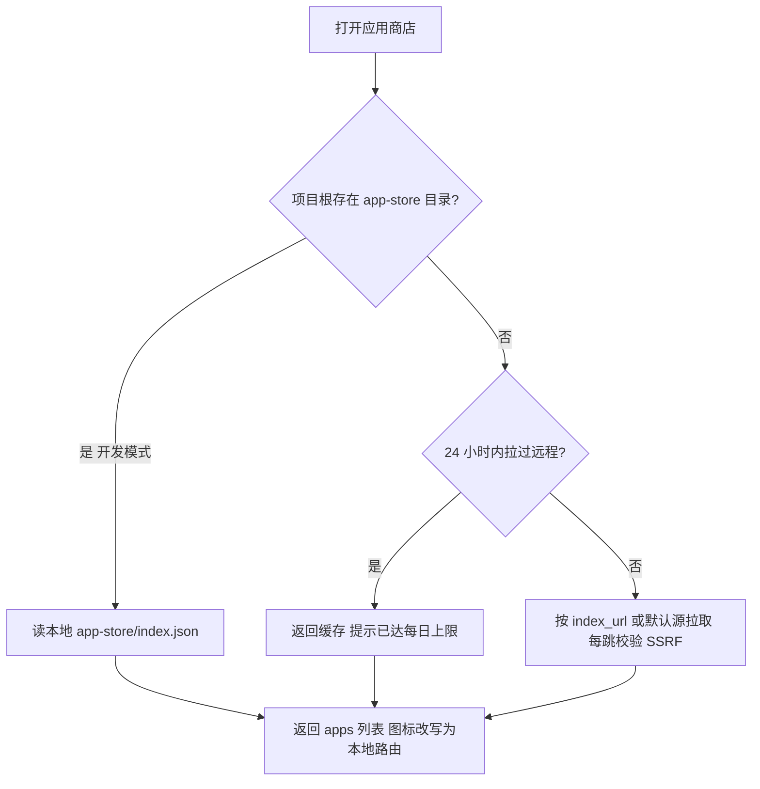
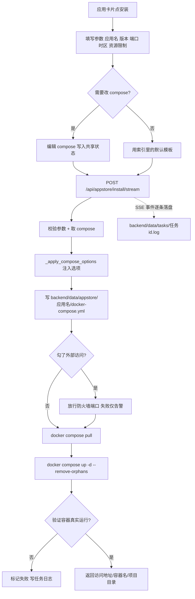
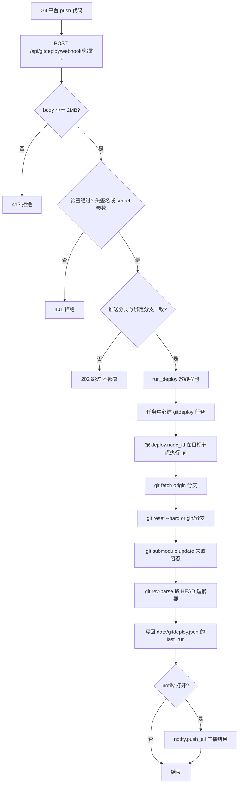

# 10 应用商店与 Git 部署

> 大白话主线：应用商店把「一个 GitHub 上的 docker-compose 就是一款应用」这件事做成了面板里的一键安装——面板拉一份索引，你在卡片上填几个参数，面板替你在本机 `docker compose up -d`。
> 另一半是「站点 Git 自动部署」：给站点绑一个仓库，你在 Git 平台一 push，平台回调面板的 webhook，面板就在目标节点上 `git fetch + reset --hard`，让站点代码强制对齐远端分支。
> 两者都用「任务中心」承载耗时过程：装应用要拉镜像，可能好几分钟，不能挂在一次 HTTP 请求上，否则你一刷新就前功尽弃。

---

## 一、应用商店（Docker 应用分发）

### 1. 业务背景

- 底层是 Docker：每个应用就是一个 `docker-compose.yml`，面板负责把它落地并启动，不自己实现「应用生命周期」。
- 「GitHub 链接即应用」：应用元数据、图标、compose 模板都托管在 GitHub，通过 GitHub Pages 发布成一份 `index.json` 索引。
- 配方侧（应用怎么定义、怎么提交、data.yml 有哪些字段、i18n 翻译怎么放、CI 怎么发索引）以仓库内的 [`app-store/README.md`](../app-store/README.md) 为准，本文只讲**面板侧**怎么消费这份索引。

### 2. 索引从哪来

面板启动应用商店时，`GET /api/appstore/index` 返回应用列表。索引有两个来源，二选一：

| 来源 | 触发条件 | 位置 | 缓存 |
|------|----------|------|------|
| 本地索引 | 项目根存在 `app-store/` 目录（开发模式） | `app-store/index.json` | 60 秒（`LOCAL_INDEX_TTL`） |
| 远程索引 | 没有本地 `app-store/` 目录，或本地索引缺失 | 配置的 `index_url`，未配置时用默认源 `https://wuhulab.github.io/Graw-app-store/index.json` | 最多每天一次（`REMOTE_INDEX_TTL = 86400`） |

几个容易忽略的点：

- **开发版优先本地**：只要 `app-store/` 目录在，就直接读本地 `index.json`，不拉远程，方便离线调试。
- **远程每天只拉一次**：`?refresh=1` 对本地源是「立即重拉」，对远程源仍受 24 小时限制——一天内重复刷新会返回缓存并提示「已达每日拉取上限」。
- **图标不依赖外网**：`/index` 返回时会把每个应用的 `icon` 统一改写成 `/api/appstore/icons/<应用id>`，由面板本地静态服务提供（读 `app-store/apps/<id>/icon.png` 或 `icon.svg`，优先 PNG）。
- **索引地址可改**：`GET/PUT /api/appstore/config`（落盘 `data/appstore.json`），保存时校验 scheme 只允许 http/https。

### 3. 安装链路与日志落盘

安装有两个接口，做的事一样，区别只在「怎么把日志给你看」：

- `POST /api/appstore/install`：同步等待，结果一次性返回（旧接口，前端仍保留）。
- `POST /api/appstore/install/stream`：**SSE 流式**，边执行边把 `status / log / result / error` 事件推给前端，安装日志窗口就是它。

无论走哪个接口，实际工作都由 `_install_prepare` + `docker compose` 完成：

1. **参数校验**：`app_name`（同时用作 compose 项目名）必须匹配 `^[A-Za-z0-9][A-Za-z0-9_.-]{0,63}$`；`restart` 必须是 `no/always/unless-stopped/on-failure`；自定义容器名同样白名单。
2. **取 compose**：优先用用户在「编辑 compose」里改过的内容，否则按索引的 `compose_url` 下载（远程失败时回退本地 `app-store/apps/<id>/docker-compose.yml`）。
3. **注入安装选项**（`_apply_compose_options`）：字符串级替换 `${VERSION}` / `${TZ}`，再过 `yaml.safe_load` 重解析，注入容器名、`restart`、`TZ`、CPU/内存 `deploy.resources.limits`、端口映射。端口只在**服务已声明该容器端口**时才替换，避免给 db/redis 之类的配套服务误加端口。
4. **写盘**：生成的文件固定写 `backend/data/appstore/<应用名>/docker-compose.yml`。
5. **可选放行防火墙**：勾了「外部访问」才调 `firewall._add_port_rule` 并写 `firewall.json`，失败只记告警不阻塞安装。
6. **执行**：`docker compose pull`（可选）→ `docker compose up -d --remove-orphans`，超时 1800 秒。引擎前缀复用 `docker_api.get_backend`，Podman 走 `_find_podman()`，Docker SDK 模式下退化为 `docker` CLI。
7. **验证**：`_verify_compose_containers` 实际查一遍容器，确认「至少一个匹配容器且处于运行态」。这一步是**关键修复**：podman-compose 在镜像拉取失败时可能返回 0 却根本没建容器，光看返回码会误报成功。

**日志落盘位置**（流式安装时）：安装流程会在「任务中心」建一条 `type=appstore-install` 的任务，每一个事件都写进 `backend/data/tasks/<任务id>.log`（JSONL，一行一条），任务状态汇总写进 `backend/data/tasks.json`。任务 id 用 `uuid4().hex[:8]`。

> 卸载：应用商店**本身没有卸载接口**。卸载实际是在「Docker」窗口对那个 compose 项目执行停止（`compose down`）/删除容器，`data/appstore/<应用名>/` 项目目录会保留，数据卷要不要清需自行处理。

### 4. 应用数据目录与 GRAW_HOST_DATA 的约定

面板以容器方式运行时（`HOST_ROOT=/host`），会出现一个「路径错位」问题：面板把 compose 文件写进了自己的数据卷（容器内 `/app/backend/data/...`），可真正执行 `docker compose` 的是**宿主机**的 docker，宿主进程看不到容器卷里的这个路径。

于是约定了一个环境变量：

- `GRAW_HOST_DATA` = 面板 `data` 目录在**宿主机上的实际路径**（典型 `/opt/graw/data`）。
- `hostfs.host_visible_path(compose_path, DATA_DIR)` 会把「data 目录内的路径」换算成 `GRAW_HOST_DATA + 相对路径`，交给宿主 docker compose 使用。
- 未配置 `GRAW_HOST_DATA` 时退化为 `/host` 前缀（只有当 data 恰好 bind 在宿主同名路径才正确，生产建议显式设置）。

非容器模式（面板直跑宿主机）或 Windows 下则不需要这套换算：Windows 会经 `_to_wsl_path` 转成 `/mnt/c/...` 形式。

### 5. 自定义 compose 的边界

- 前端「编辑 compose」窗口（`AppStoreComposeEditorWindow.vue`）本身**不调后端**，只是把改过的文本写进跨窗口共享状态 `store/appStoreCompose.js`；真正发起安装时，安装窗口从共享状态读取，作为 `compose` 字段随请求发给后端。
- 后端收到 `compose` 后**不会跳过注入逻辑**：仍要过 `yaml.safe_load`、仍会被注入容器名/重启/TZ/资源限制/端口，最后写进固定项目目录。也就是说「编辑」改的是**基础模板**，不是最终成品。
- 边界在哪：这是一条 **ADMIN** 接口，安装请求还要过 `app_name` 白名单（防路径穿越），`version`/`timezone` 有正则白名单（因为它们会先做字符串替换再重新 `safe_load`，不拦就能借 `${VERSION}` 往 YAML 里塞键，比如 `privileged`）。除此之外不对 compose 内容做「禁用 privileged」之类的裁剪——即边界是「管理员可信，可完全掌控容器定义」。

### 6. 安装链路图

---

## 二、任务中心：长线任务为什么需要

- **问题**：装应用、跑 Git 部署这类活儿慢则几分钟（拉镜像），如果实现成「一次 HTTP 请求按住不放」，客户端一刷新、一断网，任务就没人管了，状态和日志也全丢。
- **做法**：任务由后端**独立线程**执行，任务记录与日志**落盘**，页面刷新/断开都不影响继续跑，事后还能回来查。
- 接口（`/api/tasks`，ADMIN）：`GET /api/tasks` 列表、`GET /api/tasks/{id}` 详情、`GET /api/tasks/{id}/log` 日志、`DELETE /api/tasks/{id}` 删除（含日志文件）。
- 落盘：`backend/data/tasks.json`（任务记录，原子写：临时文件 + `os.replace`）、`backend/data/tasks/<id>.log`（JSONL 日志逐行追加）。
- 性能：任务记录在内存里缓存一份，并记 `_last_mtime`，磁盘文件没变就不重复读盘；写入用模块级 `threading.Lock` 保护（安装线程与请求线程会并发读写）。
- 安全：`task_id` 拼进日志文件路径，必须过白名单 `^[A-Za-z0-9_-]{1,64}$`——Windows 下 URL 编码的反斜杠（`..%5C`）能进路径参数，不拦就是任意文件读/删的穿越面。

---

## 三、运行环境（顺带一句）

「运行环境」(`/api/runtime`) 也用 podman/docker 创建容器，但它是**按语言运行时**（Python/Java/Node/Go/.NET/PHP/HTML/Other）开隔离开发容器，模板是代码里内置的 `RUNTIMES`，不来自应用商店索引，配置落 `backend/data/runtime.json`。和应用商店同属「面板管容器」，但不是商店分发链路，本文不展开。

---

## 四、站点 Git 自动部署

### 1. 业务背景

最朴素的上线动作是「代码提交后自动生效」。给站点绑定一个 Git 仓库后：

- 支持**手动触发**（`POST /api/gitdeploy/{id}/trigger`）。
- 支持 **Git 平台 Webhook 触发**（`POST /api/gitdeploy/webhook/{部署id}`）。
- 在目标节点上执行 `git fetch` + `git reset --hard origin/<分支>`，让站点代码与远端分支**强制一致**。

### 2. 配置与 CRUD

管理端点挂 `/api/gitdeploy`（ADMIN）：列表、创建、更新、删除、手动触发。要点：

- **绑定站点**：创建时 `site_id` 必须能在「合并站点列表」（自建 + 外部站点，`sites.merged_sites()`）里找到；`deploy_dir` 不填就默认取站点 root，填了必须是绝对路径且无控制字符。
- **白名单校验**：`repo_url` 仅 http/https/`git@`/`ssh://`；`branch` 允许字母数字 `. _ - /`；部署 `id` 允许字母数字 `_ -`；全部正则在本模块内单一维护。
- **一次性 secret**：创建（或 `reset_secret=true` 更新）时用 `secrets.token_hex(16)` 生成 32 位十六进制密钥，明文**只在响应里返回一次**（`secret_once`），前端在表单窗口展示 Webhook URL 供复制。
- **脱敏**：列表接口 `_public()` 永不回传 token/secret，仓库 URL 里若有 `user:token@host` 会被 `_mask_url` 洗成 `***`。

### 3. webhook 验签方式

webhook 端点是**公开**的（不挂登录鉴权），安全全靠验签：

- 优先认 GitHub 标准头 `X-Hub-Signature-256`：期望值 = `"sha256=" + HMAC-SHA256(secret, body)`，用 `hmac.compare_digest` **恒时比较**，防时序侧信道。
- 没有签名头时，兼容 `?secret=<密钥>` 查询参数（Gitee/Gitea 不带 HMAC，也方便本地 curl 模拟）。
- body 上限 2MB（`MAX_BODY`），超限 413；验签失败 401，失败日志对用户可控的 `deploy_id`/IP 做 `repr` 转义（防日志注入）。
- 分支匹配：从 body 里解析 `refs/heads/<分支>`（Gitee 部分事件没有前缀则取末段兜底），与绑定分支不符就返回 202 且**不执行**。
- 部署失败**不返回 5xx**：因为 Git 平台遇到 5xx 会一直重试，所以失败也返回 200 + `ok:false`，详情进任务中心日志。

### 4. 执行链路（按 node_id 分发）

`run_deploy(deploy_id)` 是手动与 webhook 共用的入口：

1. 在任务中心建一条 `type=gitdeploy` 任务，后续日志都追加进去。
2. **按 `deploy["node_id"]`（默认 `"local"`）分发**：`_exec_on_node` 调 `node_manager.run_on_node(node_id, ...)` + `node_manager.host_cmd([...])`，以 **argv 形式**执行（无 shell 拼接），`git -C <deploy_dir> ...`。
3. 顺序执行：`git fetch origin <分支>` → `git reset --hard origin/<分支>` → `git submodule update --init --recursive`（失败容忍，只告警）→ `git rev-parse --short HEAD` 取短摘要。单条 git 命令超时 120 秒（`DEPLOY_TIMEOUT`）。
4. 鉴权：`auth=token` 时通过 `git -c http.extraheader=Authorization: basic <base64(x-access-token:token)>` 注入凭据，**不污染仓库 remote 配置**。
5. 状态写回：`data/gitdeploy.json` 里更新 `status` 与 `last_run`（时间/是否成功/rev/错误）；`notify` 打开时用 `notify.push_all` 广播成功/失败。
6. 幂等：`reset --hard` 天然幂等，失败只记 `last_run.error`，不需要单独回滚逻辑。

> 说明：`/api/gitdeploy` 在 `main.py` 的 `_AGENT_PROXY_EXCLUDE_PREFIX` 里，所以它**不走 Agent 代理**；真正的「在哪个节点执行」由配置里的 `node_id` 决定（`run_on_node`）。这与站点模块（`/api/sites`）同一节点语义要保持一致——排障时别只看「当前管理节点」，要看绑定配置里的 `node_id`。

### 5. webhook 部署链路图

### 6. 与 sites 的关系

- 部署记录里存 `site_id` / `site_name`，用于日志与通知展示；`deploy_dir` 默认就是站点 root。
- 也就是说：**Git 部署是「站点」的一个配套动作**，它只负责把代码拉到位，不负责 nginx 配置——配置还是「网站」模块（见 [09-网站管理与WAF.md](./09-网站管理与WAF.md)）的事。

---

## 五、和应用接口开放协议（GPOP）的区别与选择

一句话区分：

- **应用商店** = 纯 Docker 分发。面板只负责把 compose 跑起来，容器和面板之间**没有通信协议**，装完就各走各路。
- **GPOP（插件开放协议）** = 在应用商店的 compose 执行链路之上，额外给了插件「面板注入的访问令牌 + 调用面板开放接口的能力（查面板信息/发通知/写审计/存配置）」。它有清单校验、令牌哈希存储、能力白名单，并且是**成对的生命周期管理**（安装/启停/卸载/轮换令牌），卸载会真的 `docker compose down` 并移除注册。

怎么选：

- 只是想把某个自托管服务跑起来 → 用**应用商店**。
- 想让容器里的应用跟面板深度联动（开机发通知、往面板审计里写记录、读面板信息） → 用 **GPOP 插件**。

细节见 [08-应用接口开放协议.md](./08-应用接口开放协议.md) 与 [docs/plugin-protocol.md](../docs/plugin-protocol.md)。

---

## 六、关键文件与函数

| 文件 | 作用 |
|------|------|
| `backend/app/routers/appstore.py` | 应用商店核心路由：索引拉取/缓存、本地索引、compose 获取、README 爬取、安装（同步 + SSE）、图标路由（无鉴权 `icons_router`） |
| `backend/app/routers/tasks.py` | 任务中心：长线任务的记录与 JSONL 日志持久化 |
| `backend/app/routers/runtime.py` | 运行环境（按语言开隔离开发容器，独立于商店索引） |
| `backend/app/gitdeploy.py` | Git 部署核心库（无 FastAPI 依赖）：配置读写、webhook 验签、`run_deploy` 执行链路 |
| `backend/app/routers/gitdeploy.py` | `/api/gitdeploy` 管理端点（ADMIN）+ webhook 公开端点 |
| `backend/app/hostfs.py` | `host_visible_path()`：容器模式下把 data 内路径换算成 `GRAW_HOST_DATA` 宿主路径 |
| `frontend/src/components/windows/AppStoreWindow.vue` | 商店主窗口：卡片网格、分类筛选、搜索、刷新、免责声明弹窗（v1.1.0，读完并勾选才可进入，同意写入 localStorage） |
| `frontend/src/components/windows/AppStoreReadmeWindow.vue` | README 阅读窗口：markdown-it + DOMPurify 渲染，相对图片/链接补全为 GitHub 绝对地址 |
| `frontend/src/components/windows/AppStoreInstallWindow.vue` | 安装参数表单 + 版本安全警告 + 未放行外部访问二次确认 |
| `frontend/src/components/windows/AppStoreComposeEditorWindow.vue` | compose 编辑器（只写共享状态，不调后端） |
| `frontend/src/components/windows/AppStoreInstallLogWindow.vue` | 流式安装日志窗口（SSE，可跳任务中心） |
| `frontend/src/components/windows/GitDeployWindow.vue` / `GitDeployFormWindow.vue` | Git 部署列表 / 绑定表单（含一次性 Webhook URL 展示） |

---

## 七、数据持久化

| 文件 / 目录 | 内容 | 说明 |
|-------------|------|------|
| `backend/data/appstore.json` | 索引地址配置 `index_url` | 保存时校验仅 http/https |
| `backend/data/appstore/<应用名>/docker-compose.yml` | 每个已安装应用的 compose 项目文件 | 由安装流程生成 |
| `backend/data/tasks.json` | 任务记录 | 原子写（临时文件 + `os.replace`） |
| `backend/data/tasks/<任务id>.log` | 任务 JSONL 日志 | 逐行追加 |
| `backend/data/runtime.json` | 运行环境配置 | 原子写 |
| `backend/data/gitdeploy.json` | Git 部署配置（含 `secret` 与仓库 `token`） | 原子写，列表接口脱敏 |
| `app-store/index.json` | 开发模式下的本地索引 | 仓库自带，面板优先读它 |

---

## 八、安全约束与易踩的坑

1. **远程索引可被投毒，`app_id` 会拼进本地文件路径**：`_get_compose_text` 对 `app_id` 做与安装参数一致的白名单校验（注释明确：`index_url` 可被管理员指向任意远程源，投毒索引里 `id` 含 `../` 就能穿越读任意 `.yml`）。图标路由同理，`app_id` 过正则 + `basename`。
2. **SSRF 防护不止看 scheme**：`_assert_public_http_url` 要求目标主机必须是公网地址（逐个解析 IP，拒绝回环/私网/链路本地/保留），且**每一跳重定向**都校验（`_SSRFRedirectHandler`），防被投毒索引拿去探测内网与云 metadata。要连内网私有商店时才设 `GRAW_APPSTORE_ALLOW_PRIVATE_NET=1` 显式放行。
3. **容器 /host 模式下 compose 文件必须是宿主可达路径**：要用 `GRAW_HOST_DATA` 经 `hostfs.host_visible_path` 换算，否则宿主 docker compose 找不到「容器卷里的文件」。别在已转换过一次的路径上再拼 `/host`。
4. **别只信 podman-compose 的返回码**：镜像拉取失败时它可能 `rc=0` 但容器没建出来，所以必须 `_verify_compose_containers` 实查；而且 compose v1 用下划线命名（`project_service_N`）、v2 用短横线（`project-service-N`），两种前缀都得匹配，否则会「容器明明起来了却误判失败」。
5. **`version` / `timezone` 必须先白名单再替换**：它们会先做 `${VERSION}` 字符串替换、再 `yaml.safe_load` 重解析，不拦就能往 compose 里注入额外 YAML 键（例如 `privileged`）。
6. **远程索引一天只能拉一次**：手动刷新也受 24 小时限制（`REMOTE_INDEX_TTL`），不是 bug 是配额约束。
7. **任务 id 必须过白名单**：`task_id` 会拼进日志文件路径，Windows 下 `..%5C` 能进路径参数，不拦即路径穿越。
8. **webhook 部署失败不要返 5xx**：Git 平台遇 5xx 会重试，会把一次失败放大成反复重试；失败也返回 200 + `ok:false`，细节进任务中心。

---

## 更新记录

- `2026-09-25`：新建，讲清应用商店的索引来源与每日拉取配额、SSE 安装链路与任务中心日志落盘、`GRAW_HOST_DATA` 的容器路径换算、自定义 compose 的边界，以及站点 Git 部署的 webhook 验签与按 `node_id` 分发执行链路，并说明它与 GPOP 的区别。