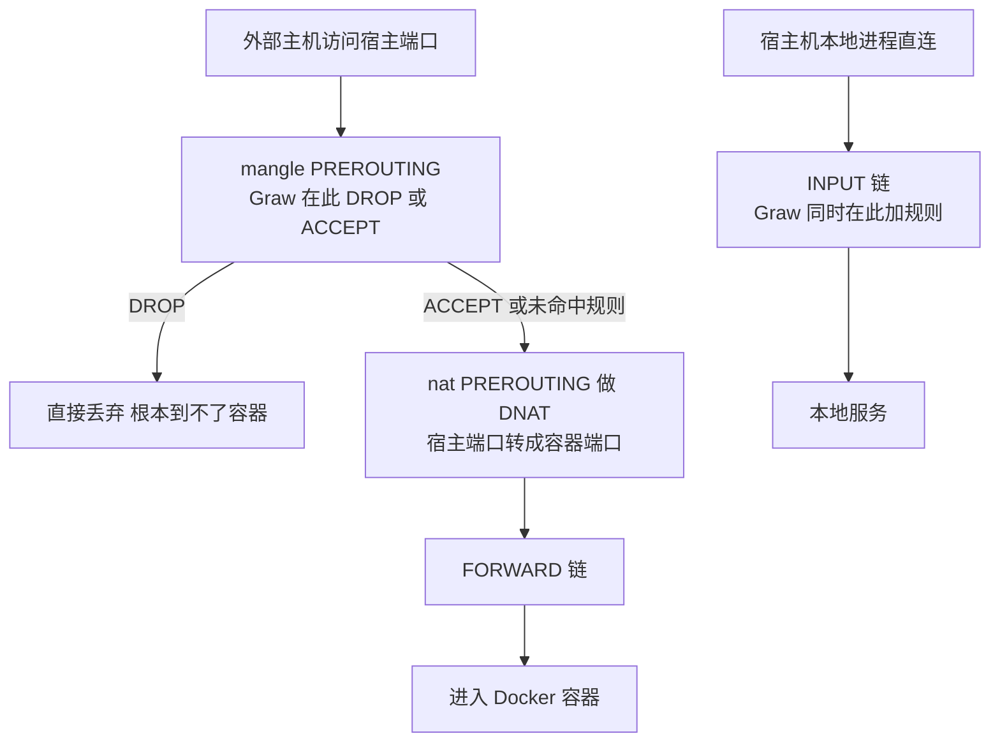
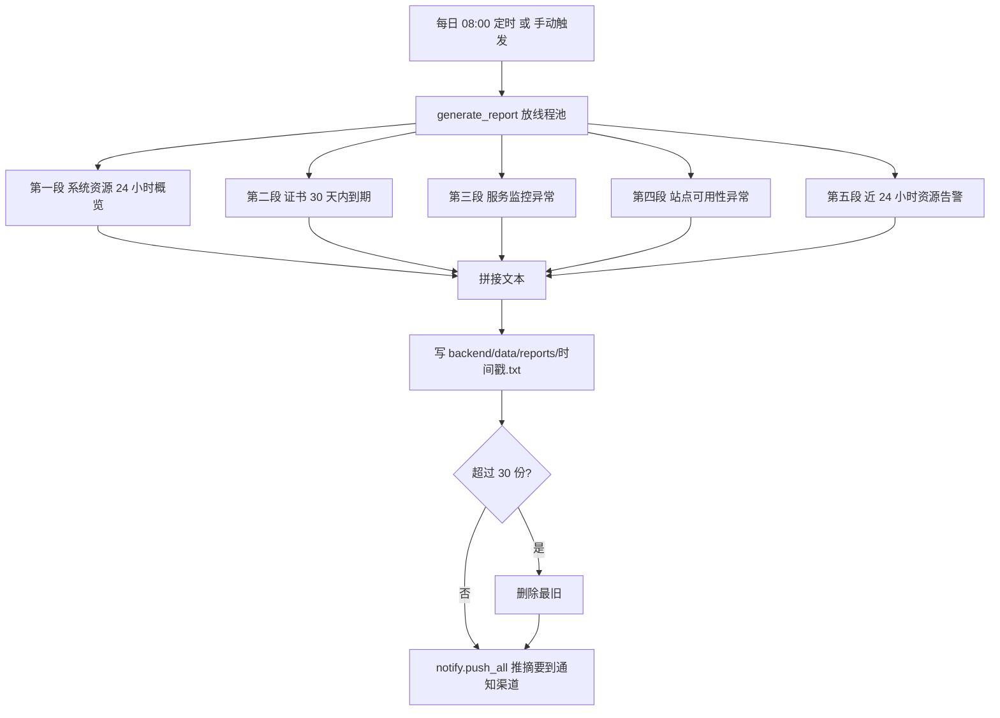
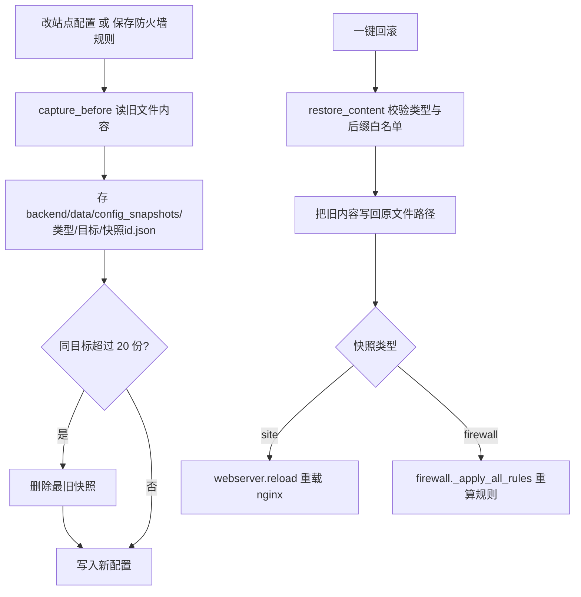

# 11 安全防护与运维工具

> 大白话主线：这一篇把面板里「安全 + 运维」那一摞工具串起来讲——防火墙怎么真正拦住 Docker 暴露的端口、保护中心怎么提醒你别把数据库装丢、SSH 端口转发怎么让本地工具直连远程库、镜像漏洞扫描怎么在本地比对、每日巡检报告怎么自动生成、慢查询怎么查、多台机器怎么批量操作，以及改坏了配置怎么一键回滚。
> 它们共同的特点是：**都跟「主机安全」和「事后可救」有关**——要么提前拦住，要么出事后能查、能恢复。

---

## 一、防火墙与 Docker 发布端口防护

### 1. 是什么、解决什么问题

防火墙模块（`/api/firewall`，ADMIN）负责按「端口规则」和「IP 规则」在宿主机上落 iptables/netsh 规则，并提供「列出监听端口 / 默认屏蔽未放行端口 / 重放规则」这些操作。

它要解决的一个经典坑是：**Docker 发布端口（`-p 8080:80`）用普通 `INPUT DROP` 拦不住。**

原因在于数据包路径：外部流量进宿主后，先在 `nat PREROUTING` 被 DNAT 成容器端口，然后走 `FORWARD` 链进入容器——**根本不经过 `INPUT`**。所以只写 `INPUT DROP`，那个端口照样能从公网访问。要想真拦住，必须在 **`mangle PREROUTING`（DNAT 之前）** 就把包丢掉。

### 2. 运行逻辑

每条端口规则落两条规则，都用 `-I` 插到链顶（保证能压过此前可能存在的更高优先规则）：

- **放行（allow）**：`iptables -I INPUT -p tcp --dport <端口> -j ACCEPT` + `iptables -t mangle -I PREROUTING -p tcp --dport <端口> -j ACCEPT`。
- **拒绝（deny）**：`iptables -I INPUT ... -j DROP` + `iptables -t mangle -I PREROUTING ... -j DROP`。
- **清除（幂等）**：对同一端口的 `mangle PREROUTING` 与 `INPUT` 的 ACCEPT/DROP 四种形态都尝试 `-D`（删不存在的规则返回非零，忽略即可）。这样反复改同一端口不会留下旧形态的残规则。
- **Windows**：改用 `netsh advfirewall firewall add/delete rule name=graw_port_<规则id> dir=in ...`（不区分 mangle，行为对齐）。

**重要端口保护**：`BLOCK_PROTECTED_PORTS = {22, 80, 443, 8000}`。「默认屏蔽未放行端口」时这些端口会被跳过，注释写明是为了「避免误伤正常访问或把管理通道（如 Agent 的 8000）一并屏蔽导致面板失联」——`8000` 是默认 Agent 端口，如果你给自建 Agent 换了端口，记得在这里追加。

相关端点：

- `GET /api/firewall/listening`：跑 `ss -tln`（失败回退 `netstat -tln`）列出监听中的 TCP 端口，并标出「已放行 / 重要端口」。
- `POST /api/firewall/block-unopened`：把「正在监听、未放行、非重要端口」统一加 deny 规则。
- `POST /api/firewall/reconcile`：按保存的记录**重放全部端口规则**（幂等），专门用来纠正旧版本「只写了 INPUT、遗漏 mangle PREROUTING」的历史规则，让 Docker 发布端口的屏蔽/放行立即生效。

### 3. 防护规则的生效位置图

### 4. 落盘与安全约束

- 规则内容落 `backend/data/firewall.json`（`port_rules` / `ip_rules`），写盘前会先存快照（见第八节）。
- IP 规则的值最终会传给 `iptables -s` / `netsh remoteip=`，所以用 `ipaddress.ip_network` 做白名单校验（同时接受单 IP 与 CIDR），挡住畸形值破坏命令语义。
- 该模块是**本机语义**（操作当前管理主机的防火墙），不是远端 Agent 业务。

---

## 二、保护中心（数据库数据防丢）

### 1. 是什么、解决什么问题

跑 Docker 的人最常见的惨剧：数据库容器**没挂持久化数据卷**，一次「删除并重建」数据就没了。保护中心就是那个在旁边盯着你、提醒你别犯傻的角色。

它扫描三类风险：

1. **独立的数据库容器**（镜像命中 `DB_IMAGE_KEYWORDS`：mysql/mariadb/postgres/mongo/redis/clickhouse/elasticsearch…）但没设永久数据卷。
2. **内置数据库的应用容器**（命中 `EMBEDDED_DB_IMAGE_KEYWORDS`：grafana/gitea/vaultwarden/nextcloud/n8n…），这类虽不是数据库服务，但容器内用 SQLite 之类的嵌入式库存数据，不挂卷照样丢；对未知镜像还会用 `docker exec` 探测容器内是否存在 SQLite 文件。
3. **宿主机上的数据库数据目录 / SQLite 文件**，但没被纳入自动备份。

### 2. 运行逻辑

- 扫描容器：`_evaluate_mounts` 判断挂载是否「持久」（命名卷 / 绑定到宿主真实目录），未持久则告警。
- 一键映射（`POST /api/protection/docker/{name}/map`）：为容器创建命名数据卷并把容器的默认数据目录挂上去，然后**重建容器（保留现有数据）**。
- 一键备份（`POST /api/protection/db-files/backup`、`batch-backup`）：把数据库路径记入清单，并**自动创建一条计划任务**（写 `data/cron.json`）定期备份。
- 移出备份（`unbackup`）：只从清单移除，**不删除**已创建的计划任务。
- 忽略（`POST /api/protection/ignore`）：标记为「暂时忽略」或永久忽略。暂时忽略默认 **7 天**（`IGNORE_DAYS`）后重新提醒，专治手滑点掉。

端点（`/api/protection`，ADMIN，且属本机 local 类，远端节点下禁用）：`/status`、`/docker`、`/docker/{name}/map`、`/db-files`、`/db-files/backup`、`/db-files/unbackup`、`/db-files/batch-backup`、`/ignore`、`/unignore`、`/ignored`、`/backups`。

### 3. 落盘与安全约束

- 落 `backend/data/protection.json`，结构为 `{"ignored": [...], "backup_items": [...]}`，**原子写**（临时文件 + `os.replace`）。
- 复用 `docker_api` 的引擎发现逻辑，同时支持「本机直跑」与「Docker /host 挂载」两种部署；宿主机路径经 `hostfs.host_path` 映射。
- 扫描/重建这类阻塞操作走线程池，不卡事件循环。

---

## 三、SSH 端口转发（本地工具直连远程服务）

### 1. 是什么、解决什么问题

本地用 Navicat / redis-cli 要连远程节点上的 MySQL/Redis，常规做法是开防火墙或搭跳板。这个模块在**面板所在主机**上监听 `127.0.0.1:<本地端口>`，收到连接后经到远程节点的 SSH 隧道（paramiko 的 `direct-tcpip`）转发到远程 `host:port`——配好「远程 3306 → 本地 13306」，本地工具直连 13306 就行。

### 2. 线程模型（重点核实项）

- **每隧道一个守护线程**：`_tunnel_loop` 负责 `bind("127.0.0.1", local_port)` + `listen(8)`，用 `settimeout(1.0)` 轮询 `accept()`，并在循环里检查 `stop` 事件以便优雅退出。**本地监听强制 127.0.0.1，绝不暴露公网**。
- **每条连接两个泵线程**：`_handle_conn` 接受一条本地连接后，通过 SSH 通道开 `direct-tcpip`，再起两个 `_pump` 线程做双向搬运——一个 `conn→chan` 记 `bytes_out`，一个 `chan→conn` 记 `bytes_in`，两个都 `join` 后才收尾关闭。
- **复用 paramiko 连接池**：通道经 `node_manager._paramiko_pool_client(node, 15)` 拿 SSH client，多隧道共享同一连接，不重复建连。
- **单连接失败不影响监听**：连接处理里任何异常只记日志，监听线程继续 accept。
- 状态统计：`stats = {conns, bytes_in, bytes_out}`。

### 3. 运行逻辑与重启恢复

- 创建（`POST /api/portforward`）：先 `start_tunnel` 校验并启动，成功后才持久化条目（保证「有记录就有隧道」）。
- 启/停（`POST /api/portforward/{id}/toggle`）：同步把条目的 `enabled` 持久化。
- 删除（`DELETE /api/portforward/{id}`）：删条目并 `stop_tunnel`。
- **重启恢复**：`main.py` 的 lifespan 启动区调 `pf_store.restore_all()`，把所有 `enabled=true` 的条目自动恢复；关闭区调 `pf_store.stop_all()`。隧道本身是进程内的线程，面板一重启就没了，全靠这两句接上。

### 4. 落盘与安全约束

- 落 `backend/data/portforwards.json`（原子写，`{"version":1,"items":[...]}`）。
- 校验（`start_tunnel` 内）：目标节点必须存在且 `type == "ssh"`；`remote_host` 过主机名/IP 白名单正则；`local_port` 必须 1024–65535；`remote_port` 必须 1–65535；本地端口被其它运行中隧道占用则拒绝。
- 设计意图（模块 docstring）：**仅允许「面向远程节点的转发」**，远端目标是普通 `host:port`，用来收敛横向攻击面。
- 路由 `_ID_RE` 白名单校验隧道 ID 防路径穿越；接口全量 ADMIN，且 `/api/portforward` 在 `_AGENT_PROXY_EXCLUDE_PREFIX`（不在业务请求里被 Agent 代理掉）。

---

## 四、镜像漏洞扫描

### 1. 是什么、解决什么问题

面板管理的 Docker 镜像里装着一堆第三方软件包，可能带已知漏洞。这个模块在**当前节点**上拿目标镜像跑一个**一次性容器**取出包清单（优先 `dpkg-query`，其次 `rpm`），与**本地自维护的 advisory 库**做版本比对，输出命中的 CVE。

注意它的取舍：**不接外部 CVE 数据源**，规则由管理员导入（`POST /api/imgsafety/advisory/import`），所以「能不能扫出东西」取决于你导了哪些规则；一条都没导时扫描结果为空，只会返回包清单。

### 2. 运行逻辑

- 扫描（`POST /api/imgsafety/scan`）：`asyncio.to_thread(imgsafety.scan_image)` 放线程池执行。内部 `docker run --rm --entrypoint sh <镜像> -c <脚本>` 取清单（超时 120 秒，输出上限 2MB），解析 `name<TAB>version` 行，再与 advisory 逐包比对。
- 版本比较是轻量「语义段比较」：按 `.\-_+` 拆段，数字按数值、文本按字典序，容忍 `alpha/beta/rc/p1` 这类后缀，不引入第三方库。约束串形如 `<= 3.0.14`。
- 缓存：结果**按镜像引用**缓存到 `data/image_scan_cache.json`，同一引用不重复扫；缓存上限 200 条，超出按插入序丢最旧。
- 辅助端点：`GET /api/imgsafety/advisory`（规则列表）、`POST /api/imgsafety/advisory/import`（导入，按 `(name, cve)` 去重）、`GET /api/imgsafety/containers`（复用 `docker_api.containers` 列容器供前端下拉，按镜像扫描）。

### 3. 落盘与安全约束

- `backend/data/advisory.json`：本地规则库（`{"version":1,"packages":[...]}`，原子写）；每项需含 `name / versions / cve`，`severity`/`desc` 可选。
- `backend/data/image_scan_cache.json`：扫描缓存（原子写）。
- 镜像引用过白名单正则 `_SAFE_IMG_RE` 清洗，**杜绝 CLI 注入**（`docker run` 的位置参数不能以 `-` 开头被当成选项）。
- 接口全量 ADMIN。

---

## 五、每日巡检报告

### 1. 是什么、解决什么问题

面板平时已经在攒一堆后台数据（系统指标历史、证书到期、服务监控、站点可用性、资源告警），但都得登录面板才看得到。巡检报告把这些**汇聚成一份文本**，每天定时生成并推送到通知渠道，让你不登录也能掌握主机健康状态。

### 2. 运行逻辑（五段内容）

`generate_report()` 依次拼五段，**每段失败单独降级，不影响其余段落**：

1. **系统资源（过去 24 小时）**：从 `metrics_store.history` 取小时桶，算 CPU/内存/磁盘/负载的平均与峰值；CPU 峰值 ≥90% 会额外提示大致时间点。
2. **证书（30 天内到期 / 已过期）**：调 `certcheck._check_certs_sync()`。
3. **服务监控异常**：读 `svcmonitor` 的条目，列出非 ok/healthy 的。
4. **站点可用性**：读 `uptime` 条目，列出当前 DOWN 的站点。
5. **资源告警（过去 24 小时）**：从 `notify._load_logs()` 里统计阈值告警次数与末次消息。

生成后：写文件 → 轮转 → 推送（`notify.push_all` 只推**摘要**，避免整篇刷屏，提示全文在面板查看）。

- 定时：`reporting.start_daily()` 在 `main.py` lifespan 启动，`_daily_loop` 算到**下一个 08:00** 的秒数再执行，每天一次；关闭区调 `reporting.stop_daily()`。
- 手动：`POST /api/report/generate`；历史：`GET /api/report/list`、`GET /api/report/{文件名}`。
- 生成本身放线程池（`asyncio.to_thread`），避免阻塞事件循环。

### 3. 巡检报告生成图

### 4. 落盘与安全约束

- 落 `backend/data/reports/<YYYYmmdd_HHMMSS>.txt`，**保留 30 份**（`_KEEP`），超出按文件名排序删最旧。
- `read_report` 对文件名做 `basename` 白名单 + 前缀守卫，防路径穿越。
- 纯只读聚合，不修改任何业务数据；接口 `/api/report` 全量 ADMIN。

---

## 六、MySQL 慢查询分析

### 1. 是什么、解决什么问题

`/api/slowquery`（ADMIN）用来快速定位「哪些 SQL 拖慢了库」。选一个 MySQL 系连接，面板解析其慢查询日志，按执行时间降序输出 **TOP 50**，并对常见低效模式给启发式建议。

### 2. 运行逻辑

- `GET /api/slowquery/connections`：从 `databases._load_connections()` 里筛出 mysql/mariadb 连接供下拉。
- `POST /api/slowquery/scan`：先用 pymysql 查 `SHOW VARIABLES` 确认 `slow_query_log` 是否开启及日志路径；**未开启只返回开启引导（`SET GLOBAL ...` 语句），面板不做强改**（安全：不擅自改服务器配置）。
- 读日志：在当前节点上下文用 `tail -c 8MB` 读日志**尾部**（`shlex.quote` 包路径），解析 `# Time` / `# User@Host` / `# Query_time ... Rows_examined` 与 SQL 多行，按 `Query_time` 降序，SQL 截断 500 字符。
- 建议（`_suggest`）：如「扫描行数为返回行数百倍以上 → 疑似全表扫描」「`SELECT *` 拉全列」「SELECT 无 WHERE」「嵌套子查询」「ORDER BY 未配 LIMIT」等。

### 3. 安全约束与限制

- **只支持本机库**：连接 host 必须在 `127.0.0.1 / localhost / ::1 / 空` 之内；远端库会返回引导「请把当前节点切到该数据库所在主机后重试」——因为面板读的是目标主机的磁盘日志，跨机器读不了。
- 只读日志尾部 8MB、解析上限 50 条，避免大日志拖垮请求。
- 连接读取沿用 `databases` 既有鉴权（ADMIN）；失败日志对用户可控的 `connection_id` 做 `repr` 转义。

---

## 七、批量操作中心

### 1. 是什么、解决什么问题

多台机器要执行同一条命令、或对一批容器做启停，一台台点太慢。`/api/batch`（ADMIN）支持：勾选多台节点批量执行同一 shell 命令；或按容器名关键字过滤后批量启/停/重启容器。

### 2. 运行逻辑与并发

- `POST /api/batch/command`：每节点在**独立 contextvars 上下文**里执行（`node_manager.run_on_node` 内部 `copy_context` 隔离），这样 `asyncio.to_thread` 的工作线程复用也不会串节点/串请求。
- `POST /api/batch/containers`：先拉各节点容器列表（docker 与 podman 都试，兼容整体 JSON 数组 / 单 dict / 逐行 JSON 三种输出），按 `filter.keyword` 子串（大小写不敏感）过滤后逐个执行 `start/stop/restart`。
- 并发受限：同一批**至多 3 路并行**（`CONCURRENCY`，信号量控制）；单节点失败返回该节点的 `ok:false`，不中断整批，也不把失败抛成 500。
- 限制参数：节点数 ≤16（`MAX_NODES`）、命令长度 ≤8000、输出默认截断 20000 字符、超时 1–300 秒。

### 3. 为什么必须排除 Agent 代理

该路由**必须在 `main.py` 的 `_AGENT_PROXY_EXCLUDE_PREFIX` 里**：批量命令要由主面板**持全部节点凭据直连执行**，如果整请求被转发给某一个子节点，子节点根本没有其它节点的凭据，批量就废了。审计只记「命令与节点集合」，**不落 stdout**（可能含敏感输出）。

---

## 八、配置快照与一键回滚

### 1. 是什么、解决什么问题

面板会高频改写配置文件（站点 nginx conf、防火墙规则 JSON），改坏了怎么恢复是运维最痛的场景之一。这个模块在**每次写配置前**把旧内容存成快照，事后能一键回滚。

### 2. 快照时机

`capture_before(kind, target_id, file_path, ...)` 在「写之前」调用，目前有两个埋点：

- **站点配置**：`sites.py` 的多处写 conf 前（`_apply_external_nginx_config` / `_apply_nginx_config` / `_apply_apache_config` 等）以 `kind="site"` 存快照。
- **防火墙规则**：`firewall._save_fw()` 写盘前以 `kind="firewall"` 存快照。

### 3. 运行逻辑

- 快照 ID = 本地时间戳 + 8 位随机十六进制（可排序、防碰撞）；内容 base64 存 `content_b64`，并记录 `file_path / when / user / ip / route / bytes`。
- 同一目标**保留 20 份**（`_KEEP`），超出删最旧；**单份上限 256KB**（`_MAX_BYTES`），超限跳过并告警，**绝不拖垮业务写配置**。
- 回滚（`POST /api/rollback/{id}/restore`）：`restore_content` 先校验 `kind` 与 `target_id` 白名单、再校验 `file_path` 后缀白名单（site 只认 `.conf`，firewall 只认 `firewall.json`），取出内容写回原文件，然后按类型触发 reload：
  - `kind=site` → `webserver.reload()` 重载 nginx/openresty；
  - `kind=firewall` → `firewall._apply_all_rules()` 重算规则。
- 全套动作写审计日志（`auditlog.record`）；写回成功但 reload 失败会返回 500 且说明「配置已写回，但 reload 失败」。

路由 `/api/rollback`（ADMIN）：列表（可按 `kind` 过滤）、详情（含内容）、回滚、删除。

### 4. 配置快照与回滚图

### 5. 安全约束

- `snapshot_id / target_id / kind` 全部过白名单正则，杜绝路径穿越；目录再做归一化 + 前缀守卫，确保落在 `SNAP_ROOT` 内。
- **快照与业务配置「同机存储」**：站点配置在子节点执行时，快照也落在子节点，保证回滚写回的目标与快照同机可见。
- 回滚写回的 `file_path` 来自内部生成（不是用户直接输入），后缀白名单只是纵深兜底。
- 模块级锁保护「读-写-轮转」，站点与防火墙埋点并发也安全。

---

## 九、关键文件与函数

| 文件 | 作用 |
|------|------|
| `backend/app/routers/firewall.py` | 防火墙规则：`_add_port_rule` / `_flush_port` / `_apply_all_rules`，Docker 发布端口的 mangle PREROUTING 管控，`BLOCK_PROTECTED_PORTS` 重要端口保护 |
| `backend/app/routers/protection.py` | 保护中心：数据库容器/内置数据库容器/宿主机数据库文件的防丢提醒、一键映射、加入备份、忽略 |
| `backend/app/portforward.py` | SSH 端口转发核心：`_tunnel_loop`（每隧道一守护线程）、`_pump`（每连接两泵线程）、`start_tunnel`/`stop_tunnel`、`restore_all`/`stop_all` |
| `backend/app/routers/portforward.py` | `/api/portforward` REST：列表 / running / 创建 / toggle / 删除 |
| `backend/app/imgsafety.py` | 镜像漏洞扫描核心：`scan_image`、版本比较、advisory 导入/比对、缓存 |
| `backend/app/routers/imgsafety.py` | `/api/imgsafety`：scan / advisory / containers |
| `backend/app/reporting.py` | 巡检报告核心：五段聚合、`generate_report`、`_daily_loop`（08:00）、`start_daily`/`stop_daily` |
| `backend/app/routers/report.py` | `/api/report`：generate / list / 读全文 |
| `backend/app/routers/slowquery.py` | 慢查询分析：解析慢日志 TOP 50 + 启发式建议 |
| `backend/app/routers/batch.py` | 批量操作中心：批量命令 / 批量容器动作（3 路并发、不中断整批） |
| `backend/app/config_snapshot.py` | 写前快照与回滚核心：`capture_before` / `restore_content` / 轮转 |
| `backend/app/routers/rollback.py` | `/api/rollback`：快照列表/详情/一键回滚/删除 |
| `frontend/src/components/windows/FirewallWindow.vue` / `FirewallRuleFormWindow.vue` | 防火墙窗口 / 规则表单 |
| `frontend/src/components/windows/ProtectionWindow.vue` | 保护中心窗口 |
| `frontend/src/components/windows/PortForwardWindow.vue` / `PortForwardFormWindow.vue` | 端口转发列表 / 表单 |
| `frontend/src/components/windows/ImageScanWindow.vue` | 镜像漏洞扫描窗口 |
| `frontend/src/components/windows/ReportWindow.vue` | 巡检报告窗口 |
| `frontend/src/components/windows/SlowQueryWindow.vue` | 慢查询分析窗口 |
| `frontend/src/components/windows/BatchWindow.vue` | 批量操作中心窗口 |
| `frontend/src/components/windows/RollbackWindow.vue` | 配置快照回滚窗口 |

---

## 十、数据持久化

| 文件 / 目录 | 内容 | 说明 |
|-------------|------|------|
| `backend/data/firewall.json` | 端口规则 `port_rules` + IP 规则 `ip_rules` | 写盘前先存快照 |
| `backend/data/protection.json` | `ignored` 忽略清单 + `backup_items` 备份清单 | 原子写 |
| `backend/data/portforwards.json` | 端口转发条目（含 `enabled`） | 原子写，重启按 `enabled` 恢复 |
| `backend/data/advisory.json` | 本地漏洞规则库 | 原子写，导入时按 `(name, cve)` 去重 |
| `backend/data/image_scan_cache.json` | 镜像扫描结果缓存 | 原子写，上限 200 条 |
| `backend/data/reports/` | 每日巡检报告 `<时间戳>.txt` | 保留 30 份 |
| `backend/data/config_snapshots/<kind>/<target>/<快照id>.json` | 写前配置快照 | 同目标保留 20 份，单份上限 256KB |
| `backend/data/cron.json` | 计划任务（保护中心「加入备份」会写） | protection 只追加备份任务 |

---

## 十一、易踩的坑

1. **Docker 发布端口只写 `INPUT` 拦不住**：必须写 `mangle PREROUTING`（DNAT 之前）。历史版本留下的「只有 INPUT」的规则要靠 `POST /api/firewall/reconcile` 重放纠正。
2. **重要端口保护列表别乱动**：`{22, 80, 443, 8000}` 里 8000 是默认 Agent 端口，屏蔽它会把自己关在门外——自建 Agent 换端口后要把新端口加进 `BLOCK_PROTECTED_PORTS`。
3. **保护中心的「一键映射」会重建容器**：数据靠新建的命名卷保留，但重建过程服务会中断，别在业务高峰点它；「暂时忽略」默认 7 天后会重新提醒。
4. **端口转发监听的是「面板所在主机」的本地端口**：`local_port` 不是子节点端口；`remote_host` 是相对**子节点**解析的地址；隧道是进程内线程，面板重启全靠 lifespan 里的 `restore_all` 接上。
5. **镜像扫描没有外部 CVE 源**：没导入 advisory 时只会返回包清单不会报漏洞；扫描要在镜像里跑一次性容器，镜像里没有 `sh`（如纯 scratch）会直接报错。
6. **巡检报告 08:00 才生成**，且指标历史不足 24 小时会显示「无可用指标历史」——面板刚部署时看不到资源段是正常的。
7. **慢查询只支持本机 MySQL/MariaDB**：远端库会返回「请切换到该数据库所在主机」的引导；面板不会替你 `SET GLOBAL` 开慢日志，只给开启语句。
8. **批量操作必须在 `_AGENT_PROXY_EXCLUDE_PREFIX` 里**：否则整批请求被转发给单个子节点，而它没有其它节点的凭据。
9. **快照是「同机存储」的**：站点配置在子节点上写，快照就落在子节点；别在主面板本地翻子节点的快照。单份超 256KB 会静默跳过（只记告警），不会影响本次配置写入。

---

## 更新记录

- `2026-09-25`：新建，讲清防火墙如何用 `mangle PREROUTING` 在 DNAT 前拦住 Docker 发布端口、保护中心的数据库防丢提醒、SSH 端口转发的「每隧道一守护线程 + 每连接两泵线程 + 复用 paramiko 连接池」模型与重启恢复、镜像漏洞扫描的本地 advisory 比对、每日巡检报告的五段内容与 08:00 定时、慢查询 TOP N、批量操作的并发与排除 Agent 代理原因，以及配置快照的写前时机与一键回滚链路。