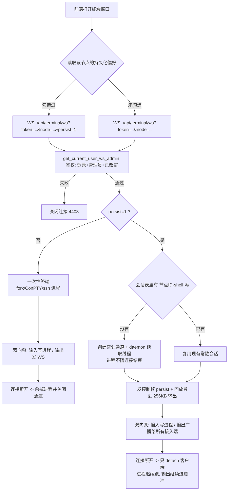
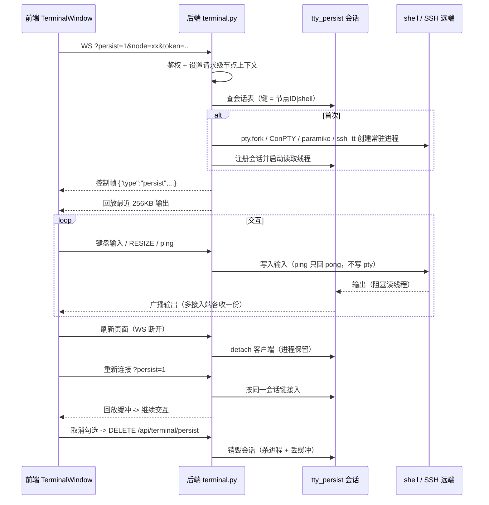

# 12 Web 终端与持久化会话

> 一台机器上「打开一个命令行」这件事，在 Graw 里要同时兼容：本机 Linux/容器、本机 Windows、
> 远程裸 SSH 节点、远程 Windows 控制端。这篇讲清楚终端连接是怎么建立、
> 断线为什么还能救回来，以及「保留持久化终端」是怎么让长任务刷不丢的。

参考源码：`backend/app/routers/terminal.py`、`backend/app/tty_persist.py`、`backend/app/routers/_wincon.py`、
`frontend/src/components/windows/TerminalWindow.vue`。

---

## 一、入口与鉴权

打开终端的方式：桌面「终端」应用、文件管理器里的「打开终端」、Docker 容器详情的「进入容器」。

前端固定做三件事（`TerminalWindow.vue`）：

1. 用 `xterm.js` 渲染终端，尺寸变化时把行列数上报后端；
2. 拼 WebSocket 地址：`/api/terminal/ws?token=<JWT>&node=<节点ID>`（容器终端走 `/api/terminal/ws/container`）；
3. 连接后先发尺寸、必要时发送工作目录 `cd` 与自动命令（`autoCommand`）。

鉴权与路由归属：

- WS 无法带 `Authorization` 头，所以令牌走**查询参数 `?token=`**，由 `get_current_user_ws_admin`
  在握手时校验：**必须登录 + 必须是管理员 + 必须已改密**（防止用终端绕过默认密码拦截）；
- `terminal` 在 `_AGENT_PROXY_EXCLUDE_PREFIX` 里 —— **终端不经过 Agent 隧道代理**，
  远程节点由主面板自己用 `paramiko` / `ssh -tt` 连过去；
- 终端属「host 类」能力：切换节点后作用在目标机器上（`remote_cap` 不拦）。

---

## 二、一个终端进程是怎么起来的

同一份上层逻辑（读写循环、心跳、尺寸同步），底层通道按平台/节点分四种：

| 场景 | 通道实现 | 说明 |
|------|----------|------|
| 本机 Linux / macOS | `pty.fork()` + `execv($SHELL)` | 容器模式下先 `chroot /host`，让终端直接操作宿主机 |
| 本机 Windows | `ConPTY`（`_wincon.py`，真伪控制台） | 输入有回显、有提示符；ConPTY 不可用时回退管道 `cmd/powershell`（无回显，体验降级） |
| 远程节点 + Windows 控制端 | `paramiko` `invoke_shell` | 复用面板已存节点密码，无需在终端里再输一次；主机密钥走 TOFU 校验（首连记录指纹，变更即拒） |
| 远程节点 + Unix 控制端 | `pty.fork()` + `ssh -tt` | `-tt` 强制分配远端伪终端；密码认证时在终端里交互输入 |

远端 `paramiko` 通道失败（未安装 / 认证失败）会自动回退到 `ssh -tt`。

**读完这条连接后，后端进入一个双向循环**：

- 输入：浏览器按键 → WS 文本帧 → 写入 pty / SSH 通道；
- 输出：后台读取线程阻塞读通道 → 经 `loop.call_soon_threadsafe` 回事件循环 → 发回浏览器；
- 尺寸：`\x1bRESIZE:rows,cols` 控制帧 → `TIOCSWINSZ` / `resize_pty` / `ResizePseudoConsole`；
- 心跳：前端每 20s 发 `{"type":"ping"}`，后端回 `{"type":"pong"}`**且不写入 pty**（否则会污染 shell 输入）。

为什么要应用层心跳？浏览器 WS 发不了协议级 ping 帧，而长时间空闲的终端会被 Nginx / NAT
静默掐断成「半开」状态（`readyState` 仍是 OPEN、`send` 也不报错），表现为「挂久了打不了字」。
前端超过 65s 没收到 pong（也没有任何真实输出）就主动断开走重连。

---

## 三、默认行为：连接断开 = 进程结束

普通终端是「连接即生命周期」：WS 一断（刷新面板、关窗口、切标签、网络抖动），
后端在 `finally` 里就 `SIGTERM` 掉子进程 / 关闭 ConPTY / 断开 SSH 通道。

对 `ls`、`vim` 这种随手操作没问题；但**正在跑的长任务（编译、大文件下载、日志跟踪、数据导入）
会随着一次刷新凭空消失** —— 这就是「保留持久化终端」要解决的问题。

---

## 四、持久化终端（保留持久化终端）

### 勾选之后发生了什么

1. 勾选框状态按**节点**写进 `localStorage`（键 `graw.terminal.persist.<节点ID>`）；
2. WebSocket 带上 `persist=1` → 后端进入 `_persistent_terminal()`；
3. 后端按**会话键 `<节点ID>|shell`** 查会话注册表（`app/tty_persist.py`）：
   - 没有 → 按当前平台/节点创建常驻通道，起一条 daemon 读取线程；
   - 已有 → 直接复用（同一节点最多一个常驻 shell，不会随刷新越开越多）；
4. 接入时后端先发**控制帧** `{"type":"persist","key":...,"fresh":...,"clients":n}`（前端只更新状态栏，
   绝不写进 xterm），随后**回放最近 256KB 输出快照**，前端收到控制帧时先 `term.reset()` 再画回放，
   避免与旧画面叠加；
5. WS 断开时只做 `detach(qid)` —— **进程继续在后台跑，输出继续进回放缓冲**。

所以「刷新面板后仍打开这一个持久化终端」是这样实现的：偏好存在 localStorage → 页面重载后组件
重新挂载并自动带上 `persist=1` → 后端按同一会话键接回原进程 + 回放历史输出。

### 多窗口共享同一个进程

一个持久会话可以有多个接入端（`clients` 计数）：输入都写进同一个 pty，输出广播给所有接入端，
行为和 `tmux attach` 的多客户端一致。前端状态栏会显示「持久终端已接入」。

### 缓冲与裁剪

回放缓冲是内存里的 256KB 环形区：超限时从头部裁剪，并把裁剪点**向后对齐到换行符**
（最多再找 4KB），避免回放以「半行」或半截 ANSI 转义序列开头导致乱码。

### 什么时候会话会结束

| 触发 | 结果 |
|------|------|
| 在终端里 `exit` / 进程崩溃 / SSH 断开 | 读取线程读到 EOF → 广播结束哨兵 → 注册表自动回收；下次连接重建新会话 |
| 用户取消勾选 | 前端调 `DELETE /api/terminal/persist?node=<ID>` → 杀掉常驻进程、丢弃缓冲 |
| 面板进程退出 / 容器重建 | `lifespan` 收尾调用 `shutdown_all()` 关闭全部会话（不留孤儿 shell） |

> 注意边界：会话只活在**面板进程内**。面板重启后会话消失——这是「进程级持久化」，
> 不是 tmux/screen 那种脱离面板的守护会话；好处是不依赖目标主机装任何工具，也不把 shell 状态落盘。

### 安全约束

- 两个 REST 端点（`GET` / `DELETE /api/terminal/persist`）都是 `ADMIN`；
- 列表只回脱敏状态（节点、创建时间、接入端数量、缓冲字节数），**不含命令输出与凭据**；
- 缓冲区纯内存，不写 `backend/data/*.json`，面板退出即消失。

---

## 五、整体流程图

---

## 六、关键文件

| 文件 | 职责 |
|------|------|
| `backend/app/routers/terminal.py` | 终端 WS（一次性 + 持久两种模式）、四种底层通道工厂、`GET/DELETE /api/terminal/persist` |
| `backend/app/tty_persist.py` | 持久会话本体：回放缓冲、多客户端广播、读取线程、会话注册表 |
| `backend/app/routers/_wincon.py` | Windows ConPTY 封装（真伪控制台） |
| `backend/app/main.py` | `lifespan` 启动/收尾：面板退出时 `shutdown_all()` 关闭持久会话 |
| `frontend/src/components/windows/TerminalWindow.vue` | xterm 渲染、勾选框、控制帧处理、断线重连与偏好持久化 |

---

## 更新记录

- 2026-09-25：
  - 新增「保留持久化终端」：勾选后 shell 进程常驻后端，刷新面板 / 重开窗口按
    `<节点ID>|shell` 会话键接回同一终端并回放最近 256KB 输出；支持多窗口共享同一常驻进程；
  - 新增 `GET/DELETE /api/terminal/persist`（`ADMIN`）用于查询与结束常驻会话；
  - 面板退出时通过 `lifespan` 调用 `tty_persist.shutdown_all()` 结束全部常驻会话，避免孤儿进程；
  - 前端按节点把勾选偏好写入 `localStorage`，实现「刷新后自动接回」。