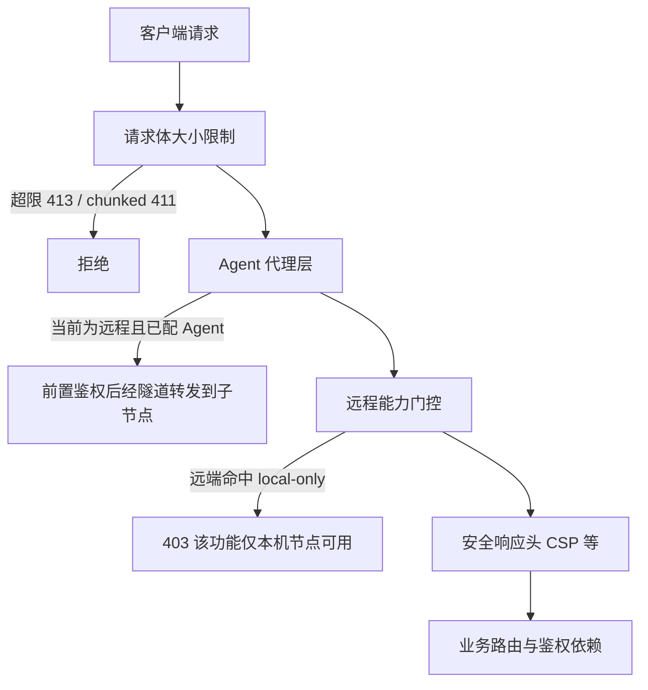

# Graw API 概览（面向集成开发者）

一份用于对接 / 调用 Graw 接口的速查：鉴权模型、公共端点、WebSocket 鉴权、路由分组总表、错误约定与调试方式。

| 项 | 说明 |
|----|------|
| 读者 | 要调用 Graw API 的集成开发者、二次开发人员 |
| 前置阅读 | [AGENTS.md](../AGENTS.md) 第 3 节（路由清单与鉴权分级，权威） |
| 相关文档 | [docs/plugin-protocol.md](./plugin-protocol.md)（插件开放接口 `/api/op/*`）、[docs/node-agent.md](./node-agent.md)（多节点与 `X-Graw-Node`） |

## 1. 基本约定

- 所有业务接口以 `/api/*` 为前缀。
- 请求 / 响应主体均为 JSON（上传与 SSE 流式接口除外）。
- 除 `/api/auth/login` 与 `/api/health` 外，全部接口要求请求头：

  ```
  Authorization: Bearer <token>
  ```

- 令牌为 JWT（HS256，默认有效期 7 天），载荷含用户名、token 版本（`tv`）与会话 ID（`sid`）。

## 2. 鉴权模型

### 2.1 三类语义

| 类别 | 语义 | 定义位置 |
|------|------|----------|
| 公开 | 无需登录：`/api/auth/login`、`/api/health` | `main.py` 路由定义 |
| `PROTECTED` | 仅需登录（只读信息类） | `main.py`：`PROTECTED = [Depends(get_current_user), Depends(require_non_default_password)]` |
| `ADMIN` | 需管理员 | `main.py`：`ADMIN = [Depends(require_admin)]` |
| 端点内自鉴权 | 不挂全局依赖，由处理函数内部校验 | WebSocket（`?token=`）、`/api/shunx`、`/api/tamper`、`/api/ui`、`/api/system`、`/api/loginlog` 部分、`/api/agent` 等 |

### 2.2 鉴权链的级联关系

```
require_admin
  └─ require_non_default_password
       └─ get_current_user
            └─ (解析并校验 Bearer JWT)
```

- `require_admin` **内部已级联** `require_non_default_password` + `get_current_user`，因此标注为 ADMIN 的路由无需再声明登录依赖。
- 校验链包含：签名有效 → 用户存在 → token 版本一致（改密 / 注销会使旧令牌失效）→ 会话未吊销（`sid` 在会话表中）→ **非默认密码**。
- 使用默认密码的账号（例如重置回 `admin123`）会被 `require_non_default_password` 拦下，必须先在面板改密（HTTP 返回相应错误，前端引导改密）。

> 关于多节点：业务请求可带请求头 **`X-Graw-Node: <节点ID>`** 临时切换「当前管理主机」（主面板按窗口聚焦节点下发）；WebSocket 因无法带请求头改用查询参数 `?node=`。详见 [docs/node-agent.md](./node-agent.md) 第 4 节。

## 3. 公共端点

| 方法 | 路径 | 说明 |
|------|------|------|
| `POST` | `/api/auth/login` | 登录，返回令牌与用户信息 |
| `GET` | `/api/health` | 健康检查，返回 `{ "status": "ok", "name": "Graw", "version": "..." }`（无需鉴权） |

`/api/health` 的 `version` 在容器部署时优先读取面板容器镜像 tag / `org.opencontainers.image.version` label，读取不到才回退内置常量 `APP_VERSION`（`backend/app/main.py`）。

其他需要注意的「半公开」端点（不挂全局依赖，由端点内部决定）：

| 路径 | 说明 |
|------|------|
| `GET /api/ui/public` | 登录页展示用的界面设置（网站名 / 欢迎语 / Logo），公开 |
| `GET /api/shunx/status` | 安全入口状态，公开；其余 `/api/shunx/*` 内部鉴权 |
| `GET /api/appstore/icons/{app_id}` | 应用图标，公开静态资源（`` 无法带 Bearer） |
| `GET /api/op/protocol` | 插件协议握手信息，公开 |
| `POST /api/gitdeploy/...`（webhook） | Git 平台回调，无面板登录态，端点内校验签名 |

## 4. WebSocket 鉴权

浏览器 WebSocket 无法自定义 `Authorization` 头，因此 WS 端点统一用**查询参数 `?token=`** 鉴权，处理函数内部校验：

| 端点 | 鉴权依赖 | 语义 |
|------|----------|------|
| `/api/terminal/ws` | `get_current_user_ws_admin` | 登录 + **强制管理员** + 非默认密码 |
| `/api/terminal/ws/container` | 同上 | 容器终端 |
| `/api/system/ws` | `get_current_user_ws_checked` | 登录 + 非默认密码（与 `/api/system/*` 的只读语义一致） |
| `/api/tamper/ws` | 同 WS 校验链 | 防篡改实时告警推送 |

节点参数：

- `/api/terminal/ws?node=<节点ID>`：终端会话**绑定该节点**（不跟随全局当前节点）。
- `/api/terminal/ws?...&persist=1`：**持久化终端**。后端把 shell 进程常驻（会话键为 `<节点ID>|shell`），
  WS 断开只摘客户端、进程继续运行；重连时先回放最近 256KB 输出快照再继续交互，用于长时间任务不因
  刷新面板而中断。接入时后端会先下发控制帧 `{"type":"persist",...}`（前端只用于状态展示，不写入终端）。
  配套管理接口 `GET /api/terminal/persist`（列出常驻会话的脱敏状态）与
  `DELETE /api/terminal/persist?node=<节点ID>`（结束常驻会话，均为 `ADMIN`）。
- `/api/system/ws?node=<节点ID>`：目标为已配置 Agent 的 SSH 子节点时，桥接到子节点自身的 `/api/system/ws`；**`?node=` 仅管理员生效**，非管理员会被忽略并回落到全局当前节点（与 HTTP 只读接口的可视范围一致）。

示例：

```text
ws://<host>/api/terminal/ws?token=<JWT>&node=node_ab12cd34
ws://<host>/api/terminal/ws?token=<JWT>&persist=1          # 持久化终端（刷新后接回同一会话）
ws://<host>/api/system/ws?token=<JWT>
```

> 部署在反向代理后时，务必透传 `Upgrade` / `Connection` 头并延长读超时，否则 WS 无法建立。反代日志请对 `?token=` 做脱敏。

## 5. 路由分组总表

前缀与鉴权级别来自 `backend/app/main.py` 的 `include_router(...)`。「local-only」表示该前缀属于 `remote_cap.LOCAL_PREFIX`：当前管理主机为**远程节点且未配置 Agent** 时会被门控返回 403。

| 前缀 | 鉴权级别 | local-only | 说明 |
|------|----------|:---:|------|
| `/api/auth` | 公开（登录）+ 登录 + 管理员（用户管理） | — | 登录、当前用户、改密、用户管理 |
| `/api/agent` | 机器间（`/issue` 成对密钥）；`/cfg`、`/reveal-secret` 管理员 | — | 子节点机器间鉴权与收取模式配置 |
| `/api/health` | 公开 | — | 健康检查与版本 |
| `/api/system` | 端点内 `PROTECTED` + WS `?token=` | — | CPU / 内存 / 磁盘 / 网络 / 负载、历史指标、实时流 |
| `/api/notes` | `PROTECTED`（写操作内部 require_admin） | — | 备忘录 |
| `/api/docker` | `ADMIN` | — | 容器与镜像管理 |
| `/api/dockervolumes` | `ADMIN` | — | 数据卷管理 |
| `/api/containeredit` | `ADMIN` | — | 容器资源与端口编辑 |
| `/api/process` | `ADMIN` | — | 进程管理 |
| `/api/files` | `ADMIN` | — | 文件浏览、传输、权限、压缩解压 |
| `/api/recycle` | `ADMIN` | — | 回收站 |
| `/api/terminal` | WS `?token=` 强制管理员；REST 为 `ADMIN` | — | Web 终端（WebSocket）+ 持久化终端会话管理 |
| `/api/sites` | `ADMIN` | ✔ | 网站虚拟主机管理 |
| `/api/databases` | `ADMIN` | ✔ | 数据库连接与查询 |
| `/api/cron` | `ADMIN` | ✔ | 计划任务 |
| `/api/firewall` | `ADMIN` | — | 防火墙（host 类，远端可用） |
| `/api/ssl` | `ADMIN` | ✔ | 证书管理 |
| `/api/logs` | `ADMIN` | — | 日志中心 |
| `/api/protection` | `ADMIN` | ✔ | 防护配置 |
| `/api/shunx` | 端点内（`/status` 公开） | — | ShunX 安全入口 |
| `/api/tamper` | 端点内（读需登录、写需管理员）+ WS | ✔ | 网页防篡改 |
| `/api/appstore` | `ADMIN`（图标路由公开） | ✔ | 应用商店 |
| `/api/tasks` | `ADMIN` | ✔ | 任务中心 |
| `/api/runtime` | `ADMIN` | ✔ | 语言运行时容器 |
| `/api/disks` | `ADMIN` | — | 磁盘 / 分区 |
| `/api/nodes` | `ADMIN` | — | 多节点管理与主机切换 |
| `/api/ui` | 端点内（`/public` 公开、`/config` 管理员） | — | 界面设置 |
| `/api/frp` | `ADMIN` | — | 内网穿透 |
| `/api/netstorage` | `ADMIN` | ✔ | 网络储存（FTP/SMB/WebDAV/对象存储） |
| `/api/update` | `ADMIN` | ✔ | 面板自身更新 |
| `/api/waf` | `ADMIN` | ✔ | WAF |
| `/api/webmode` | `ADMIN` | ✔ | Web 服务器引擎模式（NGINX / OpenResty） |
| `/api/backup` | `ADMIN` | ✔ | 备份中心 |
| `/api/notify` | `ADMIN` | ✔ | 通知中心 |
| `/api/uptime` | `ADMIN` | ✔ | 站点可用性检测 |
| `/api/certcheck` | `ADMIN` | ✔ | 证书到期提醒 |
| `/api/panelbackup` | `ADMIN` | ✔ | 面板自身备份导出 / 导入 |
| `/api/loginlog` | `PROTECTED`（`list`/`clear`/`config` 内部 require_admin） | ✔ | 登录日志 |
| `/api/webstats` | `ADMIN` | ✔ | 网站访问统计 |
| `/api/rewrite` | `ADMIN` | ✔ | 伪静态规则 |
| `/api/sitesopts` | `ADMIN` | ✔ | 站点增强配置 |
| `/api/rollback` | `ADMIN` | — | 配置快照 / 一键回滚 |
| `/api/batch` | `ADMIN` | — | 批量操作中心 |
| `/api/gitdeploy` | `ADMIN`（webhook 端点内部校验签名） | — | 站点 Git 自动部署 |
| `/api/report` | `ADMIN` | — | 巡检报告 |
| `/api/portforward` | `ADMIN` | — | SSH 端口转发 |
| `/api/imgsafety` | `ADMIN` | — | 镜像漏洞扫描 |
| `/api/slowquery` | `ADMIN` | — | MySQL 慢查询分析 |
| `/api/svcmonitor` | `ADMIN` | — | 服务 / 端口监控 |
| `/api/sshkeys` | `ADMIN` | ✔ | SSH 密钥管理与部署 |
| `/api/healthcheck` | `ADMIN` | — | 一键系统体检 |
| `/api/ftpusers` | `ADMIN` | ✔ | 虚拟 FTP 用户 |
| `/api/toolbox` | `ADMIN` | — | 工具箱 |
| `/api/phpversions` | `ADMIN` | ✔ | PHP 多版本管理 |
| `/api/plugins` | `ADMIN` | ✔ | 插件管理（GPOP）；`/settings` 总开关始终注册 |
| `/api/op` | 插件令牌（`X-Graw-Plugin-Id` + Bearer） | ✔ | 插件开放接口 |
| `/api/health` | 公开 | — | 见第 3 节 |

> `local-only` 一列仅标注 `remote_cap.LOCAL_PREFIX` 命中项；未标注的属 host 类（进程 / 文件 / Docker / 磁盘 / 日志 / 终端 / 系统监控 / 防火墙 / 服务监控 / 体检 / 工具箱），远端节点下仍可用。

## 6. 请求处理顺序（中间件链）

由外到内（外层先执行）：



| 层 | 作用 |
|----|------|
| 请求体大小限制 | 纯 ASGI 中间件，最外层。`Transfer-Encoding` 一律 411；`Content-Length` 超限 413（普通 16MB / multipart 2048MB，可用 `GRAW_MAX_BODY_MB`、`GRAW_MAX_UPLOAD_MB` 调整）；多个不一致的 `Content-Length` 返回 400 |
| Agent 代理层 | 当前节点为远程且配置了 Agent 时，业务请求（见第 7 节排除规则）先做等价鉴权再经隧道代理到子节点；WebSocket 升级不代理 |
| 远程能力门控 | 远端节点命中 local-only 前缀时 403（纵深防御） |
| 安全响应头 | 为所有响应附加 CSP、`X-Content-Type-Options: nosniff`、`X-Frame-Options: DENY`、`Referrer-Policy: same-origin` |

## 7. 哪些接口会经 Agent 隧道透传

当前管理主机为远程节点且该节点配置了 Agent（`agent_port` + `agent_key` + `agent_secret` 齐全）时，业务 `/api/*` 请求会被外层中间件代理到子节点，**以下前缀除外**（`_AGENT_PROXY_EXCLUDE_PREFIX`）：

```
/api/auth  /api/nodes  /api/terminal  /api/agent  /api/ui
/api/shunx  /api/health  /api/batch  /api/gitdeploy  /api/portforward
```

排除原因分两类：

- **主面板自身职责**：登录（`auth`）、节点管理（`nodes`）、终端（`terminal`，走 paramiko）、Agent 自身（`agent`）、界面设置（`ui`）、安全入口（`shunx`）、健康检查（`health`）。
- **必须在主面板本地执行**：批量操作（`batch`，主面板持全部节点凭据直连）、Git 部署 webhook（`gitdeploy`，按 `node_id` 分发）、端口转发（`portforward`，隧道建立在主面板与节点之间）。

另有两点必须知道：

1. **代理前先在主面板本地鉴权**，等价于业务路由的依赖链。非管理员仅允许代理只读路径（`GET /api/system`、`GET /api/notes`、`GET /api/tamper`），其余返回 403；未认证返回 401。原因是代理会附带子节点 agent 的管理员 JWT，不能因「子节点会自己鉴权」而放松。
2. 代理内部会把请求头 `Authorization` 替换为子节点的 JWT，并保留原路径与查询串；代理失败返回 **502**（错误详情只记日志，不回传）。

## 8. 统一错误返回

业务接口统一通过 FastAPI 的 `HTTPException` 返回 JSON：

```json
{ "detail": "错误说明" }
```

常用状态码约定：

| 状态码 | 含义 |
|--------|------|
| `400` | 参数 / 请求体非法（含 `Content-Length` 相关校验、节点参数格式、白名单校验失败等） |
| `401` | 未认证（无 / 失效 / 被吊销的令牌；Agent 凭证校验失败） |
| `403` | 权限不足（非管理员访问管理接口；远端节点命中 local-only；插件未声明能力） |
| `404` | 资源不存在（含 Agent 未启用时的 `/api/agent/issue`） |
| `411` | 请求使用 `Transfer-Encoding` 而未声明 `Content-Length` |
| `413` | 请求体 / 上传体过大 |
| `500` | 服务端内部错误（含 compose 执行失败） |
| `502` | 上游拉取 / Agent 代理失败（如远程索引、GitHub README、隧道转发） |
| `503` | 依赖不可用（如 Docker/Podman 不可用） |
| `504` | 执行超时（如 `docker compose` 超时） |

## 9. 调试：打开 API 文档

`/docs`、`/redoc`、`/openapi.json` 生产默认**关闭**（避免向任意设备暴露完整接口结构与参数）。调试时：

```bash
# 启动前设置环境变量
GRAW_ENABLE_DOCS=1 python -m uvicorn app.main:app --host 0.0.0.0 --port 8000
```

随后访问 `http://<host>:8000/docs`。由于这些端点不在 `/api` 前缀下，仅在确认环境可信且临时调试时开启。

## 10. 调用示例

```bash
# 1) 登录拿令牌
curl -s -X POST http://127.0.0.1:8000/api/auth/login \
  -H 'Content-Type: application/json' \
  -d '{"username":"admin","password":"你的密码"}'

# 2) 带令牌调用业务接口
TOKEN='<上一步返回的 token>'
curl -s http://127.0.0.1:8000/api/system/overview \
  -H "Authorization: Bearer $TOKEN"

# 3) 指定目标节点（统一面板场景）
curl -s http://127.0.0.1:8000/api/docker/containers \
  -H "Authorization: Bearer $TOKEN" \
  -H 'X-Graw-Node: node_ab12cd34'
```

> 具体业务端点的路径与参数请以「打开 `/docs` 后的 OpenAPI」或对应模块代码为准；`AGENTS.md` 第 3 节是路由与鉴权的权威清单。