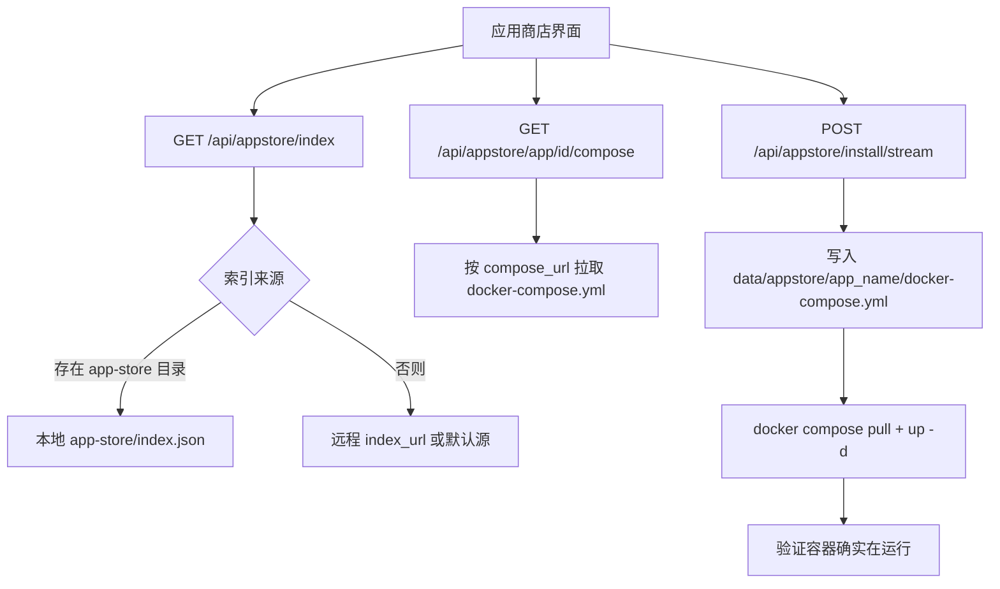

# 面板侧应用商店机制与配方要点

从「面板怎么拉索引、怎么装应用、文件落在哪」的角度讲清 Graw 应用商店；配方字段与提交规范不在这里重复，见 [app-store/README.md](../app-store/README.md)。

| 项 | 说明 |
|----|------|
| 读者 | 运维（要装 / 排查应用）、配方作者（要理解面板侧行为） |
| 前置阅读 | [docs/deployment.md](./deployment.md)（尤其是 `GRAW_HOST_DATA` 与 data 目录挂载） |
| 字段与规范 | [app-store/README.md](../app-store/README.md)（`data.yml` 字段、compose 约定、i18n、CI 发布） |
| 相关文档 | [docs/plugin-protocol.md](./plugin-protocol.md)（GPOP 插件协议，与商店不同）、[GETMEREAD/08-应用接口开放协议.md](../GETMEREAD/08-应用接口开放协议.md) |

## 1. 一句话机制

**Docker 为底层，GitHub 链接即应用**：应用元数据、图标、compose 模板托管在 GitHub（GitHub Pages），面板拉取 `index.json` 渲染列表；安装时按应用的 `compose_url` 拉取 `docker-compose.yml`，注入安装选项后在本机执行 `docker compose up -d`。



## 2. 面板如何拉取索引

### 2.1 索引地址配置

| 方法 | 路径 | 说明 |
|------|------|------|
| `GET` | `/api/appstore/config` | 返回 `{ index_url, configured, default_url }` |
| `PUT` | `/api/appstore/config` | 更新索引地址，仅接受 `http` / `https`（其它 scheme 返回 400） |
| `GET` | `/api/appstore/index?refresh=1` | 获取索引（`refresh` 请求强制刷新，见下方限制） |

- **默认源**：未配置时使用 `https://wuhulab.github.io/Graw-app-store/index.json`（代码常量 `DEFAULT_INDEX_URL`）。
- **配置落盘**：`backend/data/appstore.json`，结构为 `{ "index_url": "..." }`；改动后清空索引缓存，下次请求重新拉取。
- **SSRF 防护**：拉取时校验 scheme 且目标主机的**全部解析 IP 必须是公网地址**（拒绝回环 / 私网 / 链路本地 / 保留地址），重定向每一跳同样校验。确需访问内网私有商店时，设环境变量 `GRAW_APPSTORE_ALLOW_PRIVATE_NET=1` 显式关闭该限制。

### 2.2 本地优先与缓存 TTL

`_load_index()` 的策略：

| 场景 | 行为 | 缓存 |
|------|------|------|
| 存在 `app-store/` 目录（开发模式） | **优先读本地** `app-store/index.json`，不拉远程 | 本地源 60 秒 |
| 否则 | 拉远程索引（配置地址或默认源） | 远程 24 小时（`refresh` 也受此限制，一天最多刷新一次） |

缓存未命中才真正发起网络请求；拉取是同步 `urllib`，面板会放到线程池执行以免卡住事件循环。

### 2.3 索引响应与图标

`GET /api/appstore/index` 返回 `{ source, error, updated_at, store, apps }`，其中：

- `source` 取值为 `local` / `remote` / `remote_cached`（可据此判断数据来自本地还是远程）；
- `apps[].icon` 会被面板**统一改写为本地静态地址** `/api/appstore/icons/{id}`，不依赖外部 CDN；
- 图标路由 `GET /api/appstore/icons/{app_id}` 是**无鉴权的公开静态资源**（`` 无法带 Bearer），按 `app-store/apps/<id>/icon.png` → `icon.svg` 顺序查找返回。

索引结构示例（顶层 `store` + `apps`，完整定义见 [app-store/README.md](../app-store/README.md)）：

```json
{
  "store": { "name": "Graw Community App Store", "updated_at": "2026-08-15T...", "app_count": 4 },
  "apps": [
    {
      "id": "uptime-kuma",
      "name": "Uptime Kuma",
      "versions": [ { "tag": "1", "label": "最新" } ],
      "ports": [ { "container": 3001, "label": "Web 界面", "protocol": "tcp" } ],
      "compose_url": "https://raw.githubusercontent.com/<owner>/<repo>/gh-pages/apps/uptime-kuma/docker-compose.yml"
    }
  ]
}
```

> 索引若缺少 `apps` 字段会被判为格式不正确；远程拉取失败时接口返回 `502`。

## 3. 查看 compose 与应用 README

| 方法 | 路径 | 说明 |
|------|------|------|
| `GET` | `/api/appstore/app/{app_id}/compose` | 返回 `{ app_id, name, compose }`（compose 原文） |
| `GET` | `/api/appstore/app/{app_id}/readme` | 从应用的 GitHub 开源地址拉 README（`github.com` 地址） |

- compose 来源：优先应用条目的 `compose_url`；拉取失败或未提供时回退本地 `app-store/apps/<id>/docker-compose.yml`（开发模式）。
- README 走 GitHub API（自动识别默认分支与文件名），失败回退 `raw.githubusercontent.com` 的 `HEAD` / `main` / `master`；内容限长 512KB，超限返回 413。

## 4. 安装流程与落盘位置

### 4.1 两个安装端点

| 方法 | 路径 | 说明 |
|------|------|------|
| `POST` | `/api/appstore/install` | 同步安装：阻塞直到 compose 执行完成，返回完整结果 |
| `POST` | `/api/appstore/install/stream` | **SSE 流式安装**：逐步推送状态与 compose 输出日志，推荐使用 |

`install/stream` 会在「任务中心」创建一条持久化任务记录（`type=appstore-install`），安装日志写入 `backend/data/tasks/<task_id>.log`（JSONL）——即使浏览器刷新 / 断开，安装仍在后台继续。

安装 / 卸载等动作会写入操作审计日志。

### 4.2 落盘位置（重要）

| 内容 | 路径 |
|------|------|
| 索引地址配置 | `backend/data/appstore.json` |
| 每个已安装应用的 compose 项目目录 | `backend/data/appstore/<app_name>/` |
| 注入选项后的最终 compose | `backend/data/appstore/<app_name>/docker-compose.yml` |
| 任务记录 | `backend/data/tasks.json` |
| 任务日志（含安装日志） | `backend/data/tasks/<task_id>.log` |
| 本地索引 / 应用资源（仓库内，开发模式） | `app-store/index.json`、`app-store/apps/<app-id>/` |
| 图标 | `app-store/apps/<app-id>/icon.png` 或 `icon.svg` |

> `app_name` 由安装请求传入（Graw 维护应用名称，仅英文/数字/`_`/`-`/`.`，字母数字开头），同时用作 compose 项目名与容器名前缀。

### 4.3 容器 /host 模式下的路径转换

执行 compose 的是**宿主机 docker**，而 compose 文件写在面板的 data 目录里（容器内路径）。因此：

- `/host` 挂载模式下，面板用 `hostfs.host_visible_path(compose_path, DATA_DIR)` 把路径换算为宿主机可见路径：即 `GRAW_HOST_DATA` + data 目录内相对路径；
- 未显式配置 `GRAW_HOST_DATA` 时退化为 `/host` 前缀拼接（仅当 data 恰好 bind 在同名路径才正确）；
- Windows 非 host 模式会转换成 WSL 路径（`C:\x` → `/mnt/c/x`）。

**结论**：data 目录必须 bind mount 到宿主机某目录，并正确设置 `GRAW_HOST_DATA` 指向该宿主路径，否则应用商店安装会因宿主 docker 读不到 compose 文件而失败。

### 4.4 compose 改写规则

面板会对下载到的 compose 做解析改写（需要 PyYAML，缺失时报 500）：

- 字符串级替换 `${VERSION}`（用户选择的版本 tag）与 `${TZ}`（时区）；
- 每个 service：写入 `container_name`（多服务时为 `<名称>_<服务>`，避免重名）、`restart`、`TZ` 环境变量、`deploy.resources.limits`（`cpus` / `memory`）；
- 端口映射**只在服务已声明该容器端口时替换宿主端口**，不会给配套服务（db / redis 等）误加端口。

### 4.5 安装选项（请求体字段）

```json
{
  "app_id": "uptime-kuma",
  "app_name": "uptime-kuma",
  "version": "1",
  "port": 3001,
  "ports": [ { "container": 3001, "external": 3001 } ],
  "timezone": "Asia/Shanghai",
  "container_name": "",
  "expose_port": false,
  "restart": "always",
  "cpu_limit": 0,
  "mem_limit_mb": 0,
  "pull": true,
  "compose": null
}
```

| 字段 | 说明 |
|------|------|
| `version` | 版本 tag，白名单字符集（防借 `${VERSION}` 注入 YAML 键） |
| `port` / `ports` | 单端口 / 多端口映射；`ports` 为 `[{container, external}]` |
| `timezone` | 注入为 `TZ` 环境变量，IANA 时区名格式 |
| `container_name` | 留空自动为 `graw-<app_name>` |
| `expose_port` | 是否放行防火墙端口（仅外部访问场景） |
| `restart` | 合法值：`no` / `always` / `unless-stopped` / `on-failure` |
| `cpu_limit` / `mem_limit_mb` | 0 表示不限制 |
| `pull` | 安装前是否先 `docker compose pull` |
| `compose` | **用户编辑后的 compose 内容**，非空则覆盖下载内容（「自定义 compose 编辑」即此字段） |

### 4.6 执行与校验

- 引擎发现复用 Docker 管理同一套逻辑（Docker 或 Podman）；compose 必须走 CLI，检测到只有 SDK 而无 `docker` CLI 时会报 503。
- 依次执行 `docker compose pull`（可选）与 `docker compose up -d --remove-orphans`；超时上限 1800 秒，超时报 504 并提示可能仍在拉镜像。
- 安装成功后**会实际验证容器**：执行 `docker ps -a --format json`，确认存在匹配 `<project>_` / `<project>-` 前缀或指定容器名的容器且处于运行态。这是为了兜住 `podman-compose` 在镜像拉取失败时 `rc=0` 却未创建容器的误报。

## 5. 与 GPOP 插件的区别与选择建议

应用商店与插件都走 Docker + compose，但定位不同：

| 维度 | 应用商店（App Store） | 插件（GPOP） |
|------|----------------------|--------------|
| 解决的问题 | 一键部署**现成的第三方应用**（Nextcloud、Uptime Kuma 等） | 为面板**扩展能力**，与面板双向交互 |
| 与面板关系 | 单向：面板只负责安装 / 起停容器，应用不需要认识面板 | 双向：插件容器调用面板开放接口 `/api/op/*` |
| 协议注入 | 只注入用户配置的 `TZ` 等环境变量 | 注入 `GRAW_PLUGIN_ID` / `GRAW_PLUGIN_TOKEN` / `GRAW_PANEL_URL` / `GRAW_PLUGIN_API_VERSION` |
| 鉴权 | 无（应用自身鉴权） | 插件 ID + Bearer 令牌（面板只存 SHA-256 哈希），按 `capabilities` 能力白名单门控 |
| 清单 / 元数据 | `data.yml`（应用元数据）+ `docker-compose.yml` | `plugin.yml`（manifest v1，含 `capabilities` / `entry`） |
| 注册表 / 配置 | 无集中注册表；配置源为索引 `index.json` | `backend/data/plugins.json`、`backend/data/plugins/<id>/config.json` |
| 管理接口 | `/api/appstore/*` | 管理 `/api/plugins/*`、开放 `/api/op/*` |
| 协议文档 | [app-store/README.md](../app-store/README.md) | [docs/plugin-protocol.md](./plugin-protocol.md) |

**选择建议**：

- 想把某个开源应用「装到服务器上跑起来」→ 走**应用商店**，写 `data.yml` + `docker-compose.yml` 提交配方。
- 想让应用或脚本**主动与 Graw 面板交互**（推通知到面板通知中心、写面板审计日志、读写自己的面板侧配置）→ 走**GPOP 插件**。
- 两者都基于各面板的 Docker 引擎执行 compose，因此都要求 Docker/Podman 可用（否则报 503）。

## 6. 常见问题

| 现象 | 原因 | 处理 |
|------|------|------|
| 索引拉取失败 / 502 | 索引地址不可达、格式缺少 `apps`、被 SSRF 防护拒绝（内网地址） | 检查 `index_url`；内网商店需设 `GRAW_APPSTORE_ALLOW_PRIVATE_NET=1` |
| 刷新按钮提示已达上限 | 远程索引 24 小时内最多拉一次 | 等次日，或用开发模式（存在 `app-store/` 目录时读本地索引） |
| 安装失败：找不到 compose 文件 | 未设置 `GRAW_HOST_DATA` 或 data 未 bind 到宿主 | 见第 4.3 节 |
| 安装返回成功但容器没起来 | 已由面板的容器验证兜住并报错 | 看安装日志（任务中心 / `data/tasks/<id>.log`）中的镜像拉取输出 |
| 编辑自定义 compose 后安装异常 | 自定义内容覆盖了下载内容，缺 `services` 定义或 YAML 非法 | 面板会返回 400，检查 YAML |
| 图标不显示 | `app-store/apps/<id>/icon.png|svg` 缺失 | 补图标（仅告警，不影响安装） |
| 提示缺少 PyYAML | 运行环境未安装依赖 | 安装 `requirements.txt` 中的 `PyYAML` |