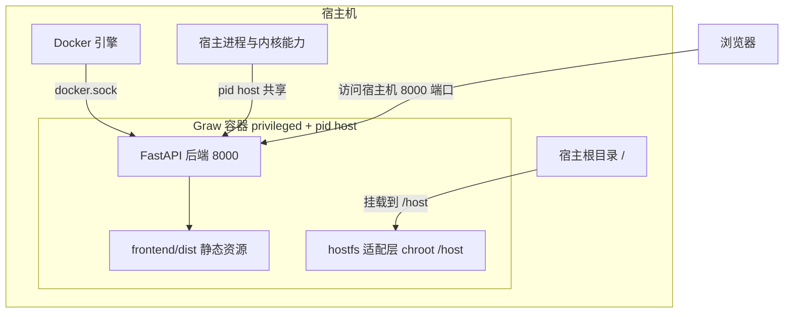

# Graw 部署与运维指南

讲清楚 Graw 怎么部署、环境变量有哪些、数据放哪、怎么升级备份、上反向代理与 HTTPS 要注意什么，以及出问题先看哪里。

| 项 | 说明 |
|----|------|
| 读者 | 负责部署 / 维护 Graw 的运维人员、自建服务器的开发者 |
| 前置阅读 | [README.md](../README.md)（项目概览与下载方式）、[AGENTS.md](../AGENTS.md) 第 7 节（陷阱） |
| 相关文档 | [docs/node-agent.md](./node-agent.md)（多节点接入）、[docs/api-overview.md](./api-overview.md)（接口鉴权） |

## 1. 部署形态总览

Graw 是一个「容器里跑，但要管理宿主机」的面板：所有实际管理动作（Docker 容器、网站配置、Web 终端、进程/防火墙等）都必须落到**宿主机**上执行。因此容器不能只做端口映射裸跑，必须让容器：

- 访问宿主机 Docker（`/var/run/docker.sock`）；
- 看到宿主机根目录（`-v /:/host:rslave` + `HOST_ROOT=/host`，面板经 `chroot /host` 操作宿主文件与命令）；
- 具备宿主级权限（`privileged` + `pid host`，否则 `chroot`、iptables、进程/系统监控都看不到或改不动宿主机）。



### 方式一：Linux 服务器（推荐，host 网络）

直接监听宿主机 8000 端口，无需端口映射：

```bash
docker run -d --name graw-panel \
  --network host --pid host --privileged \
  -v /opt/graw/data:/app/backend/data \
  -v /:/host:rslave \
  -v /var/run/docker.sock:/var/run/docker.sock \
  -e HOST_ROOT=/host \
  -e GRAW_HOST_DATA=/opt/graw/data \
  -e TZ=Asia/Shanghai \
  shunx/graw:latest
```

启动后访问 `http://<服务器IP>:8000`。

### 方式二：Bridge 网络（自定义访问端口）

想换个对外端口（示例 8041）时，去掉 `--network host` 改用 `-p`：

```bash
docker run -d --name graw-panel \
  -p 8041:8000 --pid host --privileged \
  -v /opt/graw/data:/app/backend/data \
  -v /:/host:rslave \
  -v /var/run/docker.sock:/var/run/docker.sock \
  -e HOST_ROOT=/host \
  -e GRAW_HOST_DATA=/opt/graw/data \
  -e TZ=Asia/Shanghai \
  shunx/graw:latest
```

启动后访问 `http://<服务器IP>:8041`。注意：Bridge 模式下容器网络不等于宿主网络，涉及宿主机网络的操作（部分防火墙/端口管理）行为与 host 模式不同，能用 host 网络时优先用方式一。

### 方式三：Docker Compose

仓库已提供高权限编排（`docker-compose.yml`）：

```bash
git clone https://github.com/wuhulab/Graw.git
cd Graw
docker compose up -d --build
```

该编排 `network_mode: host`，因此宿主机直接占用 8000 端口，无需 `ports` 映射。

### 关键参数为什么必需

| 参数 | 作用 | 缺了会怎样 |
|------|------|-----------|
| `--privileged` | 授予容器全部内核能力（iptables、chroot、挂载、访问设备） | 防火墙规则、`chroot /host`、挂载类操作在容器内不生效 |
| `--pid host` | 共享宿主机进程命名空间 | 进程管理 / 系统监控只能看到容器内进程 |
| `--network host` | 使用宿主机网络 | 需改用 `-p` 映射端口；部分宿主网络操作行为不一致 |
| `-v /:/host:rslave` + `HOST_ROOT=/host` | 把宿主根目录挂进容器 `/host`，面板经适配层（`backend/app/hostfs.py`）读写宿主文件、以 `chroot /host` 执行宿主命令 | 网站配置、证书、日志、crontab 等全部无法作用于宿主机 |
| `-v /var/run/docker.sock:...` | 对接宿主 Docker 引擎 | 容器 / 镜像 / 日志管理不可用 |
| `-v /opt/graw/data:/app/backend/data` + `GRAW_HOST_DATA=/opt/graw/data` | 数据目录 bind 到宿主，且告知其宿主路径 | 应用商店安装（宿主 docker 需读到 compose 文件）会失败 |

> ⚠️ 上述容器实质拥有宿主机 root 级操作能力，**仅建议部署于可信环境**。首次登录后请立即修改默认密码（首次启动播种 `admin` / `admin123`，强制改密），并妥善保护 `backend/data/`。

## 2. 环境变量全表

以下变量均在**运行时**读取，默认值来自代码；「默认」列为空表示未设置即走默认行为。

| 变量 | 含义 | 默认 / 取值 | 来源 |
|------|------|-------------|------|
| `HOST_ROOT` | 宿主机根目录在容器内的挂载点；为空表示面板直接在本机运行（非容器），路径与命令原样执行 | 空；容器部署设为 `/host` | `backend/app/hostfs.py` |
| `GRAW_HOST_DATA` | 面板 `data` 目录在**宿主机**上的实际路径，供宿主 docker 读取 compose / 备份文件 | 空；未配置时退化为 `/host` 前缀拼接 | `backend/app/hostfs.py` |
| `GRAW_ENABLE_DOCS` | 设为 `1` 时开放 `/docs`、`/redoc`、`/openapi.json` | 空（关闭） | `backend/app/main.py` |
| `GRAW_SESSION_ONLINE_SECONDS` | 会话「在线」判定的空闲阈值（秒），超时无活跃视为离线 | `7200`（2 小时） | `backend/app/auth.py` |
| `TZ` | 容器时区 | 镜像内 `Asia/Shanghai` | `Dockerfile` |
| `GRAW_AGENT_KEY` | 子节点「收取模式」访问 key（成对密钥之一，传统环境变量注入方式） | 空 | `backend/app/agent_cfg.py` |
| `GRAW_AGENT_SECRET` | 子节点校验 secret（成对密钥之一） | 空 | `backend/app/agent_cfg.py` |
| `GRAW_AGENT_TS_WINDOW` | Agent 换取 JWT 时签名时间戳的新鲜度窗口（秒），超窗拒绝 | `300` | `backend/app/agent_cfg.py` |
| `GRAW_MAX_BODY_MB` | 普通请求体大小上限（MB） | `16` | `backend/app/main.py` |
| `GRAW_MAX_UPLOAD_MB` | multipart 上传大小上限（MB） | `2048` | `backend/app/main.py` |
| `GRAW_APPSTORE_ALLOW_PRIVATE_NET` | 设为 `1` 时允许应用商店索引 / compose 指向内网私有地址（否则拒绝非公网目标，SSRF 防护） | 空（仅公网） | `backend/app/routers/appstore.py` |
| `GRAW_NOTIFY_ALLOW_PRIVATE_NET` | 设为 `1` 时允许通知渠道 webhook 指向私网地址（回环 / 链路本地/云元数据始终拒绝） | 空 | `backend/app/routers/notify.py` |
| `GRAW_UPTIME_ALLOW_PRIVATE_NET` | 设为 `1` 时允许站点可用性探测指向私网地址 | 空 | `backend/app/routers/uptime.py` |
| `GRAW_SVCMON_ALLOW_PRIVATE_NET` | 服务/端口监控是否允许私网目标；设为 `0` 关闭 | 默认允许（`!= "0"`） | `backend/app/routers/svcmonitor.py` |
| `GRAW_CONTAINER_NAME` | 面板自身容器名，用于从容器读取版本号 | `graw-panel` | `backend/app/routers/docker_api.py` |
| `GRAW_RUNTIME_MOUNT_DENY` | 追加禁止作为运行时容器挂载源的宿主路径（逗号分隔） | 空；默认已拒绝 `/etc`、`/usr`、`/var`、`/root` 等系统根 | `backend/app/routers/runtime.py` |
| `TRUSTED_PROXY_DEPTH` | 反向代理层数，用于从 `X-Forwarded-For` 还原真实客户端 IP | `0`（直接部署，完全忽略 XFF） | `backend/app/auth.py` |

> `GRAW_STORE_REPO` 仅用于应用商店索引生成脚本（`app-store/scripts/generate_index.py`）的构建期调用，**不是**面板运行时变量。

## 3. 数据目录与权限

面板的所有配置 / 凭据都以 JSON 文件存放在 `backend/data/`（容器内即 `/app/backend/data`，bind 到宿主 `/opt/graw/data`）。

### 3.1 关键文件

| 文件 / 目录 | 内容 | 敏感 |
|-------------|------|------|
| `users.json` | 账号、密码哈希、角色、token 版本 | 高 |
| `secret.key` | JWT 签名密钥（首次启动自动生成） | 高 |
| `sessions.json` | 在线会话（sid、IP、设备、last_seen） | 中 |
| `nodes.json` | 多节点元数据（含 SSH 密码 / Agent 密钥，绝不回传前端） | 高 |
| `databases.json` / `netstorage.json` / `frp.json` / `ftp_users.json` | 数据库、网络储存、内网穿透、FTP 用户凭据 | 高 |
| `agent.json` | 子节点「收取模式」配置（enabled / key / secret） | 高 |
| `plugins.json`、`plugins/<id>/config.json` | 插件注册表（令牌仅存 SHA-256 哈希）与插件配置 | 中 |
| `appstore.json`、`appstore/<app_name>/` | 应用商店索引地址配置；每个已安装应用的 compose 项目目录 | 中 |
| `tasks.json`、`tasks/<id>.log` | 任务中心记录与任务日志（JSONL） | 低 |
| `panelbackups/` | 面板自身导出 / 导入前备份的归档（`.tar.gz`） | 高（含 `secret.key`） |
| `metrics/`、`reports/`、`ssl/`、`sshkeys/`、`tamper_backups/` | 指标历史、巡检报告、证书、SSH 密钥、防篡改备份 | 视内容 |

### 3.2 权限收紧

`main.py` 的 `_secure_data_dir()` 在每次启动（lifespan）时统一收紧权限：**目录 `0700`、文件 `0600`**（递归）。这样即使默认 umask 宽松，同机低权用户也无法读取凭据文件或伪造 JWT。

- 该操作仅在 Linux 生效；Windows / FAT 等不支持的文件系统会静默忽略（不影响功能）。
- **不要在代码里放宽这些权限**，也不要将 `data/` 提交进仓库（已在 `.gitignore`）。

## 4. 升级、备份与恢复

### 4.1 升级

- **版本号单一来源**：后端版本常量 `APP_VERSION` 定义在 `backend/app/main.py`。`/api/health` 在容器部署时优先读取面板容器镜像 tag / `org.opencontainers.image.version` label，读取不到才回退到该常量（见 `docker_api.get_self_app_version`）。
- 容器化升级推荐流程：

```bash
# Compose 部署
docker compose pull
docker compose up -d

# 或直接使用新镜像重建（务必保留 data 目录的 bind mount）
docker rm -f graw-panel
docker run -d --name graw-panel ... shunx/graw:latest
```

- **升级前先备份 `data/`**（见下）。数据目录与镜像解耦，重建容器不会丢配置。

### 4.2 备份

两种途径：

1. **面板内置「面板备份」**（管理员）：`/api/panelbackup`。导出会把 `backend/data/` 下全部内容打包为 `.tar.gz` 归档（自动排除归档目录自身与 `*.tmp`），归档存放在 `backend/data/panelbackups/`。
2. **直接复制数据目录**（最稳，冷备）：

```bash
# 停容器后整目录复制
docker stop graw-panel
tar -czf graw-data-$(date +%Y%m%d).tar.gz -C /opt/graw data
docker start graw-panel
```

> 归档 / 目录含 `secret.key` 与各凭据，属高敏感数据，请加密保存、限制访问。

### 4.3 恢复

- 用「面板备份」导入：上传归档后，导入前会先把当前 `data/` 自动备份为 `panelbackups/pre-import-<时间戳>.tar.gz`（可回滚），再整体覆盖恢复。导入解压做了 Zip Slip 与解压炸弹防护，单次上传上限 200MB。**导入后建议重启后端**使配置生效。
- 冷备恢复：停容器 → 用备份覆盖宿主 `/opt/graw/data` → 启容器。

## 5. 反向代理与 HTTPS 场景注意事项

Graw 是**同源部署**设计：开发期由 Vite 代理 `/api`，生产期由后端直接托管 `frontend/dist`。放到 Nginx / Caddy 等反向代理后面时注意：

1. **CORS 已关闭**：后端 `CORSMiddleware` 的 `allow_origins=[]`、`allow_credentials=False`（同源请求不受影响）。**不要**为了图方便改成 `*`，那会向任意来源回显 CORS 头，扩大攻击面。
2. **WebSocket 必须透传 Upgrade**：系统监控流（`/api/system/ws`）、终端（`/api/terminal/ws`）、防篡改告警（`/api/tamper/ws`）都是 WebSocket。反代需转发 `Upgrade` / `Connection` 头，否则实时功能全部失效。Nginx 参考：

   ```nginx
   location / {
       proxy_pass http://127.0.0.1:8000;
       proxy_http_version 1.1;
       proxy_set_header Upgrade $http_upgrade;
       proxy_set_header Connection "upgrade";
       proxy_set_header Host $host;
       proxy_set_header X-Forwarded-For $proxy_add_x_forwarded_for;
       proxy_read_timeout 3600s;   # 终端/监控长连接，避免被掐断
   }
   ```

3. **WebSocket 鉴权走 `?token=`**：浏览器 WS 无法自定义 Bearer 头，终端与监控 WS 用查询参数令牌鉴权（终端强制管理员）。反代不要剥离查询串；并注意反代访问日志可能记录 `?token=`，建议对 WS 路径关闭或脱敏请求日志。
4. **真实客户端 IP**：直连时后端取 socket 对端地址，**完全忽略** `X-Forwarded-For`（防伪造）。经过反代后若要正确识别客户端 IP（审计 / 登录日志 / 异地提醒），需设置 `TRUSTED_PROXY_DEPTH=<代理层数>`，并由代理侧正确覆写 / 追加 XFF。
5. **安全响应头由后端附加**：所有响应带 CSP、`X-Content-Type-Options: nosniff`、`X-Frame-Options: DENY`、`Referrer-Policy: same-origin`。其中 CSP 的 `connect-src 'self' ws: wss:` 已放行同源 WebSocket；`X-Frame-Options: DENY` 意味着**面板不能被 iframe 嵌入**。若你在反代层再叠一层安全头，注意不要与之冲突。
6. **只暴露面板端口**：子节点 Agent 端口（默认 8000，实际由隧道走 `127.0.0.1`）不应对外开放，详见 [docs/node-agent.md](./node-agent.md)。

## 6. 常见故障排查

| 现象 | 原因 | 处理 |
|------|------|------|
| 访问根路径 404 或只有 API 能用 | 前端未构建，`frontend/dist` 不存在，后端不会挂载静态资源与 SPA 回退 | 在 `frontend/` 执行 `npm run build`，确认生成 `frontend/dist`（含 `index.html` 与 `assets/`）；容器部署请重新构建镜像 |
| 访问 `/docs` 提示 404 | API 文档默认关闭 | 设 `GRAW_ENABLE_DOCS=1` 后重启后端 |
| 网站 / 防火墙 / crontab 等操作「没反应」 | 未以 `privileged` + `HOST_ROOT=/host` 运行，命令未真正落到宿主机 | 检查容器参数与 `HOST_ROOT`；`chroot /host` 需要 `privileged` |
| 进程 / 系统监控只看到容器内进程 | 未使用 `--pid host` | 补上 `pid: host` |
| 应用商店安装失败，提示找不到 compose 文件 | 宿主 docker 读不到容器内 data 路径（未设置 `GRAW_HOST_DATA`，或 data 未 bind 到宿主） | 用 bind mount 挂载 data 并正确设置 `GRAW_HOST_DATA` 为宿主路径 |
| 登录后立刻被要求改密码 / 无法使用面板 | 默认密码账号被强制改密（`require_non_default_password`） | 修改默认密码；忘记密码见下 |
| 忘记管理员密码 | — | 在服务器本地执行 `cd backend && python reset_password.py admin`（直接读写 `users.json`，无需启动服务） |
| 实时监控 / 终端连不上 | 反代未透传 WebSocket Upgrade，或超时过短 | 按第 5 节配置 `Upgrade` / `Connection` 与 `proxy_read_timeout` |
| Docker Desktop for Windows 上功能残缺 | `privileged` / `pid host` / `network host` / `/:/host` 均为 Linux 特性，在 Docker Desktop for Windows 上无法完整生效 | 完整管理宿主机请在 Linux 上部署；Windows 仅建议用于前端开发或本地跑前后端调试 |
| 多节点切换后监控数据不对 | 请求级节点（`X-Graw-Node`）与全局当前节点不一致 | 见 [docs/node-agent.md](./node-agent.md) 排障清单 |

> 面板日志文件为 `backend/data/panel.log`（日志中心「面板日志」即读取它），排查后端异常可先看它。