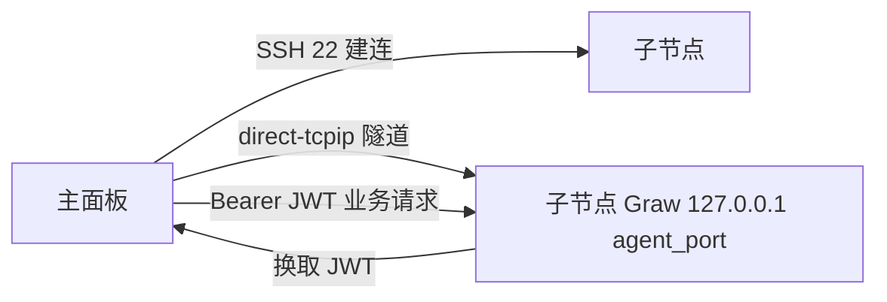
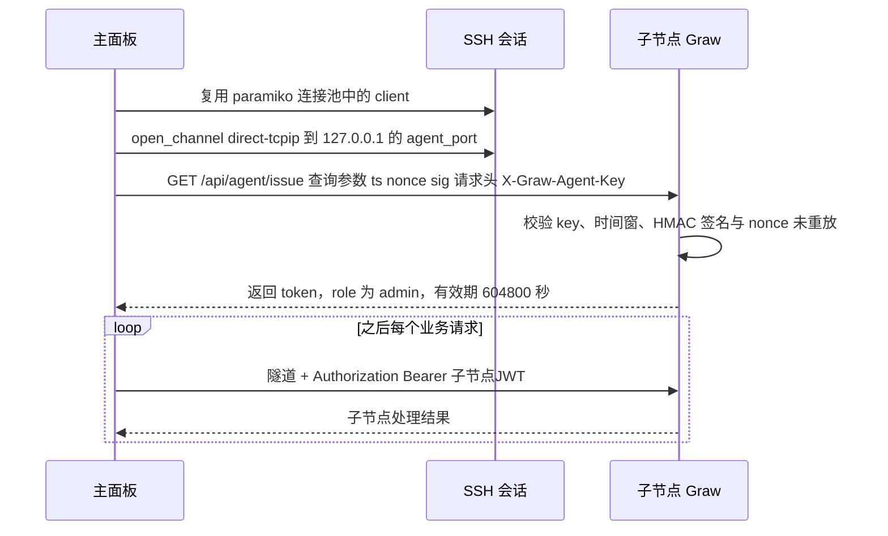

# 子节点 Agent 部署与接入实操

一份「照着做」的多节点接入手册：怎么在主面板纳管子节点、怎么开启子节点「收取模式」、成对密钥怎么生成与轮换、隧道与 JWT 怎么走、出问题怎么查。

| 项 | 说明 |
|----|------|
| 读者 | 要在一台面板上统一管理多台服务器的运维人员 |
| 前置阅读 | [docs/deployment.md](./deployment.md)（先把主面板部署跑通） |
| 原理补充 | [GETMEREAD/04-多节点与Agent隧道.md](../GETMEREAD/04-多节点与Agent隧道.md)、[GETMEREAD/02-请求生命周期与中间件.md](../GETMEREAD/02-请求生命周期与中间件.md) |
| 相关文档 | [docs/api-overview.md](./api-overview.md)（接口与鉴权）、[AGENTS.md](../AGENTS.md) 第 5.3 节 |

## 1. 两条纳管路线，先分清

Graw 管另一台机器有两条完全不同的路线，**别混用**：

| 路线 | 子节点装什么 | 主面板如何访问 | 能管理什么 |
|------|--------------|----------------|------------|
| **SSH 节点** | 什么都不用装（裸服务器） | 主面板直接 `ssh` 执行命令、读写文件 | 仅「host 类」：进程 / 文件 / Docker / 磁盘 / 日志 / 终端 / 系统监控 / 防火墙 / 服务监控 / 体检 / 工具箱 |
| **Agent 隧道** | 完整 Graw（可只监听回环） | 复用 SSH 会话打 `direct-tcpip` 隧道到子节点 agent 端口，换取 JWT 后调用子节点全部接口 | 全部应用（local 类接口由子节点自己实现） |

本流程实际是**两者的叠加**：先建 SSH 节点（提供隧道与凭据），再在该节点上配置 Agent（key/secret/port），此后业务请求优先走 Agent 隧道；未配置 Agent 时才走 SSH 直连并把「local 类」功能拦为 403。



## 2. 第一步：在子节点启用「收取模式」

子节点的「收取模式」配置持久化在**子节点自己的** `backend/data/agent.json`，支持设置界面热开关，改完立即生效（无需重启、无需改环境变量）。

### 2.1 两种配置来源与优先级

| 来源 | 说明 | 优先级 |
|------|------|--------|
| `backend/data/agent.json` | 设置界面写入，字段 `enabled` / `key` / `secret` / `role` / `secret_revealed` | 高（可覆盖环境变量） |
| 环境变量 `GRAW_AGENT_KEY` / `GRAW_AGENT_SECRET` | 传统容器/脚本注入方式，进程启动时确定 | 低（仅当持久化未写密钥时生效） |

判定逻辑（`backend/app/agent_cfg.py`）：`enabled()` 要求 **`enabled=true` 且 key、secret 同时非空**；环境变量注入的 secret 视为「已展示」，不会回传明文。

### 2.2 通过设置界面 / API 开启

设置界面「作为子节点」对应以下管理员接口（挂 `/api/agent`，`/cfg` 与 `/reveal-secret` 内部走 `require_admin`）：

| 方法 | 路径 | 说明 |
|------|------|------|
| `GET` | `/api/agent/cfg` | 读取脱敏状态 |
| `PUT` | `/api/agent/cfg` | 写入配置，请求体 `{ "enabled": true, "key": "...", "secret": "..." }` |
| `POST` | `/api/agent/reveal-secret` | **一次性**返回 secret 明文（供复制配置到主面板） |

`PUT /api/agent/cfg` 的语义要点：

- `secret` 留空表示**保持原值**（编辑时不重输）；
- 启用时 key / secret 必须成对齐全，否则返回 `400`（「未配置访问 key，无法启用」/「未配置校验 secret，无法启用」）；
- 切换为 `enabled=false` 时 **secret 会被一并清除**（失活后不再保留鉴权面）；
- 重新设置 secret 后，`secret_revealed` 复位为 `false`，允许再次一次性展示明文。

`GET /api/agent/cfg` 返回的脱敏字段：

```json
{
  "enabled": true,
  "role": "admin",
  "key": "访问key（半公开标识，可回传展示）",
  "has_secret": true,
  "can_reveal": false,
  "ts_window": 300
}
```

> **secret 永不回传**：只有 `POST /api/agent/reveal-secret` 会在「已启用 + 有 secret + 尚未展示过」时返回一次明文，返回后立刻标记已展示（`can_reveal` 变 `false`），避免明文常驻接口。key 属半公开标识（主面板需要它换 token），可以回传展示。

### 2.3 用脚本一键部署子节点 Agent

仓库提供 `backend/deploy_agent.py`，从主面板侧把后端代码推到子节点并拉起 Agent：

```bash
cd backend

# 方式一：复用 nodes.json 中当前 SSH 节点的凭据部署
python deploy_agent.py

# 方式二：显式指定目标
python deploy_agent.py --host 10.0.0.12 --user root --pass '你的密码'

# 方式三：只生成并打印成对密钥（不部署），用于手工配置
python deploy_agent.py --guest
```

脚本行为（`backend/deploy_agent.py` 实测）：经 SFTP 上传 `backend/app/**/*.py` 与 `requirements.txt` 到 `/opt/graw-agent` → 建 venv 装依赖 → 选端口（默认从 `8000` 起，被占用则顺延，最多探测 20 个）→ 以 `uvicorn app.main:app --host 127.0.0.1 --port <agent_port>` 启动 → 轮询 `http://127.0.0.1:<agent_port>/api/health` 确认就绪 → 打印 `agent_port` / `agent_key` / `agent_secret` 供你在主面板节点里填写。

> 脚本启动的子节点 Agent **只监听 `127.0.0.1`**（隧道专用），不暴露公网。

### 2.4 角色说明（与旧文档的差异）

当前实现中，子节点接入角色**固定为 `admin`**，由子节点侧强制，`AgentCfgBody` 不再提供角色字段（`agent_cfg.py` 的 `_default()` / `set_config()` 与 `agent_auth.py` 的 `agent_issue()` 均硬编码 `role="admin"`）。`deploy_agent.py` 打印的 `GRAW_AGENT_ROLE` 是历史部署参数，当前代码路径不再据此改变角色——避免低权限接入形成越权面。

## 3. 第二步：在主面板添加节点

节点元数据持久化在主面板自己的 `backend/data/nodes.json`（本地节点 `id=local` 永远存在且不可删除 / 不可被覆盖）。接口挂 `/api/nodes`，**全部为管理员级**。

| 方法 | 路径 | 说明 |
|------|------|------|
| `GET` | `/api/nodes` | 全部节点（脱敏）+ 当前选中节点 |
| `GET` | `/api/nodes/current` | 当前管理主机 |
| `POST` | `/api/nodes` | 新增 SSH 节点 |
| `PUT` | `/api/nodes/{node_id}` | 更新节点（password / agent_secret 留空表示保持原值） |
| `DELETE` | `/api/nodes/{node_id}` | 删除节点（本地节点不可删；删当前节点自动回落本机） |
| `POST` | `/api/nodes/{node_id}/test` | SSH 连通性测试 |
| `POST` | `/api/nodes/current` | 切换当前管理主机，请求体 `{ "node_id": "..." }` |

### 3.1 新增节点请求体字段

```json
{
  "name": "web-02",
  "host": "10.0.0.12",
  "port": 22,
  "user": "root",
  "auth": "password",
  "password": "SSH密码",
  "key_path": "",
  "agent_port": 8000,
  "agent_key": "子节点访问key",
  "agent_secret": "子节点校验secret",
  "agent_enabled": true
}
```

字段约束（`routers/nodes.py` 的 `SSHNodeIn` 与 `node_manager.upsert_ssh_node`）：

| 字段 | 约束 |
|------|------|
| `name` | 最长 64，留空则用节点 ID |
| `host` | 必填，最长 255；仅允许主机名 / IP 字符，不能以 `-` 开头（防 SSH 参数注入） |
| `port` | 1–65535，默认 22 |
| `user` | 必填，最长 64；仅允许字母/数字/`_`/`.`/`-` |
| `auth` | `password` 或 `key`；为 `key` 时必须提供 `key_path` |
| `password` | 最长 200；更新时留空 = 保持原密码 |
| `key_path` | 最长 1024（面板所在主机的私钥路径） |
| `agent_port` | 1–65535，默认 8000 |
| `agent_key` / `agent_secret` | 各最长 256；留空 = 保持原值 |
| `agent_enabled` | 显式 `false` 时**清空** agent_key / agent_secret（停用 Agent）；不传/`true` 则保留或更新 |

节点 ID 规则：新增未指定 `id` 时后台生成 `node_<8位十六进制>`；自定义 ID 需匹配 `^[A-Za-z0-9][A-Za-z0-9_.-]{0,63}$`，且**不可为保留字 `local`**（否则报「内置本机节点（local）不可被覆盖或改为 SSH 节点」）。

`GET /api/nodes` 中每个 SSH 节点的脱敏字段：`id / name / type / host / port / user / auth / has_password / key_path / agent_enabled / agent_port`。其中 `agent_enabled` 是「agent_port + agent_key + agent_secret 三者齐全」的派生标记；**真实密码与 agent_key/agent_secret 绝不回传**。

### 3.2 连接测试与主机密钥信任（TOFU）

- `POST /api/nodes/{node_id}/test` 返回 `{ "node_id": ..., "ok": true, "message": "ok" }`。测试用的是**独立连接**，不与连接池当前节点混用。
- 主面板对 SSH 主机密钥采用 **TOFU（首次信任）** 策略：首次连接记录指纹到 `backend/data/ssh_known_hosts.json`，之后密钥变更即拒绝连接（防中间人）。
- 删除节点时会同时遗忘该主机的 TOFU 记录（`ssh_host_keys.forget`），便于重装/换钥后重新添加节点。
- 密码认证优先走 `sshpass -e`（密码不经命令行）；缺 `sshpass` 时回退 `paramiko`（跨平台，Windows 主面板也可用）。密钥认证优先走系统 `ssh`。

### 3.3 用面板生成 SSH 密钥并一键部署

不想手敲 `authorized_keys` 时，可用「SSH 密钥」功能（`/api/sshkeys`，管理员）：

| 方法 | 路径 | 说明 |
|------|------|------|
| `GET` | `/api/sshkeys` | 密钥列表（仅元数据 + 指纹，**绝不返回私钥**） |
| `GET` | `/api/sshkeys/nodes` | 可部署的 SSH 节点列表（脱敏） |
| `POST` | `/api/sshkeys` | 生成新密钥，请求体 `{ "name": "...", "key_type": "ed25519" }`（`ed25519` 或 `rsa`） |
| `POST` | `/api/sshkeys/import` | 导入已有私钥（PEM） |
| `GET` | `/api/sshkeys/{key_id}/public` | 查看公钥（`authorized_keys` 格式） |
| `POST` | `/api/sshkeys/{key_id}/deploy` | 部署公钥到节点，请求体 `{ "node_id": "..." }` |
| `DELETE` | `/api/sshkeys/{key_id}` | 删除密钥（仅删面板保管的密钥与元数据） |

部署是**幂等**的：先做连通性测试（不可达直接报错），再远程执行 `mkdir -p ~/.ssh && chmod 700 ~/.ssh`，公钥已存在则跳过、否则追加到 `~/.ssh/authorized_keys` 并 `chmod 600`。部署完成后把节点的 `auth` 改为 `key`、`key_path` 指向面板保管的私钥路径即可免密。

## 4. 第三步：理解请求是怎么走的

### 4.1 当前的「请求级主机」

主面板的中间件按请求头 **`X-Graw-Node`** 临时覆盖「当前管理主机」（用 `contextvars` 隔离，互不污染），这样多个窗口可以并行操作不同子节点。优先级：

```
请求级节点（X-Graw-Node）
   >
全局选中的当前节点（/api/nodes/current 设置）
   >
本机 local
```

WebSocket 无法带自定义请求头，因此终端与监控改用查询参数 `?node=`：

| 端点 | 鉴权 | 节点参数 |
|------|------|----------|
| `/api/terminal/ws` | `?token=`，强制管理员 | `?node=<节点ID>`（会话绑定该节点，不跟随全局） |
| `/api/system/ws` | `?token=`，登录 + 非默认密码 | `?node=<节点ID>`；**仅管理员生效**，非管理员忽略并回落全局当前节点 |
| `/api/tamper/ws` | `?token=` | 告警推送 |

### 4.2 Agent 隧道与 JWT 换取



要点（`agent_auth.py` / `agent_client.py`）：

- 签名算法与原串：`sig = HMAC-SHA256(secret, key + "|" + ts + "|" + nonce)`，输出 hex。
- 请求形式：`GET /api/agent/issue?ts=<Unix秒>&nonce=<随机串>&sig=<签名>`，头 `X-Graw-Agent-Key: <key>`。
- 校验：key 常量时间比较 + 时间戳窗口（默认 ±300 秒，`GRAW_AGENT_TS_WINDOW`）+ 签名常量时间比较 + **nonce 在时间窗内一次性消费**（防重放）。
- 未启用 Agent 时 `/api/agent/issue` 返回 `404`；凭证错误返回 `401`。
- 成功后返回 `{ "token": "...", "role": "admin", "expires_in": 604800, "username": "agent" }`（7 天）。子节点会幂等确保本地存在一个 `agent` 账号用于 JWT 校验（其密码为随机值，无法通过常规登录入口登录）。
- 主面板侧按节点（键为 `host|port|user`）缓存该 JWT，剩余不足 300 秒自动续期；**节点凭据变更 / 节点删除时会主动清缓存**，保证「轮换密钥立即失效旧访问」。

### 4.3 哪些请求会被隧道代理

`main.py` 的最外层中间件 `agent_proxy_middleware`：当前节点是远程且已配置 Agent 时，**除下列前缀外**的业务 `/api/*` 请求优先经隧道代理到子节点：

```
/api/auth  /api/nodes  /api/terminal  /api/agent  /api/ui
/api/shunx  /api/health  /api/batch  /api/gitdeploy  /api/portforward
```

被排除的是「主面板自身职责」或必须在主面板本地执行的功能（登录、节点管理、终端、Agent 自身、界面设置、安全入口、健康检查、批量操作、Git 部署 webhook、端口转发隧道）。WebSocket 升级请求（`Upgrade: websocket`）一律不代理，由主面板承担或另行桥接。

> **安全前置鉴权**：代理发生前主面板会先在本地完成与业务路由等价的鉴权（校验 Bearer 令牌 / token 版本 / 会话未吊销 / 非默认密码）。非管理员只能代理只读路径：`GET /api/system`、`GET /api/notes`、`GET /api/tamper`；其余返回 `403 需要管理员权限`，未认证返回 `401 未认证`。这是因为代理会附带 agent 的管理员 JWT，绝不能让低权请求借道放大权限。

### 4.4 远端子节点能力门控（local-only）

即使没配 Agent（走 SSH 直连），也有一层兜底：`remote_cap.py` 把「依赖面板本地 `data/*.json`、对裸远程主机无意义」的接口标为 **local-only**，当前管理主机为远程节点且命中时直接返回 `403 该功能仅本机节点可用`。

local-only 前缀（`remote_cap.LOCAL_PREFIX`）：

```
/api/sites  /api/databases  /api/cron  /api/ssl  /api/protection  /api/runtime
/api/tasks  /api/appstore  /api/backup  /api/netstorage  /api/notify  /api/uptime
/api/webstats  /api/rewrite  /api/sitesopts  /api/waf  /api/tamper  /api/phpversions
/api/ftpusers  /api/sshkeys  /api/certcheck  /api/panelbackup  /api/update
/api/webmode  /api/loginlog  /api/plugins  /api/op
```

不在此列表的属 **host 类**（进程 / 文件 / Docker / 磁盘 / 日志 / 终端 / 系统监控 / 防火墙 / 服务监控 / 体检 / 工具箱），远端下仍可用。

> 注意中间件顺序：配了 Agent 的远程节点，业务请求被**外层** Agent 代理先行接管，因此 local-only 门控对这类请求不会触发（功能由子节点自己完成）；未配 Agent 时才由门控兜底成 403。

## 5. 端口与防火墙

| 方向 | 端口 | 要求 |
|------|------|------|
| 主面板 → 子节点 | SSH 端口（默认 `22`） | **必须放行并可登录**（`sshpass`/`paramiko` 建连、隧道都基于它） |
| 主面板 → 子节点 | `agent_port`（默认 `8000`） | **无需对公网放行**：隧道的目的地址是子节点的 `127.0.0.1:<agent_port>`，走的是已经建立好的 SSH 加密会话 |
| 子节点本机 | `agent_port` | 需要有一个监听（隧道落点）。`deploy_agent.py` 已把子节点 Agent 绑到 `127.0.0.1`，最安全 |

> 不要把子节点 Agent 端口暴露到公网。子节点是完整 Graw，暴露其面板端口等于把一套管理面直接摊在网上（即使有登录口，也放大了攻击面）；隧道方案的初衷正是不开公网口。若子节点面板确实需要对内网其他用户开放，请单独评估并启用其自身鉴权 / 反向代理。

## 6. 排障清单

| 现象 | 可能原因 | 处理 |
|------|----------|------|
| 换 JWT 失败，业务请求回 `502 Agent 代理失败` | 子节点 Agent 未启用（`/api/agent/issue` 返回 404）、key/secret 不匹配、时间戳超窗、nonce 重放 | 在子节点确认 `GET /api/agent/cfg` 的 `enabled=true`；核对主面板节点里的 `agent_key`/`agent_secret`；确认两端时钟同步（窗口默认 300 秒） |
| 凭证校验失败 `401` | 主面板保存的是旧密钥（子节点重置过 secret） | 重新 `reveal-secret` 或重置后把新 secret 填回主面板节点；保存节点会自动清理旧的 JWT 缓存 |
| 节点测试失败：SSH 端口不可达 | 子节点离线 / SSH 未启动 / 防火墙丢包 | 放行 SSH 端口；确认主机在线（测试前有 TCP 预检，不可达会秒级失败） |
| 节点测试失败：既无 sshpass 又无 paramiko | 主面板主机缺密码认证依赖 | 装 `sshpass`，或 `pip install paramiko`；密钥认证优先走系统 `ssh` |
| SSH 主机密钥校验失败（连接被拒） | 子节点重装 / 换钥，TOFU 记录与新指纹不一致 | 删除该节点（会一并遗忘指纹）后重新添加 |
| 切了节点但某些功能报 `403 该功能仅本机节点可用` | 该节点未配置 Agent，命中了 local-only 门控 | 为该节点补 `agent_port`/`agent_key`/`agent_secret` 并启用 Agent；或认清该功能本就只在本机有效 |
| 终端 / 监控连到了错误的主机 | 窗口下发的 `?node=` / `X-Graw-Node` 与全局当前节点不一致；子节点桥接失败后回退 | 重新打开窗口；确认 `GET /api/nodes/current`；非管理员对 `/api/system/ws` 的 `?node=` 会被忽略（回落全局） |
| 多窗口并行操作互相干扰 | 历史版本用 thread-local 会被单线程事件循环串扰 | 当前实现已改用 `contextvars` 按任务隔离；若仍异常请升级到最新版本 |
| 应用商店 / 网站等在子节点上不可用 | 这些是 local 类，应由子节点自己的 Agent 提供 | 配置 Agent 走隧道即可；SSH 裸节点不提供这些能力 |

> 隧道 / 代理相关异常会写入主面板日志（`backend/data/panel.log`），关键日志名 `graw.main`、`graw.agent`、`graw.nodes`。